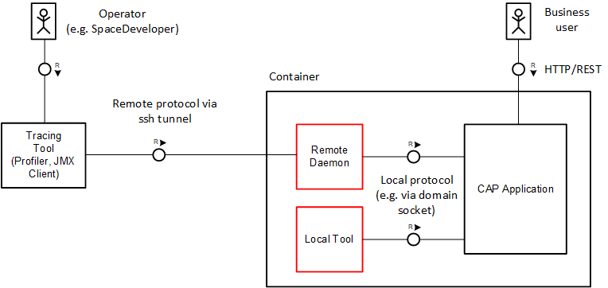

# Optimizing Applications
<style scoped>
  h1:before {
    content: "Java"; display: block; font-size: 60%; margin: 0 0 .2em;
  }
</style>

## Profiling { #profiling}

To minimize overhead at runtime, [monitoring](observability#monitoring) information is gathered rather on a global application level and hence might not be sufficient to troubleshoot specific issues.
In such a situation, the use of more focused profiling tools can be an option.
Typically, such tools are capable of focusing on a specific aspect of an application (for instance CPU or Memory management), but they come with an additional overhead and should only be enabled when needed. Hence, they need to meet the following requirements:

* Switchable at runtime
* Use a communication channel not exposed to unauthorized users
* Not interfering or even blocking business requests

How can dedicated Java tools access the running services in a secure manner? The depicted diagram shows recommended options that **do not require exposed HTTP endpoints**:

{width="600px"}

As an authorized operator, you can access the container and start tools [locally](#profiling-local) in a CLI session running with the same user as the target process. Depending on the protocol, the JVM supports on-demand connections, for example, JVM diagnostic tools such as `jcmd`. Alternatively, additional JVM configuration is required as a prerequisite (JMX).

### Local Tools { #profiling-local}

Various CLI-based tools for JVMs are delivered with the SDK. Popular examples are [diagnostic tools](https://docs.oracle.com/javase/8/docs/technotes/guides/troubleshoot/toc.html) such as `jcmd`, `jinfo`, `jstack`, and `jmap`, which help to fetch basic information about the JVM process regarding all relevant aspects. You can take stack traces, heap dumps, fetch garbage collection events and read Java properties and so on.
The SAP JVM comes with additional handy profiling tools: `jvmmon` and `jvmprof`. The latter, for instance,  provides a helpful set of traces that allow a deep insight into JVM resource consumption. The collected data is stored within a `prf`-file and can be analyzed offline in the [SAP JVM Profiler frontend](https://wiki.scn.sap.com/wiki/display/ASJAVA/Features+and+Benefits).

### Cloud Foundry Command Line Java Plugin

The [Java Plugin](https://github.com/SAP/cf-cli-java-plugin) for the [Cloud Foundry cli](https://github.com/cloudfoundry/cli) tool provides convenience utilities to work with Java applications deployed on Cloud Foundry.

It helps to create heap dumps, thread dumps and profiling records of deployed and running Java application instances. Please check the plugin documentation on details of its installation.

#### Creating Heap Dumps

```sh
cf java heap-dump sample-app-srv
```

`heap-dump` produces a `.hprof` file which can be viewed in a Java heap analyzer, such as [Memory Analyzer (MAT)](https://eclipse.dev/mat/).

#### Creating Thread Dumps

```sh
cf java thread-dump sample-app-srv
```

`thread-dump` produces a thread dump on `stdout` which you can pipe into a file for persistence, e.g.

```sh
cf java thread-dump sample-app-srv > thread-dump.txt
```

#### Async Profiler

Using `cf java` to profile Java applications running on Cloud Foundry with the [Async Profiler](https://github.com/async-profiler/async-profiler?tab=readme-ov-file#async-profiler) requires **recent versions** of the **SAP Java Buildpack with SAPMachine 17** (`1.110.0`) and **21** (`2.24.0`).

Also, the plugin requires the deployed application to have [SSH Access enabled](https://github.com/SAP/cf-cli-java-plugin?tab=readme-ov-file#ssh-access). Once that is in place you can easily start profiling with `cf java`.

`cf java` provides the following **async-profiler** related commands:

- **asprof-start-cpu**
  ```txt
  Start an async-profiler CPU-time profile recording on a running Java application
  ```

- **asprof-start-wall**
  ```txt
  Start an async-profiler wall-clock profile recording on a running Java application
  ```

- **asprof-start-alloc**
  ```txt
  Start an async-profiler allocation profile recording on a running Java application
  ```

- **asprof-start-lock**
  ```txt
  Start an async-profiler lock profile recording on a running Java application
  ```

- **asprof-stop**
  ```txt
  Stop an async-profiler profile recording on a running Java application
  ```

- **asprof-status**
  ```txt
  Get the status of async-profiler on a running Java application
  ```

- **asprof** (*Expert Mode*)
  ```txt
  Run async-profiler commands passed to asprof via --args
  ```

##### Usage
  
The typical usage would be

1. **Start profiling** with one of `asprof-start-cpu` | `asprof-start-wall` | `asprof-start-alloc` | `asprof-start-lock`:
   ```sh
   cf java asprof-start-cpu sample-app-srv
   ```

2. **Produce some load** in your Java application.

3. **Check** current asprof **status**, optionally:
   ```sh
   cf java asprof-status sample-app-srv
   ```

4. And finally **Stop profiling**:
   ```sh
   cf java asprof-stop sample-app-srv
   ```

`asprof-stop` produces a `.jfr` file in your current local working directory. `.jfr` files are *JFR recordings* and can be viewed for instance using [multiple options](https://github.com/async-profiler/async-profiler/blob/master/docs/JfrVisualization.md).

:::tip
Profiling accuracy improves if the following JVM args are set:
- **-XX:+UnlockDiagnosticVMOptions**
- **-XX:+DebugNonSafepoints**

These can be set in a running application by
```sh
cf set-env sample-app-srv JBP_CONFIG_JAVA_OPTS "[java_opts: '-XX:+UnlockDiagnosticVMOptions -XX:+DebugNonSafepoints']"
```
and restaging your application
```sh
cf restage sample-app-srv
```
:::

### Remote JMX-Based Tools { #profiling-jmx}

Java's standardized framework [Java Management Extensions](https://www.oracle.com/java/technologies/javase/javamanagement.html) (JMX) allows introspection and monitoring of the JVM's internal state via exposed Management Beans (MBeans). MBeans also allow to trigger operations at runtime, for instance setting a logger level. Spring Boot automatically creates a bunch of MBeans reflecting the current [Spring configuration and metrics](observability#spring-boot-actuators) and offers convenient ways for customization. To activate JMX in Spring, add the following property to your application configuration.:

```sh
spring.jmx.enabled: true
```

In addition, to enable remote access, add the following JVM parameters to open JMX on a specific port (for example, 5000) in the local container:

```sh
-Djava.rmi.server.hostname=localhost
-Dcom.sun.management.jmxremote
-Dcom.sun.management.jmxremote.port=<port>
-Dcom.sun.management.jmxremote.rmi.port=<port>
-Dcom.sun.management.jmxremote.authenticate=false
-Dcom.sun.management.jmxremote.ssl=false
```

::: warning Don't use public endpoints with JMX/MBeans
Exposing JMX/MBeans via a public endpoint can pose a serious security risk.
:::

To establish a connection with a remote JMX client, first open an ssh tunnel to the application via `cf` CLI as operator user:

```sh
cf ssh -N -T -L <local-port>:localhost:<port> <app-name>
```

Afterwards, connect to `localhost:<local-port>` in the JMX client. Common JMX clients are:

- [JConsole](https://openjdk.java.net/tools/svc/jconsole/), which is part of the JDK delivery.
- [OpenJDK Mission Control](https://github.com/openjdk/jmc), which can be installed separately.


## GraalVM Native Image Support <Beta /> { #graalvm-native-image-support-beta }

Since Spring Boot 3 it's possible to compile Spring Boot applications to stand-alone native executables leveraging GraalVM Native Images.
Native Image applications have faster startup times and require less memory. CAP Java provides compatibility with the Native Image technology.

[Learn more about Native Image support in Spring Boot.](https://docs.spring.io/spring-boot/how-to/native-image/index.html){.learn-more}

If you want to compile your application as a native executable the following boundary conditions need to be considered:

1. The GraalVM Native Image build analyzes your application from the `main` entry point. Only the code that is reachable through static analysis is included into the native image. This means that the full classpath needs to be known and available already at build time.

2. Dynamic elements of your code, such as usage of reflection, JDK proxies, or resources need to be registered with the GraalVM Native Image build. You can learn more about this in the [GraalVM Native Image documentation](https://www.graalvm.org/latest/reference-manual/native-image/metadata/).

    ::: tip
    Many runtime hints for reflection, JDK proxy usage, and resources are contributed automatically to the Native Image build.
    This includes
    - Required reflection for event handler classes defined in application code.
    - JDK proxies for interfaces generated from the application's CDS model by the CDS Maven Plugin.
    :::

3. Spring Boot automatically defines and fixes all bean definitions of your application at build time. If you have bean definitions that are created based on conditions on externalized configuration or profiles, you need to supply these triggers to the Native Image build.

    CAP Java also creates various bean definitions based on service bindings. Therefore, you need to provide the metadata of expected service bindings at runtime already during build time. This is similar to the information you define in deployment descriptors (for example `mta.yaml` or Helm charts). This information is also required to be supplied to the Native Image build.

    The Spring Boot Maven Plugin allows you to [configure the Spring profiles](https://docs.spring.io/spring-boot/docs/current/reference/html/howto.html#howto.aot.conditions) that are used during the Native Image build. You can supply information to the Native Image Build in a `native-build-env.json`, which you can configure together with the Spring profile. For example you can provide information to the Native image build in the `native-build-env.json` which you can configure together with the spring profile in the `srv/pom.xml`:

    ::: code-group
    ```json [native-build-env.json]
    {
        "hana": [ { "name": "<hana-binding-name>" } ],
        "xsuaa": [ { "name": "<xsuaa-binding-name>" } ]
    }
    ```
    ```xml [srv/pom.xml]
    <profile>
        <id>native</id>
        <build>
            <pluginManagement>
                <plugins>
                    <plugin>
                        <groupId>org.springframework.boot</groupId>
                        <artifactId>spring-boot-maven-plugin</artifactId>
                        <executions>
                            <execution>
                                <id>process-aot</id>
                                <configuration>
                                    <profiles>cloud</profiles>
                                    <jvmArguments>-Dcds.environment.local.defaultEnvPath=../native-build-env.json</jvmArguments>
                                </configuration>
                            </execution>
                        </executions>
                    </plugin>
                </plugins>
            </pluginManagement>
        </build>
    </profile>
    ```
    :::

When using Spring Boot's parent POM, you can easily trigger the Native Image build by executing `mvn spring-boot:build-image -Pnative`.
This builds a Docker image using Cloud Native Buildpacks including a minimized OS and your application.
You can launch the Docker image by running `docker run --rm -p 8080:8080 <srv-project-name>:<version>`.

::: tip
If you want to try out CAP's Native Image support you can use the [SFlight sample application](https://github.com/SAP-samples/cap-sflight) which is prepared for GraalVM Native Images.
Note, that SFlight's native executable is built and configured to use SAP HANA and XSUAA by default. You therefore need to run it with the `cloud` profile and supply an SAP HANA and XSUAA service binding.
Alternatively you can make corresponding adaptations in `native-build-env.json` and `srv/pom.xml` to build the native executable for a different set of service bindings and profile.
:::

