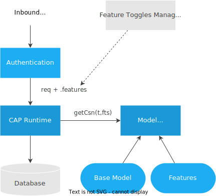

# Working with CDS Models
<style scoped>
  h1:before {
    content: "Java"; display: block; font-size: 60%; margin: 0 0 .2em;
  }
</style>

<div v-html="$frontmatter?.synopsis" />

## The CDS Model

 The interface `CdsModel` represents the complete CDS model of the CAP application and is the starting point for the introspection.

 The `CdsModel` can be obtained from the `EventContext`:

 ```java
import com.sap.cds.services.EventContext;
import com.sap.cds.reflect.CdsModel;

@On(event = "READ", entity = "my.catalogservice.books")
public void readBooksVerify(EventContext context) {
    CdsModel model = context.getModel();
   [...]
}
```

or, in Spring, be injected:

```java
@Autowired
CdsModel model;
```

On a lower level, the `CdsModel` can be obtained from the `CdsDataStoreConnector`, or using the `read` method from a [CSN](../cds/csn) String or [InputStream](https://docs.oracle.com/javase/8/docs/api/java/io/InputStream.html):

```java
InputStream csnJson = ...
CdsModel model = CdsModel.read(csnJson);
```

## Examples

The following examples are using this CDS model:

```cds
namespace my.bookshop;

entity Books {
  title  : localized String(111);
  author : Association to Authors;
  ...
}

entity Authors {
  key ID : Integer;
  ...
}

entity Orders {
  OrderNo  : String @title:'Order Number';
  ...
}
```

### Get and Inspect an Element of an Entity

In this example, we introspect the details of the type of the element `title` of the entity `Books`:

```java
CdsEntity books = model.getEntity("my.bookshop.Books");
CdsElement title = books.getElement("title");

boolean key = title.isKey();      // false
CdsType type = title.getType();   // CdsSimpleType

if (type.isSimple()) {   // true
  CdsSimpleType simple = type.as(CdsSimpleType.class);

  String typeName = simple.getQualifiedName();  // "cds.String"
  CdsBaseType baseType = simple.getType();      // CdsBaseType.STRING
  Class<?> javaType = simple.getJavaType();     // String.class
  Boolean localized = simple.get("localized");  // true
  Integer length = simple.get("length");        // 111
}
```

### Get and Inspect All Elements of an Entity

```java
CdsEntity books = model.getEntity("my.bookshop.Books");
Stream<CdsElement> elements = books.elements();
```

The method `elements()` returns a stream of all elements of the given entity, structured type, or event. It's important to note that the Model Reflection API doesn't guarantee the element order to be exactly like in the source CSN document. However, the order is guaranteed to be stable during multiple consecutive model reads.

::: tip
In case the element names are known beforehand it's recommended to access them by name through the `getElement(String name)` method.
:::

### Get and Inspect an Association Element of an Entity

We can also analyze the details of an association:

```java
CdsElement authorElement = book.getAssociation("author");
CdsAssociationType toAuthor = authorElement.getType();

CdsEntity author = toAuthor.getTarget(); // Entity: my.bookshop.Authors
boolean association = toAuthor.isAssociation();   // true
boolean composition = toAuthor.isComposition();   // false

Cardinality cardinality = toAuthor.getCardinality();
String sourceMax = cardinality.getSourceMax();    // "*"
String targetMin = cardinality.getTargetMin();    // "0"
String targetMax = cardinality.getTargetMax();    // "1"

Stream<CdsElement> keys = toAuthor.keys();  // Stream: [ ID ]
Optional<CqnExpression> onCondition = toAuthor.onCondition(); // empty
```

### Find an Annotation by Name and Get Its Value

Here, we programmatically check if the element `OrderNo` carries the annotation `title` and set the value of `displayName` depending on the presence of the
annotation:

```java
CdsEntity order = model.getEntity("my.bookshop.Orders");
CdsElement orderNo = order.getElement("OrderNo");

Optional<CdsAnnotation<String>> annotation = orderNo
        .findAnnotation("title");
String displayName = annotation.map(CdsAnnotation::getValue)
        .orElse(orderNo.getName());   // "Order Number"
```

### Filter a Stream of Services for non-abstract Services

Using a stream we determine all non-abstract services:

```java
Stream<CdsService> services = model.services()
    .filter(s -> !s.isAbstract());
List<CdsService> serviceList = services.collect(Collectors.toList());
```

### Filter a Stream of Entities by Namespace

The static method `com.sap.cds.reflect.CdsDefinition.byNamespace` allows to create a predicate to filter a stream of definitions
(for example, entities, elements, ...) for definitions contained in a given namespace:

```java
import static com.sap.cds.reflect.CdsDefinition.byNamespace;
...

Stream<CdsEntity> entities = model.entities()
    .filter(byNamespace("my.bookshop"));
```

### Get All Elements with Given Annotation

The static method `com.sap.cds.reflect.CdsAnnotatable.byAnnotation` allows to create a [predicate](https://docs.oracle.com/javase/8/docs/api/java/util/function/Predicate.html) to filter a stream of annotatable model components (for example, entities, elements, ...) for components that carry a given annotation:

```java
import static com.sap.cds.reflect.CdsAnnotatable.byAnnotation;
...

CdsEntity order = model.getEntity("my.bookshop.Orders");
Stream<CdsElement> elements = order.elements()
    .filter(byAnnotation("title"));
```

## Feature Toggles

### Feature Toggles and Active Feature Set

[Feature toggles](../guides/extensibility/feature-toggles) allow to dynamically enable or disable parts of an application at runtime or to alter the behaviour depending on features.

Feature toggles can be used for different purposes. They can be used as release toggles to selectively enable some features for some customers only based on a deployment vector. Or they can be used as runtime toggles to dynamically enable or disable selected features for selected users.

CAP Java does not make any assumption _how_ the set of enabled features (_active feature set_) is determined. This could be based on user ID, user role, user tenant, or any other information such as an HTTP header or an external feature toggle service.

### Features in CDS Models

Features are modeled in CDS by dividing up CDS code concerning separate features into separate subfolders of a common `fts` folder of your project, as shown by the following example:

```
|-- [db]
|   |-- my-model.cds
|   `-- ...
|-- [srv]
|   |-- my-service.cds
|   `-- ...
`-- [fts]
    |-- [X]
    |   |-- model.cds
    |   `-- ...
    |-- [Y]
    |   |-- feature-model.cds
    |   `-- ...
    `-- [Z]
        |-- wrdlbrmpft.cds
        `-- ...
```

In this example, three _CDS features_ `X`, `Y` and `Z` are defined. Note, that the name of a feature (by which it is referenced in a _feature toggle_) corresponds to the name of the feature's subfolder. A CDS feature can contain arbitrary CDS code. It can either define new entities or extensions of existing entities.

The database schema resulting from CDS build at design time contains *all* features. This is required to serve the base model and all combinations of features at runtime.

### The Model Provider Service

{.adapt}

At runtime, per request, an effective CDS model is used that reflects the active feature set. To obtain the effective model that the runtime delegates to the *Model Provider Service*, which uses this feature set to resolve the CDS model code located in the `fts` folder of the active features and compiles to effective CSN and EDMX models for the current request to operate on.

::: warning
The active features set can't be changed within an active transaction.
:::

### Toggling SAP Fiori UI Elements

In an [SAP Fiori elements](https://experience.sap.com/fiori-design-web/smart-templates/) application, the UI is captured with annotations in the CDS model. Hence, toggling of [SAP Fiori elements annotations](../advanced/fiori#what-are-sap-fiori-annotations) is already leveraged by the above concept: To enable toggling of such annotations (and thus UI elements), it's required that the EDMX returned by the `$metadata` respects the feature vector. This is automatically achieved by maintaining different model variants according to activated features as described in the previous section.

### Features on the Database

As CDS features are reflected in database artifacts, the database needs to be upgraded when new features are _introduced_ in the CDS model. If a feature is _enabled_, the corresponding database artifacts are already present and no further database change is required.

Only when a particular feature is turned on, the application is allowed to access the corresponding part of the database schema. The CAP framework ensures this by exposing only the CDS model that corresponds to a certain feature vector. The CAP framework accesses database entities based on the currently active CDS model only. This applies in particular to `SELECT *` requests for which the CAP framework returns all columns defined in the current view on the model, and *not* all columns persisted on the database.

### Feature Toggles Info Provider

In CAP Java, the [active feature set](#feature-toggles-and-active-feature-set) in a particular request is represented by the [`FeatureTogglesInfo`](https://javadoc.io/doc/com.sap.cds/cds-services-api/latest/com/sap/cds/services/request/FeatureTogglesInfo.html). On each request, the runtime uses the [`FeatureTogglesInfoProvider`](https://javadoc.io/doc/com.sap.cds/cds-services-api/latest/com/sap/cds/services/request/FeatureTogglesInfoProvider.html) to create the request-dependent `FeatureTogglesInfo` object, which is exposed in the current `RequestContext` by [`getFeatureTogglesInfo()`](https://www.javadoc.io/doc/com.sap.cds/cds-services-api/latest/com/sap/cds/services/request/RequestContext.html#getFeatureTogglesInfo--).

By default all features are deactivated (`FeatureTogglesInfo` represents an empty set).

#### From Mock User Configuration

If mock users are used, a default [`FeatureToggleProvider`](https://www.javadoc.io/doc/com.sap.cds/cds-services-api/latest/com/sap/cds/services/runtime/FeatureTogglesInfoProvider.html) is registered, which assigns feature toggles to users based on the [mock user configuration](./security#mock-users). Feature toggles can be configured per user or [per tenant](./security#mock-tenants). The following configuration enables the feature `wobble` for the user `Bob` while for `Alice` the features `cruise` and `parking` are enabled:

```yaml
cds:
  security:
    mock:
      users:
        - name: Bob
          tenant: CrazyCars
          features:
            - wobble
        - name: Alice
          tenant: SmartCars
          features:
            - cruise
            - parking
```

#### Custom Implementation

Applications can implement a custom [`FeatureTogglesInfoProvider`](https://javadoc.io/doc/com.sap.cds/cds-services-api/latest/com/sap/cds/services/runtime/FeatureTogglesInfoProvider.html) that computes a `FeatureTogglesInfo` based on the request's [`UserInfo`](https://www.javadoc.io/static/com.sap.cds/cds-services-api/latest/com/sap/cds/services/request/UserInfo.html) and [`ParameterInfo`](https://www.javadoc.io/static/com.sap.cds/cds-services-api/latest/com/sap/cds/services/request/ParameterInfo.html).

The following example demonstrates a feature toggles info provider that enables the feature `isbn` if the user has the `expert` role:

```java
@Component
public class DemoFTProvider implements FeatureTogglesInfoProvider {
    @Override
    public FeatureTogglesInfo get(UserInfo userInfo, ParameterInfo paramInfo) {
        Map<String, Boolean> featureToggles = new HashMap<>();
        if (userInfo.hasRole("expert")) {
            featureToggles.put("isbn", true);
        }
        return FeatureTogglesInfo.create(featureToggles);
    }
}
```

This feature toggles provider is automatically registered and used as Spring bean by means of the annotation `@Component`. At each request, the CAP Java runtime calls the method `get()`, which determines the active features based on the logged in user's roles.

#### Defining Feature Toggles for Internal Service Calls

It is not possible to redefine the feature set within an active request context as this would result in a model change.
However, if there is no active request context such as in a new thread, you can specify the feature set while [Defining Request Contexts](./request-contexts#defining-requestcontext).

In the following example, a `Callable` is executed in a new thread resulting in an initial request context. In the definition of the request context the feature toggles are defined that will be used for the statement execution:

```java
@Autowired
CdsRuntime runtime;

@Autowired
PersistenceService db;

FeatureTogglesInfo isbn = FeatureTogglesInfo.create(Collections.singletonMap("isbn", true));

...

Future<Result> result = Executors.newSingleThreadExecutor().submit(() -> {
  return runtime.requestContext().featureToggles(isbn).run(rc -> {
    return db.run(Select.from(Books_.CDS_NAME));
  });
});
```

<div id="toggle-provider-sap" />

### Using Feature Toggles in Custom Code

Custom code, which depend on a feature toggle can evaluate the [`FeatureTogglesInfo`](https://www.javadoc.io/static/com.sap.cds/cds-services-api/latest/com/sap/cds/services/request/FeatureTogglesInfo.html) to determine if the feature is enabled. The `FeatureTogglesInfo` can be obtained from the [RequestContext](./request-contexts) or `EventContext` by the `getFeatureTogglesInfo()` method or by [dependency injection](./development/#exposed-beans). This is shown in the following example where custom code depends on the feature `discount`:

```java
@After
protected void subtractDiscount(CdsReadEventContext context) {
    if (context.getFeatureTogglesInfo().isEnabled("discount")) {
        // Custom coding executed when feature "discount" is active
        // ...
    }
}
```
