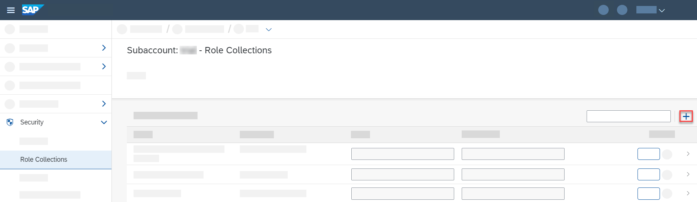

# Authentication


{{$frontmatter.synopsis}} This is done by [authentication middlewares](#strategies) setting the [`req.user` property](#cds-user) which is then used in [authorization enforcement](#enforcement) decisions.


## req.user &#8594;  cds.**User** <i> class </i> { #cds-user}
[user]: #cds-user
[`req.user`]: #cds-user

Represents the currently logged-in user as filled into [`req.user`](events#user) by authentication middlewares.
Simply create instances of `cds.User` or of subclasses thereof in custom middlewares.
For example:

```js
const cds = require('@sap/cds')
const DummyUser = new class extends cds.User { is:()=>true }
module.exports = (req,res,next) => {
  req.user = new DummyUser('dummy')
  next()
}
```

Or you can call the constructor of `cds.User` with specific arguments, to create a user instance. For example:
```js
const cds = require('@sap/cds')
// with user ID as string
const user = new cds.User('userId')
// a user instance
const anotherUser = new cds.User(user)
// a user instance like object
const yetAnotherUser = new cds.User({id: user.id, roles: user.roles, attr: user.attr})
```

#### <i> Properties & Methods </i>

<!-- % assign user = '<span style="font-weight:500; color:#088">user</span>' %} -->


### user.id <i> : string </i> {#user-id}

A user's unique ID.
It corresponds to `$user` in [`@restrict` annotations](../guides/authorization) of your CDS models
(Also in JavaScript, `user` can act as a shortcut for `user.id` in comparisons.) {.indent}


### user.is <i> (\<role\>) </i> &#8594;  boolean {#user-is}

Checks if user has assigned the given role. Example usage:

```js
if (req.user.is('admin')) ...
```

The role names correspond to the values of [`@requires` and the `@restrict.grants.to` annotations](../guides/authorization) in your CDS models.


### user.attr<i>.\<x\> : string </i> {#user-attr}

User-related attributes, for example, from JWT tokens
These correspond to `$user.<x>` in [`@restrict` annotations](../guides/authorization) of your CDS models {.indent}


### <i>DEPRECATED:</i> user.tenant <i> : string </i> {#user-tenant}

[Use `req/msg.tenant` instead.](events#tenant){.learn-more}


### <i>DEPRECATED:</i> user.locale <i> : string </i> {#user-locale}

[Use `req/msg.locale` instead.](events#locale){.learn-more}

### cds.**User.Privileged** <i> class </i> { #privileged-user }

In some cases, you might need to bypass authorization checks while [consuming a local service](./services). For this, you can create a transaction with a privileged user as follows:

```js
this.before('*', function (req) {
  const user = new cds.User.Privileged
  return this.tx({ user }, tx => tx.run(
    INSERT.into('RequestLog').entries({
      url: req._.req.url,
      user: req.user.id
    })
  )
})
```


### <i> Authorization Enforcement </i> {.h2 #enforcement }

Applications can use the `req.user` APIs to do programmatic enforcement.
For example, the authorization of the following CDS service:

```cds
service CustomerService @(requires: 'authenticated-user'){
  entity Orders @(restrict: [
    { grant: ['READ','WRITE'], to: 'admin' },
  ]){/*...*/}
  entity Approval @(restrict: [
    { grant: 'WRITE', where: '$user.level > 2' }
  ]){/*...*/}
}
```

can be programmatically enforced by means of the API as follows:

```js
const cds = require('@sap/cds')
cds.serve ('CustomerService') .with (function(){
  this.before ('*', req =>
   req.user.is('authenticated') || req.reject(403)
  )
  this.before (['READ', 'CREATE'], 'Orders', req =>
    req.user.is('admin') || req.reject(403)
  )
  this.before ('*', 'Approval', req =>
    req.user.attr.level > 2 || req.reject(403)
  )
})
```

## Authentication Strategies {#strategies}

CAP ships with a few prebuilt authentication strategies, used by default: [`mocked`](#mocked) during development and [`jwt`](#jwt) in production.
You can override these defaults and configure the authentication strategy to be used through the `cds.requires.auth` [config option in `cds.env`](./cds-env), for example:

```jsonc
"cds": { // in package.json
  "requires": {
    "auth": { "kind": "jwt" }
  }
}
```

::: tip
Run `cds env get requires.auth` in your project root to find out the effective authentication config for your current environment.
:::


### Dummy Authentication {.h2 #dummy }

This strategy creates a user that passes all authorization checks. It’s meant for temporarily disabling the `@requires` and `@restrict` annotations at development time.

**Configuration:** Choose this strategy as follows:

```json
"cds": { // in package.json
  "requires": {
    "auth": { "kind": "dummy" }
  }
}
```


### Mocked Authentication {.h2 #mocked }

This authentication strategy uses basic authentication with pre-defined mock users during development.

::: tip
**Note:** When testing different users in the browser, it's best to use an incognito window, because logon information might otherwise be reused.
:::

**Configuration:** Choose this strategy as follows:

```jsonc
"cds": { // in package.json
  "requires": {
    "auth": { "kind": "mocked" }
  }
}
```

You can optionally configure users as follows:

```jsonc
"cds": { // in package.json
  "requires": {
    "auth": {
      "kind": "mocked",
      "users": {
        "<user.id>": {
          "password": "<password>",
          "roles": [ "<role-name>", ... ],
          "userAttributes": { ... }
        }
      }
    }
  }
}
```

The default configuration shipped with `@sap/cds` specifies these users:

```jsonc
  "users": {
    "alice": { "roles": ["admin", "cds.Subscriber"] },
    "bob":   { "roles": ["cds.ExtensionDeveloper", "cds.UIFlexDeveloper"] },
    "carol": { "roles": ["admin", "cds.Subscriber", "cds.ExtensionDeveloper", "cds.UIFlexDeveloper"] },
    "dave":  { "roles": ["admin", "cds.Subscriber"] },
    "erin":  { "roles": ["admin", "cds.Subscriber", "cds.ExtensionDeveloper", "cds.UIFlexDeveloper"] },
    "fred":  { },
    "me":    { },
    "*": true //> all other logins are allowed as well
  }
}
```

::: tip
This default configuration is merged with your custom configuration such that, by default, logins by alice, bob, ... and others (`*`) are allowed.
:::

If you want to restrict these additional logins, you need to overwrite the defaults:

```jsonc
  "users": {
    "alice": { "roles": [] },
    "bob": { "roles": [] },
    "*": false //> do not allow other users than the ones specified
  }
```


### Basic Authentication {.h2 #basic }

This authentication strategy uses basic authentication to use mock users during development.

::: tip
**Note:** When testing different users in the browser, it's best to use an incognito window, because logon information might otherwise be reused.
:::

**Configuration:** Choose this strategy as follows:

```jsonc
"cds": { // in package.json
  "requires": {
    "auth": { "kind": "basic" }
  }
}
```

You can optionally configure users as follows:

```jsonc
"cds": { // in package.json
  "requires": {
    "auth": {
      "kind": "basic",
      "users": {
        "<user.id>": {
          "password": "<password>",
          "roles": [ "<role-name>", ... ],
          "userAttributes": { ... }
        }
      }
    }
  }
}
```

In contrast to [mocked authentication](#mocked), no default users are automatically added to the configuration.


### JWT-based Authentication { #jwt }

This is the default strategy used in production. User identity, as well as assigned roles and user attributes, are provided at runtime, by a bound instance of the ['user account and authentication'](https://help.sap.com/products/BTP/65de2977205c403bbc107264b8eccf4b/419ae2ef1ddd49dca9eb65af2d67c6ec.html) service (UAA). This is done in form of a JWT token in the `Authorization` header of incoming HTTP requests.

**Prerequisites:** You need to add [passport](http://www.passportjs.org/) to your project:
```shell
npm add passport
```

**Prerequisites:** You need to add [@sap/xssec](https://help.sap.com/docs/HANA_CLOUD_DATABASE/b9902c314aef4afb8f7a29bf8c5b37b3/54513272339246049bf438a03a8095e4.html#loio54513272339246049bf438a03a8095e4__section_atx_2vt_vt) to your project:
```shell
npm add @sap/xssec
```

**Configuration:** Choose this strategy as follows:

```jsonc
"cds": { // in package.json
  "requires": {
    "auth": { "kind": "jwt" }
  }
}
```

[Learn more about testing JWT-based authentication in **XSUAA in Hybrid Setup**.](#xsuaa-setup){.learn-more}


### XSUAA-based Authentication { #xsuaa }

Authentication kind *xsuaa* is a logical extension of kind [*jwt*](#jwt) that additionally offers access to SAML attributes through `req.user.attr` (for example, `req.user.attr.familyName`).


**Prerequisites:** You need to add [@sap/xssec](https://help.sap.com/docs/HANA_CLOUD_DATABASE/b9902c314aef4afb8f7a29bf8c5b37b3/54513272339246049bf438a03a8095e4.html#loio54513272339246049bf438a03a8095e4__section_atx_2vt_vt) to your project:
```shell
npm add @sap/xssec
```

**Configuration:** Choose this strategy as follows:

```jsonc
"cds": { // in package.json
  "requires": {
    "auth": { "kind": "xsuaa" }
  }
}
```

[See **XSUAA in Hybrid Setup** below for additional information of how to test this](#xsuaa-setup){.learn-more}

::: warning
It’s recommended to only use this authentication kind if it’s necessary for your use case, as it denotes a lock-in to SAP BTP.
:::


### IAS-based Authentication { #ias }

This is an additional authentication strategy using the [Identity Authentication Service](https://help.sap.com/docs/IDENTITY_AUTHENTICATION) (IAS) that can be used in production. User identity and user attributes are provided at runtime, by a bound instance of the IAS service. This is done in form of a JWT token in the `Authorization` header of incoming HTTP requests.

To allow forwarding to remote services, JWT tokens issued by IAS service don't contain authorization information. In particular, no scopes are included. Closing this gap is up to you as application developer.

**Prerequisites:** You need to add [passport](http://www.passportjs.org/) to your project:
```shell
npm add passport
```

**Prerequisites:** You need to add [@sap/xssec](https://help.sap.com/docs/HANA_CLOUD_DATABASE/b9902c314aef4afb8f7a29bf8c5b37b3/54513272339246049bf438a03a8095e4.html#loio54513272339246049bf438a03a8095e4__section_atx_2vt_vt) to your project:
```shell
npm add @sap/xssec
```

**Configuration:** Choose this strategy as follows:

```jsonc
"cds": { // in package.json
  "requires": {
    "auth": { "kind": "ias" }
  }
}
```


### Custom Authentication {#custom }


You can configure an own implementation by specifying an own `impl` as follows:

```json
"requires": {
  "auth": {
    "impl": "srv/custom-auth.js" // > relative path from project root
  }
}
```

Essentially, custom authentication middlewares must do two things. First, they must [fulfill the `req.user` contract](#cds-user) by assigning an instance of `cds.User` or a look-alike to the incoming request at `req.user`. Second, if running in a multitenant environment, `req.tenant` must be set to a string identifying the tenant that is addressed by the incoming request.


```js
module.exports = function custom_auth (req, res, next) {
  // do your custom authentication
  req.user = new cds.User({
    id: '<user-id>',
    roles: ['<role-a>', '<role-b>']
    attr: {
      <user-attribute-a>: '<value>',
      <user-attribute-b>: '<value>'
    }
  })
  req.tenant = '<tenant>'
}
```

[If you want to customize the user ID, please also have a look at this example.](./middlewares#customization-of-req-user){.learn-more}

## XSUAA in Hybrid Setup {#xsuaa-setup}

### <i> Prepare Local Environment </i>

The following steps assume you've set up the [**Cloud Foundry Command Line Interface**](https://help.sap.com/products/BTP/65de2977205c403bbc107264b8eccf4b/856119883b8c4c97b6a766cc6a09b48c.html).

1. Log in to Cloud Foundry:
```shell
cf l -a <api-endpoint>
```
If you don’t know the API endpoint, have a look at section [Regions and API Endpoints Available for the Cloud Foundry Environment](https://help.sap.com/products/BTP/65de2977205c403bbc107264b8eccf4b/350356d1dc314d3199dca15bd2ab9b0e.html#loiof344a57233d34199b2123b9620d0bb41).

2. Go to the project you have created in [Getting started in a Nutshell](../get-started/in-a-nutshell).

3. Configure your app for XSUAA-based authentication if not done yet:
    ```shell
    cds add xsuaa --for hybrid
    ```
  This command creates the XSUAA configuration file `xs-security.json` and adds the service and required dependencies to your `package.json` file.

4. Make sure `xsappname` is configured and `tenant-mode` is set to `dedicated` in `xs-security.json` file:
```json
{
  "xsappname": "bookshop-hybrid",
  "tenant-mode": "dedicated",
  ...
  }
```

5. Configure the redirect URI:

    Add the following OAuth configuration to the `xs-security.json` file:

    ```json
    "oauth2-configuration": {
      "redirect-uris": [
        "http://localhost:5001/"
      ]
    }
    ```

6. Create an XSUAA service instance with this configuration:

    ```shell
    cf create-service xsuaa application bookshop-uaa -c xs-security.json
    ```

    > Later on, if you've changed the scopes, you can use `cf update-service bookshop-uaa -c xs-security.json` to update the configuration.

    ::: tip
    This step is necessary for locally running apps and for apps deployed on Cloud Foundry.
    :::

### <i> Configure the Application </i>

1. Create a service key:

    ```shell
    cf create-service-key bookshop-uaa bookshop-uaa-key
    ```

    You do this, to gain access to the XSUAA credentials from your local application.


2. Bind to the new service key:

    ```shell
    cds bind -2 bookshop-uaa
    ```

    This adds an `auth` section containing the binding and the kind `xsuaa` to the _.cdsrc-private.json_ file. This file is created if it doesn't exist and keeps the local and private settings of your app:

    ```json
    {
      "requires": {
        "[hybrid]": {
          "auth": {
            "kind": "xsuaa",
            "binding": { ... }
          }
        }
      }
    }
    ```

    >If your running in BAS, you can alternatively [create a new run configuration](https://help.sap.com/products/SAP%20Business%20Application%20Studio/9c36fdb911ae4cadab467a314d9e331f/cdbc00244452483e9582a4f486b42d64.html), connecting the `uaa` to your XSUAA service instance.

    >In that case you need to add the environment variable `cds_requires_auth_kind=xsuaa` to the run configuration.

3. Check authentication configuration:
```
cds env list requires.uaa --resolve-bindings --profile hybrid
```
This prints the full `uaa` configuration including the credentials.


### <i> Set Up the Roles for the Application </i> { #auth-in-cockpit}

By creating a service instance of the `xsuaa` service, all the roles from the _xs-security.json_ file are added to your subaccount. Next, you create a role collection that assigns these roles to your users.

1. Open the SAP BTP Cockpit.

    > For your trial account, this is: [https://cockpit.hanatrial.ondemand.com](https://cockpit.hanatrial.ondemand.com)

2. Navigate to your subaccount and then choose *Security* > *Role Collections*.
3. Choose *Create New Role Collection*:

   {.adapt}

4. Enter a *Name* for the role collection, for example `BookshopAdmin`, and choose *Create*.
5. Choose your new role collection to open it and switch to *Edit* mode.
6. Add the `admin` role for your bookshop application (application id `bookshop!a<XXXX>`) to the *Roles* list.
7. Add the email addresses for your users to the *Users* list.
8. Choose *Save*

### <i> Running Approuter </i>

The approuter component implements the necessary authentication flow with XSUAA to let the user log in interactively.
The resulting JWT token is sent to the application where it’s used to enforce authorization and check the user's roles.

1. Add approuter in the `app` folder of your project:

    ```shell
    cds add approuter
    ```

2. Install `npm` packages for approuter:

    ```shell
    npm install --prefix app
    ```

3. In your project folder run:

    ::: code-group
    ```shell
    cds bind --exec -- npm start --prefix app
    ```
    ```cmd
    cds bind --exec -- npm start --prefix app
    ```
    ```powershell
    cds bind --exec '--' npm start --prefix app
    ```
    :::

    [Learn more about `cds bind --exec`.](../advanced/hybrid-testing#cds-bind-exec){.learn-more}

    This starts an [approuter](https://help.sap.com/docs/HANA_CLOUD_DATABASE/b9902c314aef4afb8f7a29bf8c5b37b3/0117b71251314272bfe904a2600e89c0.html) instance on [http://localhost:5001](http://localhost:5001) with the credentials for the XSUAA service that you have bound using `cds bind`.

    > Usually the approuter is started using `npm start` in the `app` folder. But you need to provide the `VCAP_SERVICES` variable with the XSUAA credentials. With the `cds bind --exec` command you can launch an arbitrary command with the `VCAP_SERVICES` variable filled with your `cds bind` service bindings.

    Since it only serves static files or delegates to the backend service, you can keep the server running. It doesn’t need to be restarted after you have changed files.

4. Make sure that your CAP application is running as well with the `hybrid` profile:

    ```shell
    cds watch --profile hybrid
    ```

    > If you are using BAS Run Configurations, you need to configure `cds watch` with profile `hybrid`:
    > 1. Right click on your run configuration
    > 2. Choose *Show in File*
    > 3. Change the command `args`:
    > ```json
    > "args": [
    >    "cds",
    >    "watch",
    >    "--profile",
    >    "hybrid"
    > ],
    > ```

5. After the approuter and CAP application are started, log in at [http://localhost:5001](http://localhost:5001) and verify that the routes are protected as expected.

    In our example, if you assigned the `admin` scope to your user in SAP BTP cockpit, you can now access the admin service at [http://localhost:5001/admin](http://localhost:5001/admin).

    <br>

    > To test UIs w/o a running UAA service, just add this to _xs-app.json_:
    ```"authenticationMethod": "none"```

**SAP Business Application Studio:**

The login fails pointing to the correct OAuth configuration URL that is expected.

1. Replace the URL `http://localhost:5001/` in your `xs-security.json` file with the full URL from the error message:

    ```json
    "oauth2-configuration": {
        "redirect-uris": [
          "<url from error message>"
      ]
    }
    ```
    ::: warning
    This is a specific configuration for your dev space and should not be submitted or shared.
    :::

2. Update the XSUAA service:

    ```shell
    cf update-service bookshop-uaa -c xs-security.json
    ```

3. Retry