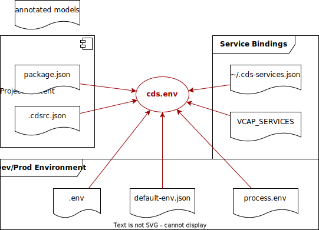

<!--- Migrated: @external/node.js/cds-env.md -> @external/node.js/cds-env.md -->


# Project-Specific Configurations

<!-- <style scoped>
  h1:before {
    content: "CAP Node.js SDK"; display: block; font-size: 60%; margin: 0 0 .2em;
  }
</style> -->

<div v-html="$frontmatter?.synopsis" />


## CLI `cds env` Command {#cli}

Run the `cds env` command in the root folder of your project to see the effective configuration.
The listed settings include [global defaults](#defaults) as well as [project-specific settings](#project-settings)
and [process environment settings](#process-env).

Here's a brief intro how to use it:

```sh
cds env               #> shortcut to `cds env ls`
cds env ls            #> lists all settings in properties format
cds env ls folders    #> lists the `requires.sql` settings
cds env get           #> prints all settings in JSON-like format
cds env get folders   #> prints the `requires.sql` settings
cds env get defaults  #> prints defaults only
cds env ?             #> get help
```

For example:

<pre class="log">
$ cds env ls requires.sql
requires.sql.credentials.database = :memory:
requires.sql.impl = @sap/cds/lib/db/sql-service
requires.sql.kind = sqlite
</pre>

<pre class="log">
$ cds env get requires.sql
{
  credentials: { database: <em>':memory:'</em> },
  impl: <em>'@sap/cds/lib/db/sql-service'</em>,
  kind: <em>'sqlite</em>'
}
</pre>


Alternatively, you can also use the `cds eval` or `cds repl` CLI commands to access the `cds.env` property, which provides programmatic access to the effective settings:

<pre class="log">
$ cds -e .env.requires.sql
{
  credentials: { database: <em>':memory:'</em> },
  impl: <em>'@sap/cds/lib/db/sql-service'</em>,
  kind: <em>'sqlite'</em>
}
</pre>

<pre class="log">
$ cds -r
<em>Welcome to cds repl v4.0.1</em>
> cds.env.requires.sql
{
  credentials: { database: <em>':memory:'</em> },
  impl: <em>'@sap/cds/lib/db/sql-service'</em>,
  kind: <em>'sqlite'</em>
}
</pre>


## The `cds.env` Module {#cds-env}

The `cds env` CLI command and all configuration-related tasks and features in Node.js-based tools and runtimes are backed by the `cds.env` module, which can be accessed through the central `cds` facade. For example, you can use it as follows:

```js
const cds = require('@sap/cds')
console.log (cds.env.requires.sql)
```
> This would print the same output as the one above for `cds env get requires.sql`.

As depicted in the figure below `cds.env` provides one-stop convenient and transparent access to the effective configuration read from various sources, including global defaults, static, project-specific configuration as well as dynamic settings from process environment and service bindings. Different environments, for example, dev vs prod can be identified and selected by [profiles](#profiles).

{.adapt}

## Sources for `cds.env`

`cds.env` is actually a getter property, which on first usage loads settings from the following sources:

| order | source | |
|-|-|-|
| 1 | [`@sap/cds`](#defaults) | built-in defaults
| 2 | [_~/.cdsrc.json_](#defaults) | user-specific defaults
| 3 | [_./.cdsrc.json_](#project-settings) | static project settings
| 4 | [_./package.json_](#project-settings) | static project settings &rarr; `{"cds":{ ... }}`
| 5 | [_./.cdsrc-private.json_](#private-project-settings) | user-specific project config |
| 6 | [_./default-env.json_](#process-env) | *deprecated see cds bind*
| 7 | [_./.env_](#process-env)  | user-specific project env (lines of `name=value`)
| 8 | [`process.env.CDS_CONFIG`](#env-cds-config) | runtime settings from shell or cloud
| 9 | [`process.env`](#process-env) | runtime env vars from shell or cloud
| 10 |  [`process.env.VCAP_SERVICES`](#services) | service bindings
| 11 |  [_~/.cds-services.json_](#services) | service bindings for [_development_ profile](#profiles)

> - `./` represents a project's root directory.
> - `~/` represents a user's home directory.

::: warning
Private files are for you only and should not be checked into your source code management.
:::

The settings are merged into `cds.env` starting from lower to higher order. Meaning that propertiers specified in a source of higher order will overwrite the value from a lower order.

For example, given the following sources:

```jsonc
// cdsrc.json
{
  "requires": {
    "db": {
      "kind": "sql",
      "model": "./db",
      "credentials": { "database": ":memory:" }
    }
  }
}
```

```jsonc
// package.json
{
  "cds": {
    "requires": {
      "db": {
        "kind": "sqlite"
      }
    }
  }
}
```

```properties
# env.properties
cds.requires.db.credentials.database = my.db
```

This would result in the following effective configuration:
```js
cds.env = { ...,
  requires: {
    db: {
      kind: "sqlite",
      model: "./db",
      credentials: { database:"my.db" }
    }
  }
}
```


### Programmatic Settings

Node.js programs can also add and change settings by simply assigning values like so:

```js
const cds = require('@sap/cds')
cds.env.requires.sql.kind = 'sqlite'
cds.env.requires.sql.credentials = { database:'my.db' }
```

> This would change the respective settings in the running program only, without writing back to the sources listed above.


## Global Defaults {#defaults}


### Built-In to `@sap/cds`

The lowest level of settings is read from built-in defaults, which comprise settings for these top-level properties:

| Settings   | Description                                 |
|------------|---------------------------------------------|
| `build`    | for build-related settings                  |
| `features` | to switch on/off cds features               |
| `folders`  | locations for `app`, `srv`, and `db` folders |
| `i18n`     | for i18n-related settings                   |
| `odata`    | for OData protocol-related settings         |
| `requires` | to configure required services              |

> As these properties are provided in the defaults, apps can safely access them, for example, through `cds.env.requires.sql`, without always checking for null values on the top-level entries.


### User-Specific Defaults in _~/.cdsrc.json_

You can also create a _.cdsrc.json_ file in your user's home folder to specify
settings to be used commonly across several projects.


## Project Configuration {#project-settings}

Settings, which are essential to your project topology go into static project settings.
Examples are the `folders` layout of your project, specific `build` tasks, or the list
of required services in `requires` — most frequently your primary database configured
under `requires.db`.

::: tip
The settings described here are part of your project's static content and delivery. They’re checked in to your git repos and used also in productive deployments. **Don’t** add environment-specific options as static settings but use one of the [dynamic process environment options](#process-env) for that.
:::

### In _./package.json_

You can provide static settings in a `"cds"` section of your project's _package.json_ as in the following example:

```json
"cds": {
  "requires": {
    "db": { "kind": "sql" }
  }
}
```

### In _./.cdsrc.json_

Alternatively, you can put static settings in _.cdsrc.json_ file in your project root:

```json
"requires": {
  "db": { "kind": "sql" }
}
```

::: tip
_.cdsrc_ goes without an enclosing  `"cds"` section.
:::

## Private Project Settings {#private-project-settings}
### In _./.cdsrc-private.json_

Put your private settings for local testing here. The file should not be submitted to your source code management system. The file's structure is the same like for _./.cdsrc.json_.

## Process Environment {#process-env}


### On the Command Line

On UNIX-based systems (Mac, Linux) you can specify individual process env variables as prefixes to the command to start your server.
For example:

```sh
CDS_REQUIRES_DB_KIND=sql cds run
```

### In _./default-env.json_

The use of _default-env.json_ is deprecated. Please use [`cds bind`](../advanced/hybrid-testing#run-with-service-bindings)


### In `./.env`

Example for `.env`:

```properties
cds_requires_db_kind = sql
```

or

```properties
cds.requires.db.kind = sql
```

or

```properties
cds.requires.db = { "kind": "sql" }
```

::: warning
The dot ("`.`") notation can only be used in `.env` files, because the dot is not a valid environment variable character. You can use it here if your config string contains underscore ("`_`") characters.
:::

### `CDS_CONFIG` env variable {#env-cds-config}

You can use the `CDS_CONFIG` env variable in three different ways to add settings to the CDS environment:

1. Using a JSON string

    ```sh
    CDS_CONFIG='{"requires":{"db":{"kind":"sqlite"}}}' cds serve
    ```

2. Using a JSON file

    ```sh
    CDS_CONFIG=./my-cdsrc.json cds serve
    ```

3. Using a directory

    ```sh
    CDS_CONFIG=/etc/secrets/cds cds serve
    ```

    For each file and folder, a new property is added to the configuration with its name. For a file the property value is the string content of the file. But if a file contains a parsable JSON string starting with `[` or `{` character, it is parsed and added as a substructure.
    For a directory an object is added and the algorithm continues there.

    ```yaml    /etc/secrets/cds/requires/uaa/kind: xsuaa
    /etc/secrets/cds/requires/uaa/credentials/clientid: capapp
    /etc/secrets/cds/requires/uaa/credentials/clientsecret: dlfed4XYZ
    /etc/secrets/cds/requires/db:
      { kind: "hana", "credentials": { "user": "hana-user" } }
    ```

    Results in:

    ```json
    {
      "requires": {
        "auth": {
          "kind": "xsuaa",
          "credentials": {
            "clientid": "cpapp",
            "clientsecret": "dlfed4XYZ"
          }
        },
        "db": {
          "kind": "hana",
          "credentials": {
            "user": "hana-user"
          }
        }
      }
    }
    ```

## Required Services {#services}

If your app requires external services (databases, message brokers, ...), you must
add them to the `cds.requires` section.

### In `cds.requires.<service>` Settings

Here, you can configure the services. Find details about the individual options in the documentation of [`cds.connect`](cds-connect#cds-env-requires).

### Prototype-Chained Along `.kind` References

You can use the `kind` property to reference other services for prototype chaining.
> CDS provides default service configurations for all supported services (`hana`, `enterprise-messaging`, ...).

Example:
```json
{
  "cds": {
    "requires": {
      "serviceA": {
        "kind": "serviceB",
        "myProperty": "my overwritten property"
      },
      "serviceB": {
        "kind": "hana",
        "myProperty": "my property",
        "myOtherProperty": "my other property"
      }
    }
  }
}
```

`serviceA` will have the following properties:

```json
{
  "kind": "serviceB",
  "myProperty": "my overwritten property",
  "myOtherProperty": "my other property", // from serviceB
  "impl": "[...]/hana/Service.js", // from hana
  "use": "hana" // where impl is defined
}
```


## Configuration Profiles {#profiles}

Wrap entries into `[<profile-name>]:{ ... }` to provide settings for different environments. For example:

```json
{
  "cds": {
    "requires": {
      "db": {
        "[development]": { "kind": "sqlite" },
        "[production]": { "kind": "hana" }
      }
    }
  }
}
```

The profile is determined at bootstrap time as follows:

1. from `--production` command line argument, if specified
2. from `--profile` command line argument, if specified
3. from `NODE_ENV` property, if specified
4. from `CDS_ENV`, if specified

If the profile is not set to `production`, the `development` profile is automatically enabled.

You can also introduce own custom profile names and use them as follows:

```sh
cds run --profile my-custom-profile
```

or

::: code-group
```sh
CDS_ENV=my-custom-profile cds run
```
```cmd
set CDS_ENV=my-custom-profile
cds run
```
```powershell
$Env:CDS_ENV=my-custom-profile
cds run
```
:::


## App-Specific Settings

You can use the same machinery as documented above for app-specific configuration options:

```json
"cds": { ... },
"my-app": { ... }
```

And access them from your app as follows:

```js
const conf = cds.env('my-app')
```
