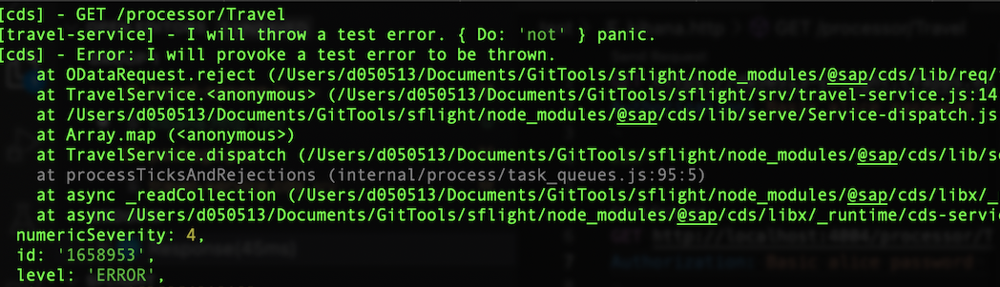
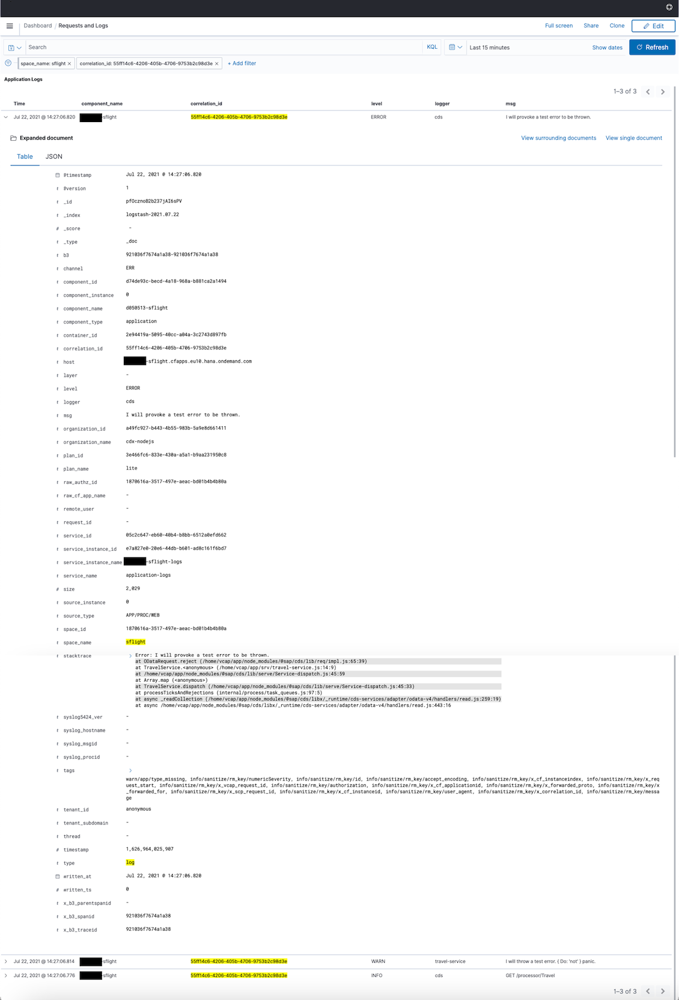
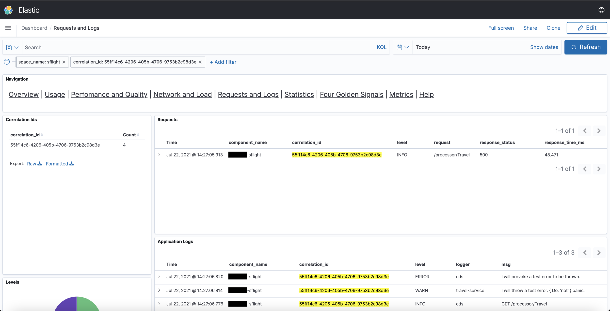

# Minimalistic Logging Facade


<!--- % include links-for-node.md %} -->
<!--- % include _toc levels="2,3" %} -->


## cds.log  <i>  (id?, options?) </i> { #cds-log}

Returns a logger identified by the given id.

```js
const LOG = cds.log('sql')
LOG.info ('whatever', you, 'like...')
```

#### *Arguments*
- `id?` —  the id for which a logger is requested — default: `'cds'`
- `options?` — alternative to `level` pass an options object with:
  - `level?` — the [log level](#log-levels)  specified as string or number — default: `'info'`
  - `label?` — the [log label](#logger-label) to add to each log output — default: `id`
- `level?` — specify a string instead of `options` as a shorthand for `{level}`

```js
// all following are equivalent...
const LOG = cds.log('foo', 'warn')  //> shorthand for:
const LOG = cds.log('foo', { level: 'warn' })
// including case-insensitivity...
const LOG = cds.log('foo', 'WARN')  //> shorthand for:
const LOG = cds.log('foo', { level: 'WARN' })
```


### *Logger `id` — cached & shared loggers* {#logger-id}

The loggers constructed by `cds.log()` are cached internally, and the same instances are returned on subsequent invocations of `cds.log()` with the same `id`. This allows to use and share the same logger in different modules.

```js
const LOG1 = cds.log('foo')
const LOG2 = cds.log('foo')
console.log (LOG1 === LOG2) //> true
```

### *Logger `label` — used to prefix log output* {#logger-label}

By default, each log output is prefixed with `[<id>] -`, for example, as in `[cds] - server listening `. Sometimes you may want to use different ids and labels. Use option `label`  to do so as in this examples:

```js
const LOG = cds.log('foo',{label:'bar'})
LOG.info("it's a foo")
//> [bar] - it's a foo
```

### _Logger usage → much like `console`_ { #logger-api }

Loggers returned by `cds.log()` look and behave very much like [JavaScript's standard `console` object](https://nodejs.org/api/console.html) a log method for each [log level](#log-levels):

```js
cds.log() → {
  trace(...), _trace,
  debug(...), _debug,
  info(...),  _info, log(...), // alias for info()
  warn(...),  _warn,
  error(...), _error,
}
```

In addition, there is a boolean indicator to check which levels are active through corresponding underscored property, for example, `LOG._debug` is true if debug is enabled.

### *Recommendations*
1. **Leave formatting to the log functions** — for example don't expensively construct debug messages, which aren't logged at all if debug is not switched on. For example:

   ```js
   // DONT:
   const { format } = require('util')
   LOG.debug (`Expected ${arg} to be a string, but got: ${format(value)}`)
   // DO:
   LOG.debug ('Expected', arg, 'to be a string, but got', value)
   ```

2. **Check levels explicitly** — to further minimize overhead you can check whether a log level is switched on using the boolean `Logger._<level>` properties like so:

   ```js
   const LOG = cds.log('sql')
   LOG._info && LOG.info ('whatever', you, 'like...')
   ```


## cds.log.format { #cds-log-format}

### _Setting Formats for New Loggers_

You can provide a custom log formatter function by setting `cds.log.format` programmatically as shown below, for example in your custom `server.js`.


```js
// the current default:
cds.log.format = (id, level, ...args) => [ `[${id}]`, '-', ...args ]
```
```js
// a verbose format:
const _levels = [ 'SILENT', 'ERROR', 'WARN', 'INFO', 'DEBUG', 'TRACE' ]
cds.log.format = (id, level, ...args) => [
  '[', (new Date).toISOString(),
  '|', _levels[level].padEnd(5),
  '|', cds.context?.tenant || '-',
  '|', cds.context?.id || '-',
  '|', id, '] -', ...args
]
```

Formatter functions are expected to return an array of arguments, which are passed to the logger functions — same as the arguments for `console.log()`.

### _Setting Formats for Existing Loggers_

You can also change the format used by newly or formerly constructed loggers using `.setFormat()` function:

```js
const _levels = [ 'SILENT', 'ERROR', 'WARN', 'INFO', 'DEBUG', 'TRACE' ]
const LOG = cds.log('foo') .setFormat ((id, level, ...args) => [
  '[', (new Date).toISOString(),
  '|', _levels[level].padEnd(5),
  '|', cds.context?.tenant || '-',
  '|', cds.context?.id || '-',
  '|', id, '] -', ...args
])
```


## cds.log.levels { #log-levels }

Constants of supported log levels:

```js
cds.log.levels = {
  SILENT: 0,    // all log output switched off
  ERROR: 1,     // logs errors only
  WARN: 2,      // logs errors and warnings only
  INFO: 3,      // logs errors, warnings and general infos
  DEBUG: 4,     // logs errors, warnings, info, and debug
                // (and trace when using default logger implementation)
  TRACE: 5,     // most detailed log level
  SILLY: 5,     // alias for TRACE
  VERBOSE: 5    // alias for TRACE
}
```

You can use these constants when constructing loggers, for example:

```js
const LOG = cds.log('foo', cds.log.levels.WARN)
```


### *Configuring Log Levels*

Configure initial log-levels per module through `cds.log.levels`, for example like that in your `package.json`:

```json
{
  "cds": {
    "log": {
      "levels": {
        "sql": "debug",
        "cds": "info"
      }
    }
  }
}
```

[Learn more about `cds.env`.](cds-env){.learn-more}

[See pre-defined module names below.](#cds-log-modules){.learn-more}


### *Programmatically Set Log Levels*
You can specify a default log level to use when constructing a logger as shown above. When called subsequently with a *different* log level, the cached and shared logger's log level will be changed dynamically. For example:

```js
// some-module.js
const LOG = cds.log('foo') // using default log level 'info'
```

```js
// some-other-module.js
const LOG = cds.log('foo') // shares the same logger as above
```

```js
// some-controller-module.js
cds.log('foo','debug') // switches the 'foo' logger to 'debug' level
```


### *Log Levels as Used by the CAP Node.js Runtime*

The CAP Node.js runtime uses the following guidelines with regards to which log level to use in which situation:

- `error`: Something went horribly wrong and it's unclear what to do (that is, an unexpected error).
- `warn`: Something off the happy trail happened, but it can be handled (that is, an expected error).
- `info`: Brief information about what is currently happening.
- `debug`: Detailed information about what is currently happening.
- `trace`/`silly`/`verbose` (not used by the CAP Node.js runtime): Exhaustive information about what is currently happening.


## cds.log.Logger

Constructs a new logger with the method signature of `{ trace, debug, log, info, warn, error }` (cf. [`console`](https://nodejs.org/api/console.html)). The default implementation maps each method to the equivalent methods of `console`.

You can assign different implementations by exchanging the factory with your own, for example, in order to integrate advanced logging frameworks such as [winston](#winston).

#### *Arguments*

- `label`— the log label to use with each log output, if applicable
- `level`— the log level to enable → *0=off, 1=error, 2=warn, 3=info, 4=debug, 5=trace*


### *Using `winston` Loggers* {#winston}

**Prerequisites:** You need to add [winston](https://www.npmjs.com/package/winston) to your project:
```sh
npm add winston
```

Being designed as a simple log facade, `cds.log` can be easily integrated with advanced logging frameworks such as  [`winston`](https://www.npmjs.com/package/winston). For example, using the built-in convenience method `cds.log.winstonLogger()` in your project's server.js like that:

```js
cds.log.Logger = cds.log.winstonLogger()
```

You can specify winston custom options to that method [as documented for `winston.createLogger()`](https://github.com/winstonjs/winston#creating-your-own-logger), for example like that:

```js
cds.log.Logger = cds.log.winstonLogger({
  format: winston.format.simple(),
  transports: [
    new winston.transports.Console(),
    new winston.transports.File({
      filename: 'errors.log',
      level: 'error'
    })
  ],
})
```

### _Custom Loggers_

Custom loggers basically have to return an object fulfilling the `console`-like [`cds.log` loggers API](#logger-api) as in this example:

```js
const winston = require("winston")
const util = require('util')
const cds = require('@sap/cds')
cds.log.Logger = (label, level) => {
  // construct winston logger
  const logger = winston.createLogger({
    levels: cds.log.levels, // use cds.log's levels
    level: Object.keys(cds.log.levels)[level],
    transports: [new winston.transports.Console()],
  })
  // winston's log methods expect single message strings
  const _fmt = (args) => util.formatWithOptions(
    {colors:false}, `[${label}] -`, ...args
  )
  // map to cds.log's API
  return Object.assign (logger, {
    trace: (...args) => logger.TRACE (_fmt(args)),
    debug: (...args) => logger.DEBUG (_fmt(args)),
    log:   (...args) => logger.INFO  (_fmt(args)),
    info:  (...args) => logger.INFO  (_fmt(args)),
    warn:  (...args) => logger.WARN  (_fmt(args)),
    error: (...args) => logger.ERROR (_fmt(args)),
  })
}
```

Actually, the above is essentially the implementation of `cds.log.winstonLogger()`.


## `DEBUG` env variable

Use env variable `DEBUG` to quickly switch on debug output from command line like that:

```sh
DEBUG=app,sql cds watch
DEBUG=all cds watch
```

Values can be

  - comma-separated list of [logger ids](#logger-id), or
  - the value `all` to switch on all debug output.

### *Matching multiple values of `DEBUG`*

When obtaining loggers with `cds.log()` you can specify alternate ids that will all be matched against the entries of the `DEBUG` env variable; for example:

```js
const LOG = cds.log('db|sql')
```

Will be debug-enabled by both, `DEBUG=db`, as well as `DEBUG=sql ...`.

**Note:** The alternative ids specified after `|` have no impact on the unique logger ids. That is, the logger above will have the id `'db'`, while `'sql'` will only be used for matching against `DEBUG` env variable.

## Configuration
Configuration for `cds.log()` can be specified through `cds.env.log`, for example like that in your `package.json`:

```json
{
  "cds": {
    "log": {
      "levels": {
        "sql": "debug",
        "cds": "info"
      }
    }
  }
}
```

[Learn more about `cds.env`.](cds-env){.learn-more}

The following configuration options can be applied:

- `levels` — configures log levels for logged modules. The keys refer to the [loggers' `id`](#logger-id), the values are lower-case names of [log levels](#log-levels).

- `user` — Specify `true` to log the user's ID (`req.user.id`) as `remote_user` (Kibana formatter only). Consider the data privacy implications! Default: `false`.

- `sanitize_values`— Specify `false` to deactivate the default behavior of sanitizing payload data in debug logs in production. Default: `true`.

## Common IDs { #cds-log-modules }

The runtime uses the same logger facade, that is `cds.log()`. For each component, it requires a separate logger. So projects can set different log levels for different components/layers. The following table lists the ids used to set the log levels:

| Component                                | Logger IDs(s)     |
|------------------------------------------|-------------------|
| Server and common output                 | `cds`             |
| CLI output                               | `cli`             |
| CDS build output                         | `build`           |
| [Application Service](./app-services)    | `app`             |
| [Databases](databases)                   | `db\|sql`         |
| [Messaging Service](messaging)           | `messaging`       |
| [Remote Service](remote-services)        | `remote`          |
| AuditLog Service                         | `audit-log`       |
| OData Protocol Adapter                   | `odata`           |
| REST Protocol Adapter                    | `rest`            |
| GraphQL Protocol Adapter                 | `graphql`         |
| [Authentication](./authentication)       | `auth`            |
| Database Deployment                      | `deploy`          |
| Multitenancy and Extensibility           | `mtx`             |


## Logging in Development

During development, we want concise, human-readable output in the console, with clickable stack traces in case of errors. You should not be overloaded with information that is additionally obfuscated by a bad rendering. Hence, [console.log()](https://nodejs.org/api/console.html#console_console_log_data_args), that makes use of [util.format()](https://nodejs.org/api/util.html#util_util_format_format_args) out of the box, with raw arguments is a good choice.

The *plain log formatter*, which is the default in non-production environments, prepends the list of arguments with `[<module> -]`. The following screenshot shows the log output for the previous warning and rejection with the plain log formatter.



The plain log formatter is the default formatter in non-production.


## Logging in Production

SAP BTP offers two services, [SAP Cloud Logging](https://help.sap.com/docs/cloud-logging) and [SAP Application Logging Service](https://help.sap.com/docs/application-logging-service), to which bound Cloud Foundry applications can stream logs.
In both services, operators can access and analyze observability data, as described in [Access and Analyze Observability Data](https://help.sap.com/docs/cloud-logging/cloud-logging/access-and-analyze-observability-data) for SAP Cloud Logging and [Access and Analyze Application Logs, Container Metrics and Custom Metrics](https://help.sap.com/docs/application-logging-service/sap-application-logging-service/access-and-analyze-application-logs-container-metrics-and-custom-metrics) for SAP Application Logging Service.
To get connected with either of those services, the application needs to be bound to the respective service instance(s) as described for [SAP Cloud Logging](https://help.sap.com/docs/cloud-logging/cloud-logging/ingest-via-cloud-foundry-runtime?version=Cloud) and [SAP Application Logging Service](https://help.sap.com/docs/application-logging-service/sap-application-logging-service/produce-logs-container-metrics-and-custom-metrics).

Additionally, the log output needs to be formatted in a way that enables the respective dashboard technology to optimally support the user, for example, filtering for logs of specific levels, modules, status, etc.

The *JSON log formatter* constructs a loggable object from the passed arguments as well as [cds.context](events#cds-event-context) and the headers of the incoming request (if available).

The JSON log formatter is the default formatter in production.

::: tip
Since `@sap/cds 7.5`, running `cds add kibana-logging` or setting <Config>cds.features.kibana_formatter: true</Config> are no longer needed. If you want to opt-out of the JSON formatter in production, set <Config>cds.log.format: plain</Config>.
:::

Further, there are two formatting aspects that are activated automatically, if appropriate, and add the following information to the loggable object:
1. Running on Cloud Foundry: `tenant_subdomain`, `CF_INSTANCE_IP` and information from `VCAP_APPLICATION`
1. Bound to an instance of the [SAP Application Logging Service](https://help.sap.com/docs/application-logging-service/sap-application-logging-service/sap-application-logging-service-for-cloud-foundry-environment) or [SAP Cloud Logging](https://help.sap.com/docs/cloud-logging/sap-cloud-logging/what-is-sap-cloud-logging): `categories` and *custom fields* as described in [Custom Fields](#custom-fields)

The following screenshot shows the log output for the rejection in the previous example with the JSON log formatter including the two aspects.



::: warning
The SAP Application Logging Service offers [different plans with different quotas](https://help.sap.com/docs/application-logging-service/sap-application-logging-service/service-plans-and-quotas). Please make sure the plan you use is sufficient, that is, no logs are being dropped so that the information is available in Kibana. As soon as logs are dropped, you cannot reliably assess what is going on in your app.
:::


### Header Masking

Some header values shall not appear in logs, for example when pertaining to authorization. Configuration option <Config keyOnly>cds.log.mask_headers: ["/authorization/i", "/cookie/i", "/cert/i", "/ssl/i"]</Config> allows to specify a list of matchers for which the header value shall be masked. Masked values are printed as `***`. The default value is `["/authorization/i", "/cookie/i", "/cert/i", "/ssl/i"]`.

::: warning
In case your application shares any sensitive data (for example, secrets) via headers, please ensure that you adjust the configuration as necessary.
:::

::: tip
In the log entry, header field names are normalized to lowercase with `_` instead of `-`.
Make sure your matchers work on the original header name, for example, `"/Foo-Bar/"` instead of the normalized `"/foo_bar/"`.
:::


### Custom Fields { #custom-fields }

Information that is not included in the [list of supported fields](https://help.sap.com/docs/application-logging-service/sap-application-logging-service/supported-fields) of the SAP Application Logging Service can be shown as additional information. This information needs to be provided as custom fields.

By default, the JSON formatter uses the following custom fields configuration for SAP Application Logging Service:

```jsonc
{
  "log": {
    "als_custom_fields": {
      // <key>: <index>
      "query": 0,                //> sql
      "target": 1, "details": 2, //> generic validations
      "reason": 3                //> errors
    }
  }
}
```

Up to 20 such custom fields can be provided using this mechanism. The advantage of this approach is that the additional information can be indexed. Besides being a manual task, it has the drawback that the indexes should be kept stable.

::: details Background

The SAP Application Logging Service requires the following formatting of custom field content inside the JSON object that is logged:

```js
{
  ...,
  '#cf': {
    strings: [
      { k: '<key>', v: '<value>', i: <index> },
      ...
    ]
  }
}
```

That is, a generic collection of key-value-pairs that are treated as opaque strings.

The information is then rendered as follows:

```txt
custom.string.key0: <key>
custom.string.value0: <value>
```

Hence, in order to analyze, for example, the SQL statements leading to errors, you'd need to look at field `custom.string.value0` (given the default of `cds.env.log.als_custom_fields`).

In a more practical example, the log would look something like this:

```log
msg: SQL Error: Unknown column "IDONTEXIST" in table "DUMMY"
...
custom.string.key0: query
custom.string.value0: SELECT IDONTEXIST FROM DUMMY
```

Without the additional custom field `query` and it's respective value, it would first be necessary to reproduce the issue locally to know what the faulty statement is.

:::

For SAP Cloud Logging, the JSON formatter uses the following default configuration:

```jsonc
{
  "log": {
    "cls_custom_fields": [
      "query",             //> sql
      "target", "details", //> generic validations
      "reason"             //> errors
    ]
  }
}
```

In order for the JSON formatter to detect the binding to SAP Cloud Logging via user-provided service, the user-provided service must have either tag `cloud-logging` or `Cloud Logging`.
(For existing user-provided services, tags can be added via [`cf update-user-provided-service`](https://cli.cloudfoundry.org/en-US/v7/update-user-provided-service.html).)

The key-value pairs can either be part of the first argument or an exclusive object thereafter:

```js
LOG.info({ message: 'foo', reason: 'bar' })
LOG.info('foo', { reason: 'bar' })
```

As always, both defaults are overridable via [cds.env](cds-env#cds-env).


## Request Correlation { #node-observability-correlation }

Unfortunately, there is no standard correlation ID header. `x-correlation-id` and `x-request-id` are the most commonly used, but SAP products often use `x-correlationid` (that is, without the second hyphen) and SAP BTP uses `x-vcap-request-id` when logging incoming requests.

As CAP aims to be platform independent, we check an array of headers (or generate a new ID if none hits) and ensure the value available at `cds.context.id` as well as `req.headers['x-correlation-id']`:

```js
const { headers: h } = req
const id = h['x-correlation-id'] || h['x-correlationid']
  || h['x-request-id'] || h['x-vcap-request-id']
  || uuid()
if (!cds.context) cds.context = { id }
req.headers['x-correlation-id'] = cds.context.id
```

Subsequently, the JSON log formatter (see [Logging in Production](#logging-in-production)) sets the following fields:
- `cds.context.id` &rarr; `correlation_id`
- Request header `x_vcap_request_id` &rarr; `request_id`
- Request header `traceparent` (cf. [W3C Trace Context](https://www.w3.org/TR/trace-context/)) &rarr; `w3c_traceparent`

Specifically field `w3c_traceparent` is then used by both SAP Application Logging Service and SAP Cloud Logging to determine field `trace_id` in order to correlate requests, logs, and traces across multiple applications.

The following screenshot shows an example for log correlation based on field `correlation_id` in a log analytic dashboard of the [SAP Application Logging Service for SAP BTP](https://help.sap.com/docs/application-logging-service).


