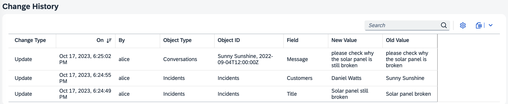

# CAP Plugins & Enhancements

Following is a curated list of plugins that are available for the SAP Cloud Application Programming Model (CAP) which provide integration with BTP services and technologies, or other SAP products.

::: tip Maintained by CAP and SAP
These plugins are created and maintained in close collaboration and shared ownership of CAP development teams and other SAP and BTP development teams.
:::


[[toc]]

<style>
   h2 : {
      border-top: 1px solid #ddd;
   }
   h2 + .subtitle {
      font-style: italic;
      margin: -44px 0 40px;
   }
</style>


## As _cds-plugins_ for Node.js

For Node.js all these plugins are implemented using the [`cds-plugin`](../node.js/cds-plugins) technique, which features minimalistic setup and **plug & play** experience. Usually usage is as simple as that, like for the [Audit Logging](../guides/data-privacy/audit-logging) plugin:

1. Add the plugin:

   ```sh
   npm add @cap-js/audit-logging
   ```

2. Add annotations to your models:

   ```cds
   annotate Customer with @PersonalData ...;
   ```

3. Test-drive locally:

   ```sh
   cds watch
   ```
   > → audit logs are written to console in dev mode.

4. Bind the platform service.

   > → audit logs are written to Audit Log service in production.


## GraphQL Adapter
[@cap-js/graphql](https://www.npmjs.com/package/@cap-js/graphql) {.subtitle}

The GraphQL Adapter is a protocol adapter that generically generates a GraphQL schema for the models of an application and serves an endpoint that allows you to query your services using the [GraphQL](https://graphql.org) query language. All you need to do is to add the `@graphql` annotation to your service definitions like so:

```cds
@graphql service MyService { ... }
```

Available for:

[](https://www.npmjs.com/package/@cap-js/graphql)

Click on the icon to get detailed instructions. {.learn-more}


## OData v2 Proxy
[@cap-js-community/odata-v2-adapter](https://www.npmjs.com/package/@cap-js-community/odata-v2-adapter) {.subtitle}

The OData v2 Proxy is a protocol adapter that allows you to expose your services as OData v2 services. For Node.js, this is provided through the [@cap-js-community/odata-v2-adapter](https://www.npmjs.com/package/@cap-js-community/odata-v2-adapter) plugin, which converts incoming OData V2 requests to CDS OData V4 service calls and responses back. For Java, this is built in.

Available for:

[](https://www.npmjs.com/package/@cap-js-community/odata-v2-adapter)
[](../java/migration#v2adapter)

Click on the icons to get detailed instructions. {.learn-more}

See also [_Advanced > OData APIs > V2 Support_](../advanced/odata#v2-support) {.learn-more}


## UI5 Dev Server
[cds-plugin-ui5](https://www.npmjs.com/package/cds-plugin-ui5) {.subtitle}

The UI5 Dev Server is a CDS server plugin that enables the integration of UI5 (UI5 freestyle or Fiori elements) tooling-based projects into the CDS server via the UI5 tooling express middlewares. It allows to serve dynamic UI5 resources, including TypeScript implementations for UI5 controls, which get transpiled to JavaScript by the plugin automatically.

Available for:

[](https://www.npmjs.com/package/cds-plugin-ui5)

Click on the icon to get detailed instructions. {.learn-more}


## Change Tracking
[@cap-js/change-tracking](https://npmjs.com/package/@cap-js/change-tracking) {.subtitle}

The Change Tracking plugin provides out-of-the box support for automated capturing, storing, and viewing of the change records of modeled entities. All we need is to add @changelog annotations to your models to indicate which entities and elements should be change-tracked.

```cds
annotate my.Incidents {
  customer @changelog: [customer.name];
  title    @changelog;
  status   @changelog;
}
```



Available for:

[](https://npmjs.com/package/@cap-js/change-tracking)

Click on the icon to get detailed instructions. {.learn-more}


## Audit Logging
[@cap-js/audit-logging](https://www.npmjs.com/package/@cap-js/audit-logging) {.subtitle}

The new Audit Log plugin provides out-of-the box support for logging personal data-related operations with the [SAP Audit Log Service](https://discovery-center.cloud.sap/serviceCatalog/audit-log-service). All we need is annotations of respective entities and fields like that:

```cds
annotate my.Customers with @PersonalData {
  ID           @PersonalData.FieldSemantics: 'DataSubjectID';
  name         @PersonalData.IsPotentiallyPersonal;
  email        @PersonalData.IsPotentiallyPersonal;
  creditCardNo @PersonalData.IsPotentiallySensitive;
}
```

Features:

- Simple, Annotation-based usage → automatically logging personal data-related events
- CAP Services-based programmatic client API → simple, backend-agnostic
- Logging to console in development → fast turnarounds, minimized costs
- Logging to [SAP Audit Log Service](https://discovery-center.cloud.sap/serviceCatalog/audit-log-service) in production
- Transactional Outbox → maximised scalability and resilience

Available for:

[](../guides/data-privacy/audit-logging)
[](../java/auditlog)

Click on the icons to get detailed instructions. {.learn-more}

## Notifications

[@cap-js/notifications](https://www.npmjs.com/package/@cap-js/notifications) {.subtitle}

The Notifications plugin provides integration with the [SAP Alert Notifications](https://discovery-center.cloud.sap/serviceCatalog/alert-notification) service to send notifications via email, Slack, Microsoft Teams, or SAP Fiori notifications. The client is implemented as a CAP service, which gives us a very simple programmatic API:

```js
let alert = await cds.connect.to ('notifications')
await alert.notify({
   recipients: [ ...supporters ],
   title: `New incident created by ${customer.info}`,
   description: incident.title
})
```

Features:

- CAP Services-based programmatic client API → simple, backend-agnostic
- Logging to console in development → fast turnarounds, minimized costs
- Sending to [SAP Alert Notification Service](https://discovery-center.cloud.sap/serviceCatalog/alert-notification) in production
- Transactional Outbox → maximised scalability and resilience
- Notification templates with i18n support
- Automatic lifecycle management of notification templates
- SAP ANS supports email, Slack, Microsoft Teams, and SAP Fiori notifications

Available for:

[](https://github.com/cap-js/notifications#readme)

Click on the icon to get detailed instructions. {.learn-more}


<div id="attachments" />

<div id="internal-plugins" />

<div id="upcoming-plugins" />

<div id="planned-plugins" />