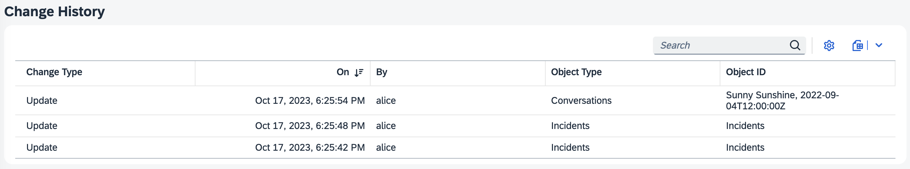

# CAP Plugins & Enhancements

Following is a curated list of plugins that are available for the SAP Cloud Application Programming Model (CAP) which provide integration with BTP services and technologies, or other SAP products.

::: tip Maintained by CAP and SAP
These plugins are created and maintained in close collobaration and shared ownership of CAP development teams and other SAP and BTP development teams.
:::


[[toc]]

<style>
   h2 : {
      border-top: 1px solid #ddd;
   }
   h2 + .subtitle {
      font-style: italic;
      margin: -44px 0 40px;
   }
</style>


## As _cds-plugins_ for Node.js

For Node.js all these are implemented using the [`cds-plugin`](../node.js/cds-plugins) technique, which features minimalistic setup and **plug & play** experience. Usually usage is as simple as that, for example for the [Audit Logging](../guides/data-privacy/audit-logging) plugin:

1. Add the plugin:

   ```sh
   npm add @cap-js/audit-logging
   ```

2. Add annotations to your models:

   ```cds
   annotate Customer with @PersonalData ...;
   ```

3. Test-drive Locally

   ```sh
   cds watch
   ```
   > → audit logs are written to console in dev mode.

4. Bind the platform service

   > → audit logs are written to Audit Log service in production.


## GraphQL Adaptor
[@cap-js/graphql](https://www.npmjs.com/package/@cap-js/graphql) {.subtitle}

This protocol adapter generically generates a GraphQL schema for the models of an application and serves an endpoint that allows you to query your services using the [GraphQL](https://graphql.org) query language. All you need to do is to add the `@graphql` annotation to your service definitions like so:

```cds
@graphql service MyService { ... }
```

Available for:

[{style="height:2.5em; display:inline; margin:0 1em"}](https://www.npmjs.com/package/@cap-js/graphql)

Click on the icon to get detailed instructions. {.learn-more}


## OData v2 Proxy

The OData v2 Proxy is a protocol adapter that allows you to expose your services as OData v2 services. For Node.js this is provided through the [@cap-js-community/odata-v2-adapter](https://www.npmjs.com/package/@cap-js-community/odata-v2-adapter) plugin, which converts incoming OData V2 requests to CDS OData V4 service calls and responses back. For Java, this is built in.

Available for:

[{style="height:2.5em; display:inline; margin:0 1em"}](https://www.npmjs.com/package/@cap-js-community/odata-v2-adapter)
[{style="height:3em; display:inline; margin:0 1em"}](../java/migration#v2adapter)

Click on the icons to get detailed instructions. {.learn-more}

See also [_Advanced > OData APIs > V2 Support_](../advanced/odata#v2-support) {.learn-more}


## UI5 Dev Server
[cds-plugin-ui5](https://www.npmjs.com/package/cds-plugin-ui5) {.subtitle}

The cds-plugin-ui5 is a CDS server cds-plugin which enables the integration of UI5 tooling based (UI5 freestyle or Fiori elements) projects into the CDS server via the UI5 tooling express middlewares. It allows to serve dynamic UI5 resources from, including TypeScript implementations for UI5 controls, which get transpiled to JavaScript by the plugin automatically.

Available for:

[{style="height:2.5em; display:inline; margin:0 1em"}](https://www.npmjs.com/package/cds-plugin-ui5)

Click on the icon to get detailed instructions. {.learn-more}


## Change Tracking

The Change Tracking plugin provides out-of-the box support for automatic capturing, storing, and viewing of the change records of modeled entities. All we need is to add @changelog annotations to your models to indicate which entities and elements should be change-tracked.

```cds
annotate my.Incidents {
  customer @changelog: [customer.name];
  title    @changelog;
  status   @changelog;
}
```



Available for:

[{style="height:2.5em;display:inline; margin:0 1em"}](https://npmjs.com/package/@cap-js/change-tracking)

Click on the icon to get detailed instructions. {.learn-more}


## Audit Logging

The Audit Log plugins provide out-of-the box support for audit logging personal data-related operations with the SAP BTP Audit Logging Service. All we need is annotations of respective entities and fields like that:

```cds
annotate my.Customers with @PersonalData {
  ID           @PersonalData.FieldSemantics: 'DataSubjectID';
  name         @PersonalData.IsPotentiallyPersonal;
  email        @PersonalData.IsPotentiallyPersonal;
  creditCardNo @PersonalData.IsPotentiallySensitive;
}
```

Features:

- Simple, annotation-based usage
- Minimized performance impact through asynchroneous logging
- Ultimate resilience through transactional outbox.

Available for:

[{style="height:2.5em; display:inline; margin:0 1em"}](../guides/data-privacy/audit-logging)
[{style="height:3em; display:inline; margin:0 1em"}](../java/auditlog)

Click on the icons to get detailed instructions. {.learn-more}

## Notifications

## Attachments


<div id="internal-plugins" />

<div id="upcoming-plugins" />

<div id="planned-plugins" />