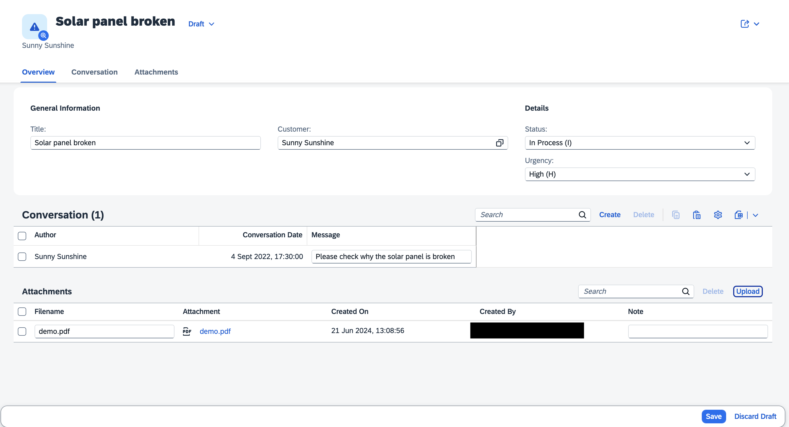
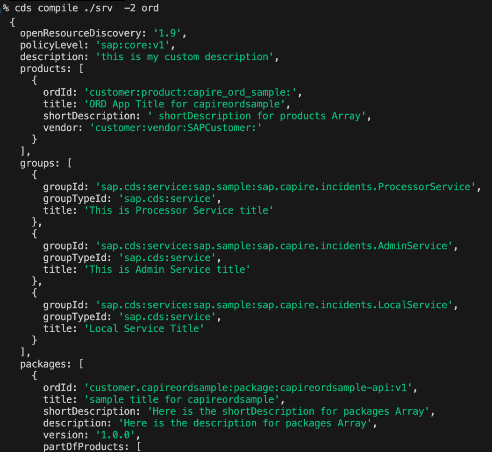

# CAP Plugins & Enhancements

Following is a curated list of plugins that are available for the SAP Cloud Application Programming Model (CAP) which provide integration with SAP BTP services and technologies, or other SAP products.

::: tip Maintained by CAP and SAP
The `@cap-js`-scoped plugins are created and maintained in close collaboration and shared ownership of CAP development teams and other SAP development teams.
:::

[[toc]]

<style scoped>
   main .vp-doc h2 + .subtitle {
      font-style: italic;
      margin: -44px 0 40px;
   }
   main .vp-doc a:has(> img) {
      display: inline-flex;
      align-items: center;
      transition: opacity 0.2s;
   }
   main .vp-doc a:has(> img):hover {
      opacity: 0.7;
   }
   main .vp-doc a:has(> img):not(:last-child) {
      margin-right: 1em;
   }
</style>


## As _cds-plugins_ for Node.js

For Node.js all these plugins are implemented using the [`cds-plugin`](../node.js/cds-plugins) technique, which features minimalistic setup and **plug & play** experience. Usually usage is as simple as that, like for the [Audit Logging](../guides/data-privacy/audit-logging) plugin:

1. Add the plugin:

   ```sh
   npm add @cap-js/audit-logging
   ```

2. Add annotations to your models:

   ```cds
   annotate Customer with @PersonalData ...;
   ```

3. Test-drive locally:

   ```sh
   cds watch
   ```
   > → audit logs are written to console in dev mode.

4. Bind the platform service.

   > → audit logs are written to Audit Log service in production.

## As Plugin for CAP Java

The [CAP Java plugin technique](../java/building-plugins) makes use of _jar_-files which are distributed as Maven packages.
By adding an additional Maven dependency to the project, the plugin automatically adds functionality or extensions to the CDS model.
For [Audit Logging V2](../java/auditlog#handler-v2) it looks like this:

1. Add the Maven dependency (in _srv/pom.xml_):
   ```xml
   <dependency>
     <groupId>com.sap.cds</groupId>
     <artifactId>cds-feature-auditlog-v2</artifactId>
     <scope>runtime</scope>
   </dependency>
   ```
2. Add annotations to your model:

   ```cds
   annotate Customer with @PersonalData ...;
   ```
   > → audit logs are written to console in dev mode.

3. Bind the platform service.

   > → audit logs are written to SAP Audit Log service.

## Support for Plugins

Use one of the support channels below, in this order:

1. Open an issue in the **plugin's GitHub repository**.

   Find the link in the plugin list below (if the plugin has a public repository).

2. Ask a question in the [SAP community](/resources/ask-question-vscode).

   This applies to all plugins, especially those without public repositories. Or if you're not quite sure that the problem is caused by the plugin.

3. Open incidents through [SAP Support Portal](/resources/#support-channels).

   Note that plugins by external parties, like the [CAP JS](https://github.com/cap-js-community/) community, are out of scope for incidents.

:::tip Public channels help everyone.
Prefer public repositories and issues over private/internal ones, as they help everyone using CAP to find solutions quickly.
:::


<div id="internal-support" />

<br>

:::info Complete list of plugins
As CAP is blessed with an active community, there are many useful plugins available created by the community. Have a look at the [CAP JS community](https://github.com/cap-js-community) to browse all available plugins. A broader collection of plugins can be found at [bestofcapjs.org](https://bestofcapjs.org/)
:::

## OData V2 Adapter {#odata-v2-proxy}

OData V2 has been deprecated. Use the plugin only if you need to support existing UIs or if you need to use specific controls that don't work with V4 **yet** like, tree tables (sap.ui.table.TreeTable). The CDS OData V2 Adapter is a protocol adapter that allows you to expose your services as OData V2 services. For Node.js, this is provided through the [@cap-js-community/odata-v2-adapter](https://www.npmjs.com/package/@cap-js-community/odata-v2-adapter) plugin, which converts incoming OData V2 requests to CDS OData V4 service calls and responses back. For Java, this is built in.

Available for:

[{style="height:2.5em; display:inline; margin:0 0.2em;"}](https://github.com/cap-js-community/odata-v2-adapter#readme)
[{style="height:3em; display:inline; margin:0 0.2em;"}](../java/migration#v2adapter)

See also [Cookbook > Protocols/APIs > OData APIs > V2 Support](../advanced/odata#v2-support) {.learn-more}

## WebSocket

Exposes a WebSocket protocol via WebSocket standard or Socket.IO for CDS services.

```cds
@protocol: 'websocket'
service ChatService {
  function message(text: String) returns String;
  event received {
    text: String;
  }
}
```

Available for:

[{style="height:2.5em; display:inline; margin:0 0.2em;"}](https://github.com/cap-js-community/websocket#readme)

## UI5 Dev Server


The UI5 Dev Server is a CDS server plugin that enables the integration of UI5 (UI5 freestyle or Fiori elements) tooling-based projects into the CDS server via the UI5 tooling express middlewares. It allows to serve dynamic UI5 resources, including TypeScript implementations for UI5 controls, which get transpiled to JavaScript by the plugin automatically.

Available for:

[{style="height:2.5em; display:inline; margin:0 0.2em;"}](https://github.com/ui5-community/ui5-ecosystem-showcase/tree/main/packages/cds-plugin-ui5#cds-plugin-ui5)

## GraphQL Adapter

The GraphQL Adapter is a protocol adapter that generically generates a GraphQL schema for the models of an application and serves an endpoint that allows you to query your services using the [GraphQL](https://graphql.org) query language. All you need to do is to add the `@graphql` annotation to your service definitions like so:

```cds
@graphql service MyService { ... }
```

Available for:

[{style="height:2.5em; display:inline; margin:0 0.2em;"}](https://github.com/cap-js/graphql#readme)


## Attachments


The Attachments plugin provides out-of-the-box support for attachment handling. On Node.js, attachments are stored on AWS S/3 through [SAP BTP's Object Store service](https://discovery-center.cloud.sap/serviceCatalog/object-store), whereas Java stores attachments on the SAP HANA database. To use it, simply add a composition of the predefined aspect `Attachments` like so:

```cds
using { Attachments } from '@cap-js/attachments';
entity Incidents { ...
  attachments: Composition of many Attachments // [!code focus]
}
```

That's all we need to automatically add an interactive list of attachments to your Fiori UIs as shown below.


Features:

- Pre-defined type `Attachment` to use in entity definitions
- Automatic handling of all upload and download operations
- Automatic malware scanning for uploaded files
- (Automatic) Fiori Annotations for Upload Controls
- Streaming and piping to avoid memory overloads
- Support for different storage backends
- Support for Multitenancy


Available for:

[{style="height:2.5em; display:inline; margin:0 0.2em;"}](https://github.com/cap-js/attachments#readme)
[{style="height:3em; display:inline; margin:0 0.2em;"}](https://github.com/cap-java/cds-feature-attachments#readme)


## SAP Document Management Service {#@cap-js/sdm}

The SAP Document Management Service  plugin lets you easily store attachments (documents) in an [SAP Document Management service Repository](https://help.sap.com/docs/document-management-service).

To use this CAP-level integration, extend a domain model by using the predefined aspect called Attachments:

```cds
extend my.Incidents with {
  attachments: Composition of many Attachments
}
```



Features:

- **Pre-defined Type Attachment for Entity Definitions**: Seamlessly integrate attachments into your entity definitions with our pre-defined type, simplifying the process of linking files.
- **Automatic Management of File Operations**: Effortlessly manage file operations, including upload, view, download, delete, and rename functions, with built-in automation. This ensures a smooth and user-friendly experience.
- **Automated Malware Scanning for Uploaded Files**: Enhance security by automatically scanning all uploaded files for malware, ensuring the integrity and safety of your data.
- **Automatic Fiori Annotations for Upload Controls**: Streamlined user interactions with automatic SAP Fiori annotations that enhance upload controls, providing a more intuitive and seamless user experience.
- **Support for SAP Document Management Service-Hosted Cloud Repository**: Leverage the robust capabilities of the SAP Document Management service-hosted cloud repository to store and manage your documents efficiently.
- **Support for Third-Party CMIS-Compliant Repositories**: Integrate with third-party repositories that adhere to the Content Management Interoperability Services (CMIS) standard, offering flexibility and compatibility with various document management systems.
- **Intrinsic Multitenancy Handling**: Benefit from built-in multi-tenancy support, allowing for efficient management of multiple tenants without additional configuration.

Outlook:
- **Support for Versioned Repository**: Ensure better document control and historical tracking with native support for versioned repositories, enabling you to manage document revisions effectively.
- **Native Document Management Features with SAP Document Management Service**: Access a wide array of native document management features provided by the SAP Document Management service, including metadata management, advanced search capabilities, and audit trails. For more information, see [SAP Document Management Service](https://help.sap.com/docs/document-management-service/sap-document-management-service/what-is-document-management-service).

Available for:

[{style="height:2.5em; display:inline; margin:0 0.2em;"}](https://github.com/cap-js/sdm/#readme)
[{style="height:3em; display:inline; margin:0 0.2em;"}](https://github.com/cap-java/sdm/#readme)


## Audit Logging


The new Audit Log plugin provides out-of-the box support for logging personal data-related operations with the [SAP Audit Log Service](https://discovery-center.cloud.sap/serviceCatalog/audit-log-service). All we need is annotations of respective entities and fields like that:

```cds
annotate my.Customers with @PersonalData : {
  DataSubjectRole : 'Customer',
  EntitySemantics : 'DataSubject'
} {
  ID           @PersonalData.FieldSemantics: 'DataSubjectID';
  name         @PersonalData.IsPotentiallyPersonal;
  email        @PersonalData.IsPotentiallyPersonal;
  creditCardNo @PersonalData.IsPotentiallySensitive;
}
```

Features:

- Simple, Annotation-based usage → automatically logging personal data-related events
- CAP Services-based programmatic client API → simple, backend-agnostic
- Logging to console in development → fast turnarounds, minimized costs
- Logging to [SAP Audit Log Service](https://discovery-center.cloud.sap/serviceCatalog/audit-log-service) in production
- Transactional Outbox → maximised scalability and resilience

Available for:

[{style="height:2.5em; display:inline; margin:0 0.2em;"}](https://github.com/cap-js/audit-logging#readme)
{style="height:3em; display:inline; margin:0 0.2em;"}

Learn more about audit logging in [Node.js](../guides/data-privacy/audit-logging) and in [Java](../java/auditlog) {.learn-more}


## Change Tracking


The Change Tracking plugin provides out-of-the box support for automated capturing, storing, and viewing of the change records of modeled entities. All we need is to add @changelog annotations to your models to indicate which entities and elements should be change-tracked.

```cds
annotate my.Incidents {
  customer @changelog: [customer.name];
  title    @changelog;
  status   @changelog;
}
```


Available for:

[{style="height:2.5em; display:inline; margin:0 0.2em;"}](https://github.com/cap-js/change-tracking#readme)
[{style="height:3em; display:inline; margin:0 0.2em;"}](../java/change-tracking)


## Notifications


The Notifications plugin provides support for publishing business notifications in SAP Build WorkZone. The client is implemented as a CAP service, which gives us a very simple programmatic API:

```js
let alert = await cds.connect.to ('notifications')
await alert.notify({
   recipients: [ ...supporters ],
   title: `New incident created by ${customer.info}`,
   description: incident.title
})
```

Features:

- CAP Services-based programmatic client API → simple, backend-agnostic
- Logging to console in development → fast turnarounds, minimized costs
- Transactional Outbox → maximised scalability and resilience
- Notification templates with i18n support
- Automatic lifecycle management of notification templates


Available for:

[{style="height:2.5em; display:inline; margin:0 0.2em;"}](https://github.com/cap-js/notifications#readme)


## Telemetry


The Telemetry plugin provides observability features such as tracing and metrics, including [automatic OpenTelemetry instrumentation](https://opentelemetry.io/docs/concepts/instrumentation/automatic).
By enabling the plugin in your project, various kinds of telemetry data will be automatically collected. For Node.js, you will find telemetry output written to the console as follows:

```txt
[odata] - GET /odata/v4/processor/Incidents
[telemetry] - elapsed times:
  0.00 → 2.85 = 2.85 ms  GET /odata/v4/processor/Incidents
  0.47 → 1.24 = 0.76 ms    ProcessorService - READ ProcessorService.Incidents
  0.78 → 1.17 = 0.38 ms      db - READ ProcessorService.Incidents
  0.97 → 1.06 = 0.09 ms        @cap-js/sqlite - prepare SELECT json_object('ID',ID,'createdAt',createdAt,'creat…
  1.10 → 1.13 = 0.03 ms        @cap-js/sqlite - stmt.all SELECT json_object('ID',ID,'createdAt',createdAt,'crea…
  1.27 → 1.88 = 0.61 ms    ProcessorService - READ ProcessorService.Incidents.drafts
  1.54 → 1.86 = 0.32 ms      db - READ ProcessorService.Incidents.drafts
  1.74 → 1.78 = 0.04 ms        @cap-js/sqlite - prepare SELECT json_object('ID',ID,'DraftAdministrativeData_Dra…
  1.81 → 1.85 = 0.04 ms        @cap-js/sqlite - stmt.all SELECT json_object('ID',ID,'DraftAdministrativeData_Dr…
```

Telemetry data can be exported to [SAP Cloud Logging](https://help.sap.com/docs/cloud-logging) and Dynatrace. Node.js additionally supports Jaeger.

Available for:

[{style="height:2.5em; display:inline; margin:0 0.2em;"}](https://github.com/cap-js/telemetry#readme)
[{style="height:3em; display:inline; margin:0 0.2em;"}](../java/operating-applications/observability#open-telemetry)

## ORD (Open Resource Discovery)

This plugin enables generation of [Open Resource Discovery (ORD)](https://open-resource-discovery.github.io/specification/) documents for CAP based applications.

When you adopt ORD, your application gains a single entry point, known as the Service Provider Interface. This interface allows you to discover and gather relevant information or metadata. You can use this information to construct a static metadata catalog or to perform a detailed runtime inspection of your actual system landscapes.

{style="width:450px; box-shadow: 1px 1px 5px #888888" .mute-dark}

You can get the ORD document in multiple ways, see the readme of the plugin.

Available for:

[{style="height:2.5em; display:inline; margin:0 0.2em;"}](https://github.com/cap-js/ord)
[{style="height:3em; display:inline; margin:0 0.2em;"}](https://javadoc.io/doc/com.sap.cds/cds-feature-ord/latest/index.html)


## CAP Operator for Kubernetes {#cap-operator-plugin}

The [CAP Operator](https://sap.github.io/cap-operator/) manages and automates the lifecycle operations involved in running multitenant CAP applications on Kubernetes (K8s) clusters. If you deploy an application using the CAP Operator, you must manually define the custom resources for the application in a helm chart, which needs time and deep knowledge of helm concepts.

This is where the CAP Operator **plugin** is very useful, as it provides an easy way to generate such a helm chart, which can be easily modified.

Available for:

[{style="height:2.5em; display:inline; margin:0 0.2em;"}](https://github.com/cap-js/cap-operator-plugin#readme)
{style="height:3em; display:inline; margin:0 0.2em;"}


## SAP Cloud Application Event Hub {#event-hub}

The plugin provides out-of-the-box support for consuming events from [SAP Cloud Application Event Hub](https://discovery-center.cloud.sap/serviceCatalog/sap-cloud-application-event-hub) -- for example emitted by SAP S/4HANA Cloud -- in stand-alone CAP applications.

```js
const S4Bupa = await cds.connect.to ('API_BUSINESS_PARTNER')
S4bupa.on ('BusinessPartner.Changed', msg => {...})
```

<div id="eh-plugin-mt" />

For more details, please see [Events and Messaging &rarr; Using SAP Cloud Application Event Hub](../guides/messaging/#sap-event-broker).

Available for:

[{style="height:2.5em; display:inline; margin:0 0.2em;"}](https://github.com/cap-js/event-broker#readme)
[{style="height:3em; display:inline; margin:0 0.2em;"}](https://github.com/cap-java/cds-feature-event-hub#readme)


## SAP Integration Suite, Advanced Event Mesh <Beta /> {#advanced-event-mesh}

[SAP Integration Suite, advanced event mesh](https://www.sap.com/products/technology-platform/integration-suite/advanced-event-mesh.html) allows you to, amongst others, integrate non-SAP systems into your event-driven architecture.

Available for:

[{style="height:2.5em; display:inline; margin:0 0.2em;"}](https://github.com/cap-js/advanced-event-mesh#readme)
[{style="height:3em; display:inline; margin:0 0.2em;"}](https://github.com/cap-java/cds-feature-advanced-event-mesh#readme)


## ABAP RFC

The  `@sap/cds-rfc` plugin allows to import the API of RFC-enabled function modules from
ABAP systems and to call these functions in your custom code.

Available for:

[{style="height:2.5em; display:inline; margin:0 0.2em;"}](https://www.npmjs.com/package/@sap/cds-rfc)

<div id="rfc-plugin" />

<div id="internal-plugins" />

<div id="upcoming-plugins" />

<div id="planned-plugins" />

