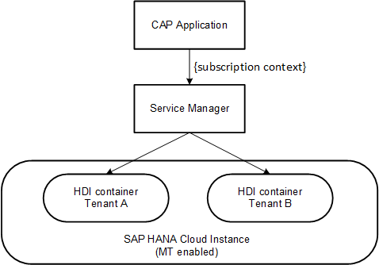
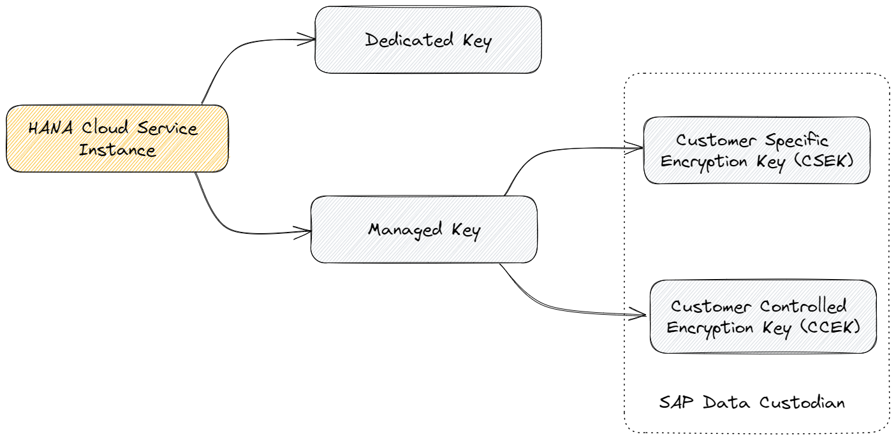

# Security Aspects

{{ $frontmatter.synopsis }}

## Secure Communications { #secure-communications }


### Encrypted Communication Channels { #encrypted-channels }
<!-- #SEC-218 -->

*Integrity* and *confidentiality* of data being transferred between any communication endpoints needs to be guaranteed.
In particular, this holds true for communication between client and server ([public zone](./overview#public-zone) resp. [platform zone](./overview#platform-zone)), but also for service-to-service communication (within a platform zone).
That means the communication channels are established in a way that rules out undetected data manipulation or disclosure.


#### Inbound Communication (Server) { #inbound }
<!-- #SEC-266 -->

[SAP BTP](https://help.sap.com/docs/btp/sap-business-technology-platform/btp-security) exclusively establishes encrypted communication channels based on HTTPS/TLS as shown in the [architecture overview](./overview#architecture-overview)
and hence fulfills the requirements out of the box.
For all deployed (CAP) applications and platform services, the platform's API gateway resp. ingress router provides TLS endpoints accepting incoming request and forwards to the backing services via HTTP.
The HTTP endpoints of microservices are only accessible for the router in terms of network technology (perimeter security) and therefore aren't visible for clients in public and platform zone.
Likewise microservices can only serve a single network port, which the platform has opened for the hosting container.

The router endpoints are configured with an up to date TLS protocol version containing a state-of-the-art cipher suite. Server authentication is given by X.509 server certificates signed by a trusted certificate authority.

::: tip
It's mandatory for public clients to authenticate the server and to verify the server's identity by matching the target host name with the host name in the server certificate.
:::

::: tip
Manually provided certificates for [custom domains](https://help.sap.com/docs/CUSTOM_DOMAINS/6f35a23466ee4df0b19085c9c52f9c29/4f4c3ff62fd2413089dce8a973620167.html) need to be signed by a [trusted certificate authority](https://help.sap.com/docs/btp/sap-business-technology-platform/trusted-certificate-authentication).
:::

<!--
TODO:
Platforms shall support the option to set the HTTP-Strict-Transport-Security (HSTS) header in all HTTP responses to enforce secure communications
-->

#### Outbound Communication (Client) { #outbound }

As platform services and other applications deployed to BTP are only accessible via exposed TLS router endpoints, outbound connections are automatically secured as well.
Consequently, technical clients have to [validate the server certificate](#inbound) for proper server authentication.
Also here CAP application developers don't need to deal with HTTPS/TLS connection setup provided the client code is build on CAP offerings such as HANA Cloud Service or CloudSDK integration.

#### Internal Communication (Client and Server) { #internal }

Depending on the target platform, closely coupled microservices of the application zone might also communicate via trusted network channels instead of using [outbound connections](#outbound).
For instance, a CAP service could communicate to a CAP sidecar, which is deployed to the same container via localhost HTTP connection.

::: tip
CAP allows to use alternative communication channels, but application operators are responsible to set up them in a secure manner.
:::

::: tip
CAP applications don't have to deal with TLS, communication encryption, or certificates, for inbound as well as outbound connections.
:::

### Filtering Internet Traffic { #filtering }
<!-- #SEC-331 -->

Reducing attack surface by filtering communication from or to public zone increases the overall security protection level.
By default, the platform comes with a standard set of services and configurations to protect network communication building on security features of the underlying hyperscaler.

::: warning
Measures to further **restrict web access to your application** can be applied at platform level and aren't offered by CAP.
For instance, [CF Route service](https://docs.cloudfoundry.org/services/route-services.html) can be used to implement route-specific restriction rules.
:::

## Secure Authentication { #secure-authentication }

None-public resources may only be accessed by authenticated users. Hence, authentication plays a key role for product security on different levels:
- **Business users** consume the application via web interface. In multitenant applications, they come from different subscriber tenants that need to be isolated from each other.
- **Platform users** operate the application and have privileged access to its components on OS level (containers, configurations, logs etc.). Platform users come from the provider tenant.

Managing user pools, providing a logon flow, and processing authentication are complex and highly security-critical tasks **that shouldn't be tackled by applications**.
Instead, applications should rely on an identity service provided by the platform which is [seamlessly integrated by CAP](#authenticate-requests).

Find more about platform and business users:
[SAP BTP User and Member Management](https://help.sap.com/docs/btp/sap-business-technology-platform/user-and-member-management){.learn-more}


### Authentication of Server Requests { #authenticate-requests }
<!-- #SEC-230 #SEC-231 #SEC-232  -->

SAP BTP offers central identity services [SAP Cloud Identity Services - Identity Authentication](https://help.sap.com/docs/IDENTITY_AUTHENTICATION) resp. [SAP Authorization and Trust Management Service](https://help.sap.com/docs/CP_AUTHORIZ_TRUST_MNG)
for managing and authenticating platform and business users providing:
- User authentication flows (OpenID connect), for example, multifactor authentication
- Federation of custom identity providers (IdPs)
- Single-sign on
- Principal propagation
- Password and session policies etc.

The central platform service provides applications with a large set of industry-proven security features, which is why applications don't have to develop their own extensions and run the risk of security flaws.

CAP doesn't require any specific authentication strategy, but it provides out of the box integration with the platform identity service.
On configured authentication, *all CAP endpoints are authenticated by default*.

::: warning
❗ **CAP applications need to ensure that an appropriate [authentication method](../guides/authorization.md#prerequisite-authentication) is configured**.
It's highly recommended to establish integration tests to safeguard a valid configuration.
:::

Learn more about user model and identity providers here:
[SAP BTP Security](https://help.sap.com/docs/btp/sap-business-technology-platform/btp-security){.learn-more}


### Authentication for Remote Services { #authenticate-remote }
<!-- #SEC-374 -->

CAP microservices consume remote services and hence need to be authenticated as technical client as well.
Similar to [request authentication](#authenticate-requests), CAP saves applications from having to implement secure setup of service to service communication:
- CAP interacts with platform services such as [Event Mesh](../guides/messaging/) or [SaaS Provisioning Service](../guides/deployment/as-saas) on basis of platform-injected service bindings.
- CAP offers consumption of [Remote Services](../guides/using-services/) on basis of [SAP BTP destinations](../guides/using-services/#btp-destinations).

Note that the applied authentication strategy is specified by server offering and resp. configuration and not limited by CAP.

<div id="security-mtls" />

### Maintaining Sessions { #sessions }
<!-- #SEC-220 #SEC-221 -->

CAP microservices require [authentication](#authenticate-requests) of all requests, but they don't support logon flows for UI clients.
Being stateless, they neither establish a session with the client to store login information such as an OAuth 2 token that needs to be passed in each server request.

To close this gap, UI-based CAP applications can use an [Application Router](https://help.sap.com/docs/btp/sap-business-technology-platform/application-router) instance or service as reverse proxy as depicted in the [diagram](./overview#architecture-overview).
The Application Router redirects the login to the identity service, fetches an OAuth2 token, and stores it into a secure session cookie.

::: warning
❗ The **Application Router endpoints don't hide CAP endpoints** in the service backend.
Hence, authentication is still mandatory for CAP microservices.
:::

### Maintaining Secrets { #secrets }
<!-- #SEC-309 -->

To run a CAP application that authenticates users and consumes remote services, **it isn't required to manage any secrets such as keys, tokens, or passwords**.
Also CAP doesn't store any of them, but relies on platform [injection mechanisms](./overview#platform-environment) or [destinations](../guides/using-services/#btp-destinations).

::: tip
In case you still need to store any secrets, use a platform service [SAP Credential Store](https://help.sap.com/docs/CREDENTIAL_STORE).
:::

## Secure Authorization { #secure-authorization }
<!-- #SEC-248 -->

According to segregation of duties paradigm, user administrators need to control how different users may interact with the application.
Critical combinations of authorizations must be avoided. Basically, access rules for [business users](#business-authz) are different from [platform users](#platform-authz).


### Authorization of Business Users { #business-authz }
<!-- #SEC-376 #SEC-250 -->

To align with the principle of least privilege, applications need to enforce fine-grained access control for business users from the subscriber tenants.

Depending from the business scenario, users need to be restricted to operations they perform on server resources, e.g. reading an entity collection.
Moreover, they might also be limited to a subset of data entries, that is, they may only operate on a filtered view on the data.
The set of rules that apply to a user reflects a specific conceptual role that describes the interaction with the application to fulfill a business scenario.
Obviously, the business roles are dependent from the scenarios and hence *need to be defined by the application developers*.

Enforcing authorization rules at runtime is highly security-critical and shouldn't be implemented by the application as this would introduce the risk of security flaws.
Instead, [CAP authorizations](../guides/authorization.md) follow a declarative approach allowing applications to design comprehensive access rules in the CDS model.

Resources in the model such as services or entities can be restricted to users that fulfill specific conditions as declared in `@requires` or `@restrict` [annotations](../guides/authorization.md#restrictions).
According to the declarations, server-side authorization enforcement is guaranteed for all requests. It's executed close before accessing the corresponding resources.

::: warning
❗ **By default, CAP services and entities aren't authorized**.
Application developers need to **design and test access rules** according to the business need.
:::

::: tip
To verify CAP authorizations in your model, it's recommended to use [CDS lint rules](../tools/#cds-lint-rules).
:::

The rules prepared by application developers are applied to business users according to grants given by the subscribers user administrator, that is, they're applied tenant-specific.

CAP authorizations can be defined dependently from [user claims](../guides/authorization.md#user-claims) such as [XSUAA scopes or attributes](https://help.sap.com/docs/btp/sap-business-technology-platform/application-security-descriptor-configuration-syntax)
that are deployed by application developers and granted by the user administrator of the subscriber.
Hence, CAP provides a seamless integration of central identity service without technical lock-in.

::: tip
You can generate the `xs-security.json` [descriptor file](https://help.sap.com/docs/btp/sap-business-technology-platform/protecting-your-application) of the application's XSUAA instance by executing `cds add xsuaa` in the project root folder.
The XSUAA scopes, roles, and attributes are derived from the CAP authorization model.
:::

::: warning
CAP authorization enforcement doesn't automatically log successful and unsuccessful authorization checks.
Applications need to add corresponding custom handlers to support it.
:::

#### Authorization of CAP Endpoints { #cap-endpoints }
<!-- #SEC-236 -->

In general, responses created by *standard* CAP handlers and services are created on need-to-know basis.
This means, authorized users only receive server information according to their privilege.
Therefore, business users won't gain information about server host names, any version of application server component, generated queries etc.

Based on the CDS model and configuration of CDS services, the CAP runtime exposes following endpoints:

| Name              | Configuration    | URL                                       | Authorization                                 |
|-------------------|------------------|-------------------------------------------|-----------------------------------------------|
| CDS Service `Foo` | `service Foo {}` | `/<protocol-path>/Foo/**`<sup>1</sup>     | `@restrict`/`@requires`<sup>2</sup>           |
|                   | OData v2/v4      | `/<odata-path>/Foo/$metadata`<sup>1</sup> | See [here](../guides/authorization.md#requires) |
| Index page        |                  | `/index.html`                             | none                                          |

> <sup>1</sup> See [protocols and paths](../java/application-services#configure-path-and-protocol)

> <sup>2</sup> No authorization by default

Based on configured features, the CAP runtime exposes additional callback endpoints for specific platform service:

<div markdown="1" class="impl java">

| Platform service             | URL                         | Authorization                                                                                                           |
|------------------------------|-----------------------------|-------------------------------------------------------------------------------------------------------------------------|
| Messaging (Event Mesh, MT)   | `/messaging/v1.0/em`        | [Technical roles](../guides/messaging/event-mesh#3-secure-inbound-access-to-http-webhooks) `emcallback`, `emmanagement` |
| Multitenancy (SaaS Registry) | `/mt/v1.0/subscriptions/**` | [Technical role](../guides/deployment/as-saas#xsuaa-mt-configuration) `mtcallback`                                      |

</div>
<div markdown="1" class="impl node">

| Platform service           | URL                                      | Authorization                                                                                           |
|----------------------------|------------------------------------------|---------------------------------------------------------------------------------------------------------|
| Messaging (Event Mesh, MT) | `/messaging/enterprise-messaging`        | [Technical role](../guides/messaging/event-mesh#3-secure-inbound-access-to-http-webhooks) `emcallback`, |
|                            | `/messaging/enterprise-messaging/deploy` | Technical role`emmanagement`                                                                            |

</div>

Moreover, technical [MTXs CAP services](../guides/multitenancy/mtxs#) may be configured, for example, as sidecar microservice to support higher-level features such as Feature Toggles or Multitenancy:

| CAP service | URL | Authorization
| ----------- | --- | -------------
| [cds.xt.ModelProviderService](../guides/multitenancy/mtxs#modelproviderservice) | `/-/cds/model-provider/**` | Internal, technical user<sup>1</sup>
| [cds.xt.DeploymentService](../guides/multitenancy/mtxs#deploymentservice) | `/-/cds/deployment/**` | | Internal, technical user<sup>1</sup>, or technical role `cds.Subscriber`
| [cds.xt.SaasProvisioningService](../guides/multitenancy/mtxs#saasprovisioningservice) | `/-/cds/saas-provisioning/**` | Internal, technical user<sup>1</sup>, or technical roles `cds.Subscriber` resp. `mtcallback`
| [cds.xt.ExtensibilityService](../guides/multitenancy/mtxs#extensibilityservice) | `/-/cds/extensibility/**` | Internal, technical user<sup>1</sup>, or technical roles `cds.ExtensionDeveloper` resp. `cds.UIFlexDeveloper`

> <sup>1</sup> The microservice running the MTXS CAP service needs to be deployed to the [application zone](./overview#application-zone))
and hence has established trust with the CAP application client, for instance given by shared XSUAA instance.

Authentication for a CAP sidecar needs to be configured just like any other CAP application.

::: warning
❗ Ensure that technical roles such as `cds.Subscriber`, `mtcallback`, or `emcallback` **never are included in business roles**.
:::

### Authorization of Platform Users { #platform-authz }
<!-- #SEC-250 -->

Similar to [business consumption](#business-authz), different scenarios apply on operator level that need to be separated by dedicated access rules: deployment resp. configuration, monitoring, support, audit logs etc.
*CAP doesn't cover authorization of platform users*. Please refer to security documentation of the underlying SAP BTP runtime environment:
- [Roles in the Cloud Foundry Environment](https://help.sap.com/docs/btp/sap-business-technology-platform/about-roles-in-cloud-foundry-environment)
- [Roles in the Kyma Environment](https://help.sap.com/docs/btp/sap-business-technology-platform/assign-roles-in-kyma-environment)

## Secure Multi-Tenancy { #secure-multitenancy }
<!-- #SEC-378 -->

Multitenant SaaS-applications need to take care for security aspects on a higher level.
Different subscriber tenants share the same runtime stack to interact with the CAP application.
Ideally, from perspective of a single tenant, the runtime should look like a self-contained virtual system that doesn't interfere with any other tenant.

All directly or indirectly involved services that process the business request require to isolate with regards to several dimensions:
- No breakout to [persisted data](#isolated-persistent-data)
- No breakout to [transient data](#isolated-transient-data)
- Limited [resource consumption](#limiting-resource-consumption)

The CAP runtime is designed from scratch to support tenant isolation:

### Isolated Persistent Data { #isolated-persistent-data }

Having configured [Multitenancy in CAP](../guides/multitenancy/), when serving a business request, CAP automatically targets an isolated HDI container dedicated for the request tenant to execute DB statements.
Here, CAP's data query API based on [CQN](../cds/cqn) is orthogonal to multitenancy, that is, custom CAP handlers can be implemented agnostic to MT.

During tenant onboarding process, CAP triggers the HDI container creation via [SAP HANA Cloud Services](https://help.sap.com/docs/HANA_SERVICE_CF/cc53ad464a57404b8d453bbadbc81ceb/f70399be7fca4508aa0e33e138dbd84d.html).
The containers have separated DB schemas and dedicated technical DB users for access.
CAP guarantees that code for business requests runs on a DB connection opened for the technical user of the tenant's container.

### Isolated Transient Data { #isolated-transient-data }

Although CAP microservices are stateless, the CAP Java runtime (generic handlers inclusive) needs to cache data in-memory for performance reasons.
For instance, filters for [instance-based authorization](../guides/authorization.md#instance-based-auth) are constructed only once and are reused in subsequent requests.

To minimize risk of a data breach by exposing transient data at runtime, the CAP Java runtime explicitly refrains from declaring and using static mutable objects in Java heap.
Instead, request-related data such as the [EventContext](https://www.javadoc.io/doc/com.sap.cds/cds-services-api/latest/com/sap/cds/services/EventContext.html) is provided via thread-local storage.
Likewise, data is stored in tenant-maps that are transitively referenced by the [CdsRuntime](https://www.javadoc.io/doc/com.sap.cds/cds-services-api/latest/com/sap/cds/services/CdsRuntime.html) instance.
{ .impl .node }

To achieve tenant-isolation, the CAP Node.js runtime dynamically adds data to the tenant's [cds.model](../node.js/cds-facade#cds-model).
Request-related data is propagated down the call stack (for instance [cds.context](../node.js/middlewares#cdscontext)).
{ .impl .java }

::: tip
Make sure that custom code doesn't break tenant data isolation.
:::

### Limiting Resource Consumption { #limiting-resource-consumption }

Tenant-aware microservices also need to handle resource consumption of tenants, in particular with regards to CPU, memory, and network connections.
Excessive use of resources requested by a single tenant could cause runtime problems for other consumers (noisy neighbor problem).

CAP helps to control resource usage:

<div markdown="1" class="impl java">

- Business request run in isolated Java threads and hence OS thread scheduling ensures fair distribution of CPU shares.
- By default, tenants have dedicated DB connection pools.

</div>

<div markdown="1" class="impl node">

- Fine granular processing of request (CAP handlers) to avoid disproportionate blocking times of the event loop.
- Tenants have dedicated DB connection pools.

</div>

::: tip
Make sure that custom code doesn't introduce excessive memory or CPU consumption within a single request.
:::

Because OS resources are strictly limited in a virtualized environment, a single microservice instance can handle load of a limited set of tenants, only.
[**Adequate sizing**](#dos-attacks) of your microservice is mandatory, that is, adjusting memory settings, connection pool sizes, request size limits etc. according to the business needs.

Last but not least you need to implement a **scaling strategy** to meet increasing load requirements by additional microservice instances.

::: warning
❗ **Sizing and scaling** is up to application developers and operators. CAP default values aren't suitable for all applications.
:::

## Secure Against Untrusted Input { #secure-untrusted-input }

Without protection mechanism in place, a malicious user could misuse a valid (that is, authenticated) session with the server and attack valuable business assets.

### Protection Against Injection Attacks { #injection-attacks }

Attackers can send malicious input data in a regular request to make the server perform unintended actions that can lead to serious data exploits.

#### Common Attack Patterns { #common-injection-attacks }
<!-- #SEC-100 #SEC-283 #SEC-228  -->

- CAP's intrinsic data querying engine is immune with regards to [SQL injections](https://owasp.org/www-community/attacks/SQL_Injection).
[CQL statements](../guides/querying/) are transformed into prepared statements that are executed in SQL databases such as SAP HANA.

::: warning
Be careful in custom code when modifying or creating CQL queries. Refrain from building the query structure (target entity, columns) directly on basis of request input.
You're encouraged to pass user data in the provided methods such as CQL values or entity data.
:::

- [Cross Site Scripting (XSS)](https://owasp.org/www-community/attacks/xss) is used by attackers to inject a malicious script, which is executed in the browser session of an unsuspecting user.
By default, there are some protection mechanisms in place.
For instance, CAP OData V4 adapter renders responses with HTTP, which prevents the browser from misinterpreting the context.
On the client side, SAPUI5 provides input validation for all typed element properties and automatic output encoding in all standard controls.

- Untrusted data being transferred may contain malware.
[SAP Malware Scanning Service](https://help.sap.com/docs/MALWARE_SCANNING) is capable to scan provided input streams for viruses and is regularly updated.

::: warning
❗ Currently, CAP applications need to add custom handlers to **scan data being uploaded or downloaded**.
:::

- [Path traversal](https://owasp.org/www-community/attacks/Path_Traversal) attacks aim to access parts of the server's file system outside the web root folder.
As part of the [application zone](./overview#application-zone), an Application Router serves the static UI content of the application. The CAP microservice doesn't need to serve web content from file system.
Apart from that the used web server frameworks such as Spring or Express already have adequate protection mechanisms in place.

- [CLRF injections](https://owasp.org/www-community/vulnerabilities/CRLF_Injection) or [log injections](https://owasp.org/www-community/attacks/Log_Injection) can occur when untrusted user input is written to log output.

CAP Node.js offers a CLRF-safe [logging API](../node.js/cds-log#logging-in-production) that should be used for application logs.
{ .impl .node }

::: warning
❗ Currently, CAP applications need to care for escaping user data that is used as input parameter for application logging.
It's recommended to make use of an existing Encoder such as OWASP [ESAPI](https://www.javadoc.io/doc/org.owasp.esapi/esapi/2.0.1/org/owasp/esapi/Encoder.html).
:::
{ .impl .java }

- [Deserialization of untrusted data](https://owasp.org/www-community/vulnerabilities/Deserialization_of_untrusted_data) can lead to serious exploits including remote code execution.
The OData adapter converts JSON payload into an object representation. Here it follows a hardened deserialization process where the deserializer capabilities (e.g. no default types in Jackson) are restricted to a minimum.
A strong input validation based on EDMX model is done as well.
Moreover, deserialization errors terminate the request and are tracked in the application log.


#### General Recommendations Against Injections { #general-injection-attacks }
<!-- #SEC-100 -->

In general, to achieve perfect injection resistance, applications should have input validation, output validation, and a proper Content-Security-Policy in place.

- CAP provides built-in support for **input validation**.
Developers can use the [`@assert`](../guides/providing-services/#input-validation) annotation to define field-specific input checks.

::: warning
❗ Applications need to validate or sanitize all input variables according to the business context.
:::

- With respect to **output encoding**, CAP OData adapters have proper URI encoding for all resource locations in place.
Moreover, OData validates the JSON response according to the given EDMX schema.
In addition, client-side protection is given by [SAPUI5](https://community.sap.com/topics/ui5) standard controls

- Applications should meet basic [Content Security Policy (CSP)](https://www.w3.org/TR/CSP2/) compliance rules to further limit the attack vector on client side.
CSP-compatible browsers only load resources from web locations that are listed in the allowlist defined by the server.
`Content-Security-Policy` header can be set as route-specific response header in the [Application Router](https://help.sap.com/docs/btp/sap-business-technology-platform/responseheaders).
SAPUI5 is [CSP-compliant](https://sapui5.hana.ondemand.com/sdk/#/topic/fe1a6dba940e479fb7c3bc753f92b28c.html) as well.

::: warning
❗ Applications have to **configure Content Security Policy** to meet basic compliance.
:::

### Protection Against Service Misuse Attacks { #misues-attacks }
<!-- #SEC-375 #SEC-223 #SEC-264 #SEC-278 -->

- [Server Side Request Forgery (SSRF)](https://owasp.org/www-community/attacks/Server_Side_Request_Forgery) abuses server functionality to read or update resources from a secondary system.
CAP microservices are protected from this kind of attack if they use the [CAP standard mechanisms](#authenticate-remote) for service to service communication.

- [Cross-Site Request Forgery (CSRF)](https://owasp.org/www-community/attacks/csrf) attacks make end users executing unwanted actions on the server while having established a valid web session.
By default, the Application Router, which manages the session with the client, enforces a CSRF token protection (on basis of `x-csrf-token` headers).
Hence, CAP services don't have to deal with CSRF protection as long as they don't maintain sessions with the client.
SAPUI5 supports CSRF tokens on client side out of the box.

- [Clickjacking](https://owasp.org/www-community/attacks/Clickjacking) is an attack on client side where end users are tricked to open foreign pages.
SAPUI5 provides [protection mechanisms](https://sapui5.hana.ondemand.com/sdk/#/topic/62d9c4d8f5ad49aa914624af9551beb7.html) against this kind of attack.

::: warning
❗ To protect against clickjacking, SAPUI5 applications need to configure `frame options`.
:::


### Additional Protection Mechanisms { #additional-attacks }
<!-- #SEC-278 #SEC-238 #SEC-235 #SEC-282 -->

There are additional attack vectors to consider. For instance, naive URL handling in the server endpoints frequently introduces security gaps.
Luckily, CAP applications don't have to implement HTTP/URL processing on their own as CAP offers sophisticated [protocol adapters](../about/features#consuming-services) such as OData V2/V4 that have the necessary security validations in place.
The adapters also transform the HTTP requests into a corresponding CQN statement.
Access control is performed on basis of CQN level according to the CDS model and hence HTTP Verb Tampering attacks are avoided.

The OData protocol allows to encode field values in query parameters of the request URL or in the response headers. This is, for example, used to specify:
- [Sorting](../guides/providing-services/#using-cdssearch-annotation)
- [Pagination (implicit sort order)](../guides/providing-services/#pagination)
- Filtering

::: warning
Applications need to ensure by means of CDS modeling that fields reflecting sensitive data are excluded and don't appear in URLs.
:::

::: tip
It's recommended to serve all application endpoints via CAP adapters.
Securing custom endpoints is left to the application.
:::

In addition, CAP runs on a virtual machine with a managed heap that protects from common memory corruption vulnerabilities such as buffer overflow or range overflows.

CAP also brings some tools to effectively reduce the attack vector of race condition vulnerabilities.
These might be exposed when the state of resources can be manipulated concurrently and a consumer faces an unexpected state.
CAP provides basic means of [concurrency control](../guides/providing-services/#concurrency-control) on different layers, e.g. [ETags](../guides/providing-services/#etag) and [pessimistic locks](../guides/providing-services/#select-for-update). Moreover, Messages received from the [message queue](../guides/messaging/) are always in order.

::: tip
Applications have to ensure a consistent data processing taking concurrency into account.
:::


### Protection Against Denial-of-Service Attacks { #dos-attacks }
<!-- #SEC-237 -->

[Denial-of-service (DoS)](https://owasp.org/www-community/attacks/Denial_of_Service) attacks attempt to reduce service availability for legitimate users.
This can happen by erroneous server behavior upon a single large or a few specially crafted malicious requests that bind an excessive amount of shared OS resources such as CPU, memory, or network connections.

Since OS resource allocations are distributed over the entire request, DoS-prevention needs to be addressed in all different layers of the runtime stack:

#### HTTP Server and CAP Protocol Adapter

The used web server frameworks such as [Spring/Tomcat](https://docs.spring.io/spring-boot/docs/current/reference/html/application-properties.html#appendix.application-properties.server) or [Express](https://expressjs.com/) start with reasonable default limits, e.g.:
- Maximum size of the HTTP request header.
- Maximum size of the HTTP request body.
- Maximum queue length for incoming connection requests
- Maximum number of connections that the server accepts and processes at any given time.
- Connection timeout.
Additional size limits and timeouts (request timeout) are established by the reverse proxy components, API Gateway and Application Router.

::: tip
If you want to apply an application-specific sizing, consult the corresponding framework documentation.
:::

Moreover, CAP adapters automatically introduce query results pagination in order to limit memory peaks (customize with [`@cds.query.limit`](../guides/providing-services/#configuring-defaults-with-cdsquerylimit)).
The total number of request of OData batches can be limited by application configuration.
<div markdown="1" class="impl java">
Settings `cds.odataV4.batch.maxRequests` resp. `cds.odataV2.batch.maxRequests` specify the corresponding limits.
</div>

::: warning
❗ CAP applications have to limit the amount of `$expands` per request in a custom handler.
Also the maximum amount of requests per `$batch` request need to be configured.
:::

::: tip
Design your CDS services exposed to web adapters on need-to-know basis. Be especially careful when exposing associations.
:::

#### CAP Service Runtime

Open transactions are expensive as they bind many resources such as a database connection as well as memory buffers.
To minimize the amount of time a transaction must be kept open, the CAP runtime offers an [Outbox Service](../java/outbox) that allows to schedule asynchronous remote calls in the business transaction.
Hence, the request time to process a business query, which requires a remote call (such as to an audit log server or messaging broker), is minimized and independent from the response time of the remote service.

::: tip
Avoid synchronous requests to remote systems during a transaction.
:::

[See why CPU time is fairly distributed among business requests](#limiting-resource-consumption){.learn-more}


#### Database

As already outlined, database connections are a expensive resource.
To limit overall usage, by default, the CAP runtime creates connection pools per subscriber tenant.
Similarly, the DB driver settings such as SQL query timeout and buffer size have reasonable values.

::: tip
<div markdown="1" class="impl java">
In case the default setting doesn't fit, <a href="../java/multitenancy#data-source-pooling-configuration">connection pool properties</a> and <a href="../java/persistence-services#datasource-configuration">driver settings</a> can be customized, respectively.
</div>
<div markdown="1" class="impl node">
In case the default setting doesn't fit, <a href="../node.js/databases#pool">connection pool properties</a> and <a href="../node.js/databases#tcp-keepalive-with-hdb">driver settings</a> can be customized, respectively.
</div>
:::

::: warning
❗ Applications need to establish an adequate [Workload Management](https://help.sap.com/docs/HANA_CLOUD_DATABASE/f9c5015e72e04fffa14d7d4f7267d897/30f2e9cb92aa4f358dda4ac58e062d83.html) that controls DB resource usage.
:::


#### Supplementary Measures

As outlined before, a well-sized microservice instance doesn't help to protect from service downtimes when excessive workload initiated by an attacker exceeds the available capacity.
[Rate limiting](https://help.sap.com/docs/btp/developing-resilient-apps-on-sap-btp/rate-limiting-c56d72711eec41118f243054f2e92f94) is a possible counter measure to restrict the frequency of calls of a client.

::: warning
❗ Applications need to establish an adequate **rate limiting** strategy.
:::

There's also the possibility to introduce request filtering and rate limiting on platform level via [Route Service](https://docs.cloudfoundry.org/services/route-services.html).
It has the advantage that the requests can be controlled centrally before touching application service instances.

In addition, the number of instances need to be **scaled horizontally** according to current load requirements.
This can be achieved automatically by consuming [Application Autoscaler](https://help.sap.com/docs/Application_Autoscaler).

<div id="#security-secure-storage" />

### Separation of Tenant Data { #storage-separation }

Prerequisite to a tenant-specific encryption is that the business data of subscriber tenants as well as the provider tenant is strictly separated.
CAP leverages [HDI containers](https://help.sap.com/docs/HANA_CLOUD_DATABASE/c2b99f19e9264c4d9ae9221b22f6f589/ebf0aa26958443f58f86b862056862d4.html) to provide a [strong data isolation](#isolated-persistent-data) out of the box.

During tenant onboarding process, CAP delegates HDI container creation to Service Manager:


By default, HDI containers are strictly isolated at the database level and don't allow cross-container access.

::: tip
Applications can also create HDI containers at deployment time that are suitable for the provider tenant.
:::


### Encryption of Tenant Data { #storage-encryption }
<!-- #SEC-272 -->

SAP HANA Cloud (HC) offers strong server-side storage encryption that is transparent for applications.
This holds for all business data permanently stored to file system, including redo-log entries.

An HC service instance, which is not MT-enabled, uses a dedicated encryption key for all DB artifacts.
In contrast, a [MT-enabled HC instance](https://help.sap.com/docs/HANA_CLOUD_DATABASE/5db69f41f207422a98669500adc0181f/172f93968dfe45f09bf8c14b2ca9582d.html?state=DRAFT) enforces encryption of HDI containers with different keys managed in [SAP Data Custodian](https://help.sap.com/docs/SAP_DATA_CUSTODIAN):



In `Customer-Specific Encryption Key (CSEK)` mode, the tenant-specific key is managed by SAP,
but in `Customer-Controlled Encryption Key (CCEK)` mode the customer (that is, SaaS subscriber) defines and controls the key.

Customer-specific keys need to be explicitly activated in the application configuration.

For Java, the application property `cds.multitenancy.datasource.hanaEncryptionMode` supports all encryption modes as described in the HC [documentation](https://help.sap.com/docs/HANA_CLOUD_DATABASE/5db69f41f207422a98669500adc0181f/1c69829fd68941dfa699cbaae5417a8d.html?state=DRAFT).<!--{ .impl .java }-->

For Node.js, the cds configuration needs to contain the parameters as described in the HC [documentation](https://help.sap.com/docs/HANA_CLOUD_DATABASE/5db69f41f207422a98669500adc0181f/1c69829fd68941dfa699cbaae5417a8d.html?state=DRAFT) in the Deployment Service configuration.
<!--{ .impl .node }-->

```json
"requires": {
  ...
  "cds.xt.DeploymentService": {
    "hdi": {
      "create": {
        "provisioning_parameters": {
          "dataEncryption": {
            "mode": "MANAGED_KEY"
          },
          "enableTenant": true
        }
      }
    }
  }
}
```
<!-- { .impl .node } -->

::: tip
Currently, Customer Encryption Key mode is only activated for new HDI containers created for business tenants.
:::

[HANA Cloud with Customer-Managed Keys (CMK) Consumption Guide](https://github.wdf.sap.corp/pages/HANA-Cloud/hc-doc-cmk-stakeholder/){.learn-more}

## Secure by Default and by Design { #secure-by-default }

### Secure Default Configuration { #secure-default }
<!-- #SEC-244 #SEC-281 -->

Where possible, CAP default configuration matches the secure by default principle:

- There's no need to provide any password, credentials, or certificates to [protect communication](#secure-communications).

- A CAP application bound to an XSUAA instance authenticates all endpoints [by default](#secure-authentication).
Developers have to explicitly configure public endpoints if necessary.

- Isolated multitenancy is provided out of the box.

- Application logging has `INFO` level to avoid potential information disclosures.

- CAP also has first-class citizen support for [Fiori UI](../advanced/fiori) framework that brings a lot secure by default features in the UI client.

Of course, several security aspects need application-specific configuration.
For instance, this is true for [authorizations](#secure-authorization) or application [sizing](#dos-attacks).

::: tip
It's recommended to ensure security settings by automated integration tests.
:::


### Fail Securely { #fail-securely }
<!-- #SEC-239 -->

CAP runtime differentiates several types of error situations during request processing:
- Exceptions because of invalid user input (HTTP 4xx).
- Exceptions because of unexpected server behaviour, for example, network issues.
- Unrecoverable errors due to serious issues in the VM (for example, lack of memory) or program flaws.

In general, **exceptions immediately stop the execution of the current request**.

In Java, the thrown [ServiceException](https://www.javadoc.io/doc/com.sap.cds/cds-services-api/latest/com/sap/cds/services/EventContext.html) is automatically scoped to the current request by means of thread isolation.
{ .impl .java }

CAP Node.js adds an exception wrapper to ensure that only the failing request is affected by the exception.
{ .impl .node }

Customers can react in dedicated exception handlers if necessary.

In contrast, **errors stop the overall microservice** to ensure that security measures aren't weakened.

::: tip
Align the exception handling in your custom coding with the provided exception handling capabilities of the CAP runtime.
:::

<div id="#security-secure-auditlogging" />

### Auditlog Service

CAP provides a technical [AuditlogService](../java/auditlog#auditlog-service) that defines a high-level API to emit security events.
It helps to decouple business logic from the concrete audit log implementation. By default, it writes audit log events to console.

::: warning
Currently, CAP doesn't automatically trigger audit log for security-related events.
Custom handlers need to call the Auditlog Service API explicitly.
:::

### Auditlog

CAP integrates with SAP BTP Audit Log Service (version 2) in a resilient way.
Tenant logs are automatically separated.
