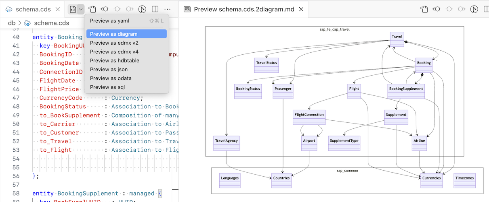

<script setup>
  import { h } from 'vue'
  const X =  () => h('span', { class: 'ga',      title: 'Available' },      ['✓']   )
  const Na = () => h('i',    { class: 'na',      title: 'not applicable' }, ['n/a'] )
  const D =  () => h('i',    { class: 'prog',    title: 'in progress'  },   ['in prog.'] )
  const O =  () => h('i',    { class: 'plan',    title: 'planned'  },       ['planned'] )
  const C =  () => h('i',    { class: 'contrib', title: 'contributions welcome'  }, ['contrib?'] )
  const Ac = () => h('i',    { class: 'contrib', title: 'active contributions'  },  ['contrib'] )
</script>
<style scoped lang="scss">
  .ga   { color: var(--vp-c-green-2);}
  .na   { color: gray; font-size:90%; }
  .prog { color: var(--vp-c-green-3); font-size:90%; font-weight:500; }
  .plan { color: gray; font-size:90% }
  .contrib { color: gray; font-size:90% }

  .add::before     { content: 'cds add '; color: #999 }
  .compile::before { content: 'cds compile --to '; color: #999 }
</style>

# CDS Command Line Interface (CLI) {#cli}

To use `cds` from your command line, install package  `@sap/cds-dk` globally:

```sh
npm i -g @sap/cds-dk
```

<ImplVariantsHint />

[[toc]]

## cds version

Use `cds version` to get information about your installed package version:

<!--@include: ./assets/help/cds-version.out.md-->

Using `--markdown` you can get the information in markdown format:

<!--@include: ./assets/help/cds-version-md.out.md-->


## cds completion <Since version="7.9.0" of="@sap/cds-dk" />

The `cds` command supports shell completion with the <kbd>tab</kbd> key for several shells and operating systems.

For Linux, macOS and Windows use the following command to activate shell completion:

```sh
cds add completion
```

After that, restart your shell (or source the shell configuration) and enjoy shell completion support for all `cds` commands.

Currently supported shells:
| Operating System  | Shell |
|-------------------|-------|
| Linux             | bash, fish (version 8 or higher), zsh |
| macOS             | bash, fish (version 8 or higher), zsh |
| Windows           | PowerShell, Git Bash |
| WSL               | bash, fish (version 8 or higher), zsh |

To remove the shell completion, run the following command:
```sh
cds completion --remove
```
Then source or restart your shell.


## cds help

Use `cds help` to see an overview of all commands:

<!--@include: ./assets/help/cds-help.out.md-->

Use `cds help <command>` or `cds <command> ?` to get specific help:

<!--@include: ./assets/help/cds-repl.out.md-->


## cds init

Use `cds init` to create new projects.

The simplest form creates a minimal Node.js project.  For Java, use

```sh
cds init --java
```

In addition, you can add (most of) the project 'facets' from [below](#cds-add) right when creating the project.
For example to create a project with a sample bookshop model and configuration for SAP HANA, use:

```sh
cds init --add sample,hana
```

::: details See the full help text of `cds init`
<!--@include: ./assets/help/cds-init.out.md -->
:::


## cds add

Use `cds add` to gradually add capabilities ('facets') to projects.

The facets built into `@sap/cds-dk` provide you with a large set of standard features that support CAP's grow-as-you-go approach:


| Feature                       |     Node.js      |       Java       |
|-------------------------------|:----------------:|:----------------:|
| `tiny-sample`                 |       <X/>       |       <X/>       |
| `sample`                      |       <X/>       |       <X/>       |
| `mta`                         |       <X/>       |       <X/>       |
| `cf-manifest`                 |       <X/>       |       <X/>       |
| `helm`                        |       <X/>       |       <X/>       |
| `helm-unified-runtime`        |       <X/>       |       <X/>       |
| `containerize`                |       <X/>       |       <X/>       |
| `multitenancy`                |       <X/>       |       <X/>       |
| `toggles`                     |       <X/>       |       <X/>       |
| `extensibility`               |       <X/>       |       <X/>       |
| `xsuaa`                       |       <X/>       |       <X/>       |
| `hana`                        |       <X/>       |       <X/>       |
| `postgres`                    | <X/><sup>1</sup> | <X/><sup>1</sup> |
| `sqlite`                      |       <X/>       |       <X/>       |
| `h2`                          |      <Na/>       |       <X/>       |
| `liquibase`                   |      <Na/>       |       <X/>       |
| `local-messaging`             |       <X/>       |       <O/>       |
| `file-based-messaging`        |       <X/>       |       <O/>       |
| `enterprise-messaging`        |       <X/>       |       <O/>       |
| `enterprise-messaging-shared` |       <X/>       |       <O/>       |
| `redis-messaging`             | <X/><sup>1</sup> |       <O/>       |
| `kafka`                       |       <X/>       |       <X/>       |
| `approuter`                   |       <X/>       |       <X/>       |
| `connectivity`                |       <X/>       |       <X/>       |
| `destination`                 |       <X/>       |       <X/>       |
| `html5-repo`                  |       <X/>       |       <X/>       |
| `portal`                      |       <X/>       |       <X/>       |
| `application-logging`         |       <X/>       |       <X/>       |
| `audit-logging`               |       <X/>       |       <X/>       |
| `notifications`               |       <X/>       |       <O/>       |
| `attachments`                 |       <X/>       |       <X/>       |
| [`data`](#data)               |       <X/>       |       <X/>       |
| [`http`](#http)               |       <X/>       |       <X/>       |
| `lint`                        |       <X/>       |       <X/>       |
| `pipeline`                    |       <X/>       |       <X/>       |
| `esm`                         |       <X/>       |      <Na/>       |
| `typer`                       |       <X/>       |      <Na/>       |
| `typescript`                  |       <X/>       |      <Na/>       |
| `completion`                  |       <X/>       |       <X/>       |
| [`handler`](#handler)         |       <X/>       |       <X/>       |

> <sup>1</sup> Only for Cloud Foundry <br>

::: details See the full help text of `cds add`
<!--@include: ./assets/help/cds-add.out.md -->
:::

### sample {.add}

Creates a bookshop application including custom code (Node.js or Java) and a UI with [SAP Fiori Elements](../advanced/fiori).

```sh
cds add sample
```

This corresponds to the result of the [_Getting Started in a Nutshell_ guide](../get-started/in-a-nutshell).

### tiny-sample {.add}

Creates a minimal CAP application without UI.

```sh
cds add tiny-sample
```

### data {.add}

Adds files to the project that carry initial data, in either JSON and CSV format.

The simplest form of:

```sh
cds add data
```

adds _csv_ files with a single header line for all entities to the _db/data/_ folder.  The name of the files matches the entities' namespace and name, separated by `-`.

#### Filtering <Since version="7.9.0" of="@sap/cds-dk" /> {#data-filtering}

To create data for some entities only, use `--filter`.  For example:

```sh
cds add data --filter books
```

would only create data for entity names that include _books_ (case insensitive).

You can use regular expressions for more flexibility and precision.  For example, to only match _Books_, but not _Books.texts_, use:

```sh
cds add data --filter "books$"
```

::: details Special characters like `?` or `*` need escaping or quoting in shells

The escape character is usually the backslash, for example, `\?`.  Quote characters are `'` or `"` with varying rules between shells.  Consult the documentation for your shell here.
:::

#### Sample records <Since version="7.9.0" of="@sap/cds-dk" />

To create actual data (along with the header line), use `--records` with a number for how many records you wish to have.

This example creates 2 records for each entity:

```sh
cds add data --records 2
```

[Watch a short video by DJ Adams to see this in action.](https://www.youtube.com/shorts/_YVvCA2oSco){.learn-more}

#### Formats <Since version="7.9.0" of="@sap/cds-dk" />

By default, the data format is _CSV_.  You can change this to JSON with the `--content-type` option:

```sh
cds add data --content-type json
```

The result could look like this for a typical _Books_ entity from the _Bookshop_ application:

```jsonc
[
  {
    "ID": 29894036,
    "title": "title-29894036",
    "author": {
      "ID": 1343293
    },
    "stock": 94,
    "texts": [
      { ... }
    ]
  }
]
```

::: details Some details on the generated data
-  For the _JSON_ format, _structured_ objects are used instead of flattened properties, for example, `author: { ID: ... }` instead of `author_ID.` The flattened properties would work as well during database deployment and runtime though.  Flattened properties are also used in the _CSV_ format.
- `author.ID` refers to a key from the _...Authors.json_ file that is created at the same time.  If the _Authors_ entity is excluded, though, no such foreign key would be created, which cuts the association off.
- Data for _compositions_, like the `texts` composition to `Books.texts`, is always created.
- A random unique number for each record, _29894036_ here, is added to each string property, to help you correlate properties more easily.
- Data for elements annotated with a regular expression using [`assert.format`](../guides/providing-services#assert-format) can be generated using the NPM package [randexp](https://www.npmjs.com/package/randexp), which you need to installed manually.
- Other constraints like [type formats](../cds/types), [enums](../cds/cdl#enums), and [validation constraints](../guides/providing-services#input-validation) are respected as well, in a best effort way.
:::

#### Interactively in VS Code <Since version="7.9.0" of="@sap/cds-dk" />

In [VS Code](./cds-editors#vscode), use the commands _Generate Model Data as JSON / CSV_ to insert test data at the cursor position for a selected entity.


### http <Since version="7.9.0" of="@sap/cds-dk" /> {.add}

Adds `.http` files with sample read and write requests.

The simplest form of:

```sh
cds add http
```

creates `http` files for all services and all entities.


#### Filtering {#http-filtering}

See the filter option of [`add data`](#data-filtering) for the general syntax.
In addition, you can filter with a service name:

```sh
cds add http --filter CatalogService
```

#### Interactively in VS Code

In [VS Code](./cds-editors#vscode), use the command _Generate HTTP Requests_ to insert request data in an _http_ file for a selected entity or service.

#### Authentication / Authorization

##### To local applications

<div class="impl node">

By default, an authorization header with a [local mock user](../node.js/authentication#mock-users) is written to the `http` file, and `localhost` is the target host.

```http [Node.js]
@server = http://localhost:4004
@auth = Authorization: Basic alice:

### CatalogService.Books
GET {{server}}/odata/v4/admin/Books
{{auth}}
...
```
</div>

<div class="impl java">

By default, an authorization header with a [local mock user](../java/security#mock-users) is written to the `http` file, and `localhost` is the target host.

```http [Java]
@server = http://localhost:8080

### CatalogService.Books
GET {{server}}/odata/v4/admin/Books
{{auth}}
...
```
</div>


##### To remote applications

Use `--for-app <cf-appname>` to use a JWT token of a remote application.  For example:

```sh
cds add http --for-app bookshop
```

assumes a remote app named `bookshop` on CloudFoundry and a JWT token for this app is written to the request file:

```http
@server = https://...
@auth = x-approuter-authorization: bearer ...
```

::: details Cloud login required
For CloudFoundry, use `cf login ...` and select org and space.
:::

### handler <Since version="8.5.0" of="@sap/cds-dk" /> {.add}

Generates handler stubs for actions and functions for both Java and Node.js projects.

To generate handler files, run:

::: code-group
```sh [Node.js]
cds add handler
```
```sh [Java]
mvn compile  # let Java know what your model looks like
cds add handler
```
:::

The files contain handlers for
- actions and functions
- service entities (Node.js only)


#### Filtering {#handler-filtering}

Use the `--filter` option to create handlers for specific actions/functions or entities.

```sh
cds add handler --filter submitOrder
cds add handler --filter Books
```


## cds env

Use `cds env` to inspect currently effective config settings of your Node.js application:

<!--@include: ./assets/help/cds-env-requires-db.out.md -->

::: details See the full help text of `cds env`
<!--@include: ./assets/help/cds-env.out.md -->
:::

::: tip Inspect configuration for Java applications
While `cds env` does _not_ show the [runtime SpringBoot configuration for CAP Java applications](../java/developing-applications/configuring), you can still use it to learn about _designtime_ configuration, which applies to Java applications as well.  Examples are build tasks (`cds env build.tasks`) or build plugins (`cds env plugins`).<br>
Also, the [multitenancy sidecar](../java/multitenancy) is a Node.js application, for which `cds env` shows the entire configuration if executed in the _mtx/sidecar_ folder.
:::


## cds compile

Compiles the specified models to [CSN](../cds/csn) or other formats.

[See simple examples in the getting started page](../get-started/in-a-nutshell#cli).{.learn-more}

[For the set of built-in compile 'formats', see the `cds.compile.to` API](../node.js/cds-compile#cds-compile-to).{.learn-more}


In addition, the following formats are available:

### mermaid <Since version="8.0.0" of="@sap/cds-dk" /> {.compile}

This produces text for a [Mermaid class diagram](https://mermaid.js.org/syntax/classDiagram.html):

```sh
cds compile db/schema.cds --to mermaid
```

Output:

```log
classDiagram
  namespace sap_fe_cap_travel {
    class `sap.fe.cap.travel.Travel`["Travel"]
    class `sap.fe.cap.travel.Booking`["Booking"]
    class `sap.fe.cap.travel.Airline`["Airline"]
    class `sap.fe.cap.travel.Airport`["Airport"]
    class `sap.fe.cap.travel.Flight`["Flight"]
  }
```

If wrapped in a markdown code fence of type `mermaid`, such diagram text is supported by many markdown renderers, for example, on [GitHub](https://docs.github.com/en/get-started/writing-on-github/working-with-advanced-formatting/creating-diagrams).

````md
```mermaid
classDiagram
  namespace sap_fe_cap_travel {
    class `sap.fe.cap.travel.Travel`["Travel"]
    ...
  }
```
````

To customize the diagram layout, use these environment variables when calling `cds compile`:

```sh
CDS_MERMAID_ASSOCNAMES=false|true    # show association/composition names
CDS_MERMAID_ELEMENTS=false|all|keys  # no, all, or only key elements
CDS_MERMAID_MIN=false|true           # remove unused entities
CDS_MERMAID_NAMESPACES=false|true    # group entities by namespace
CDS_MERMAID_QUERIES=false|true       # show queries/projections
CDS_MERMAID_DIRECTION=TB|BT|LR|RL    # layout direction of the diagram
```

<div id="mermaid-cli-more" />

#### Interactively in VS Code

To visualize your CDS model as a diagram in VS Code, open a `.cds` file and use the dropdown in the editor toolbar or the command _CDS: Preview as diagram_:

 {style="filter: drop-shadow(0 2px 5px rgba(0,0,0,.40));"}

If you don't see the graphics rendered, but only text, install the [Markdown Preview Mermaid Support](https://marketplace.visualstudio.com/items?itemName=bierner.markdown-mermaid) extension for VS Code.

To customize the diagram layout, use these settings in the _Cds > Preview_ category:

- [Diagram: Associations](vscode://settings/cds.preview.diagram.associations)
- [Diagram: Direction](vscode://settings/cds.preview.diagram.direction)
- [Diagram: Elements](vscode://settings/cds.preview.diagram.elements)
- [Diagram: Minify](vscode://settings/cds.preview.diagram.minify)
- [Diagram: Namespaces](vscode://settings/cds.preview.diagram.namespaces)
- [Diagram: Queries](vscode://settings/cds.preview.diagram.queries)

## cds watch

Use `cds watch` to watch for changed files, restarting your Node.js server.

::: details See the full help text of `cds watch`
<!--@include: ./assets/help/cds-watch.out.md-->
:::

::: tip Watch for Java
For CAP Java applications, you can use [`mvn cds:watch`](../java/developing-applications/running#cds-watch) instead.
:::

### Includes and Excludes <Since version="8.7.0" of="@sap/cds-dk" />

Additional watched or ignored paths can be specified via CLI options:

```sh
cds watch --include ../other-app --exclude .idea/
```

Alternatively, you can add these paths through settings <Config keyOnly>cds.watch.include: ["../other-app"]</Config> and <Config keyOnly>cds.watch.exclude: [".idea"]</Config> to your project configuration.


## cds repl

Use `cds repl` to live-interact with cds' JavaScript APIs in an interactive read-eval-print-loop.

<pre class="log">
<span class="cwd">$</span> <span class="cmd">cds</span> <span class="args">repl</span>
<em>Welcome to cds repl</em>

> <i>cds.parse`
  entity Foo { bar : Association to Bar }
  entity Bar { key ID : UUID }
`</i>
{
  definitions: {
    Foo: {
      kind: <em>'entity'</em>,
      elements: {
        bar: { type: <em>'cds.Association'</em>, target: <em>'Bar'</em> }
      }
    },
    Bar: ...
  }
}

> <i>SELECT.from(Foo)</i>
cds.ql {
  SELECT: { from: { ref: [ <em>'Foo'</em> ] } }
}
</pre>

There a couple of shortcuts and convenience functions:

- `.run` (a [REPL dot commands](https://nodejs.org/en/learn/command-line/how-to-use-the-nodejs-repl#dot-commands)) allows to start Node.js `cds.server`s:

  ```sh
  .run cap/samples/bookshop
  ```

- CLI option `--run` does the same from command line, for example:

  ```sh
  cds repl --run cap/samples/bookshop
  ```

- CLI option `--use` allows to use the features of a `cds` module, for example:

  ```sh
  cds repl --use ql # as a shortcut of that within the repl:
  ```

  ```js
  var { expr, ref, columns, /* ...and all other */ } = cds.ql
  ```

- `.inspect` command displays objects with configurable depth:

  ```sh
  .inspect cds .depth=1
  .inspect CatalogService.handlers .depth=1
  ```

::: details See the full help text of `cds repl`
<!--@include: ./assets/help/cds-repl.out.md-->
:::

::: tip Repl for Java
`cds repl` does not run Java code, but can still be useful:
For example, if you work on Node.js things like [building plugins](../guides/deployment/custom-builds#custom-build-plugins) that make use of Node.js APIs.
:::


## Debugging with `cds debug` <Beta /> {#cds-debug}

`cds debug` lets you debug applications running locally or remotely on SAP BTP Cloud Foundry.
Local applications will be started in debug mode, while (already running) remote applications are put into debug mode.

To debug an application on Cloud Foundry, the following is important:
- You're logged in to the space where the application is deployed to.
- You have developer permissions in that space -> [Space Developer role](https://help.sap.com/docs/btp/sap-business-technology-platform/about-roles-in-cloud-foundry-environment).
- The app is running and [reachable through SSH](https://docs.cloudfoundry.org/devguide/deploy-apps/ssh-apps.html#check-ssh-permissions).

Effectively, run:
```sh
cf login                   # select the correct org and space here
cf ssh-enabled <app-name>  # to check if SSH is enabled
```

::: tip Scale to one application instance only
We recommend to only scale to a _single_ app instance on SAP BTP Cloud Foundry, as then your request is guaranteed to hit this one instance.
If you scale out to more instances, only some of your requests will hit the instance that the debugger is connected to. This can result in 'missed breakpoints'.

However, it's possible to [route a request to a specific instance](https://docs.cloudfoundry.org/devguide/deploy-apps/routes-domains.html#surgical-routing), which is useful if you can't reduce the number of app instances.
:::

### Node.js Applications

#### Remote Applications

Run the following, to debug remote Node.js applications in the currently targeted CF space:

<pre class="log">
<span class="cwd">$</span> <span class="cmd">cds</span> <span class="args">debug</span> <span class="options">&lt;app-name&gt;</span>

Opening SSH tunnel on 9229:127.0.0.1:9229
Opening Chrome DevTools at devtools://devtools/bundled/inspector.html?ws=...

> Keep this terminal open while debugging.
</pre>

This opens an [SSH tunnel](https://docs.cloudfoundry.org/devguide/deploy-apps/ssh-apps.html), puts the application in debug mode, and connects and opens the [debugger of Chrome DevTools](https://developer.chrome.com/docs/devtools/javascript).

<video src="./assets/cds-debug_compressed.mp4" autoplay loop muted webkit-playsinline playsinline alt="Video demonstrating the debugging process with cds debug command, as described in the accompanying text." />

::: details Under the hoods, these commands are executed:
```sh
cf ssh <app> -c "kill -usr1 `pidof node`"
cf ssh -N -L 9229:localhost:9229 <app>
```
:::

#### Local Applications

Without an `<app name>`, `cds debug` starts `cds watch --debug` locally:

<pre class="log">
<span class="cwd">$</span> <span class="cmd">cds</span> <span class="args">debug</span>
Starting 'cds watch --debug'
...
Debugger listening on ws://127.0.0.1:9229/...
Opening Chrome DevTools at devtools://devtools/bundled/inspector.html?ws=...

[cds] - ...
</pre>


### Java Applications <Since version="8.7.0" of="@sap/cds-dk" />

#### Remote Applications

Run the following, to debug remote Java applications in the currently targeted CF space:

<pre class="log">
<span class="cwd">$</span> <span class="cmd">cds</span> <span class="args">debug</span> <span class="options">&lt;app-name&gt;</span>
...
Debugging has been started.
Address : 8000

Opening SSH tunnel on 8000:127.0.0.1:8000

> Keep this terminal open while debugging.
</pre>

This opens an [SSH tunnel](https://docs.cloudfoundry.org/devguide/deploy-apps/ssh-apps.html) and puts the application in debug mode.

Afterwards, connect a debugger in your IDE at the given port.  In VS Code, for example, add a launch configuration like this one:

::: code-group
```json [.vscode/launch.json]
{
  "type": "java",
  "name": "Attach to Remote Java App",
  "request": "attach",
  "hostName": "localhost",
  "port": "8000"
}
```
:::

Make sure the port matches to what the debug tunnel uses (see the message in the terminal). The default port is `8000`.

> [!NOTE] SapMachine is required
> SapMachine is required as Java runtime environment for this feature to work.<br>
> There is nothing to do if you set up your MTA deployment descriptors with [`cds mta`](../guides/deployment/to-cf#add-mta-yaml) or CAP project wizards.
> See the [documentation of SapMachine](https://help.sap.com/docs/btp/sap-business-technology-platform/sapmachine) for how to configure this manually.

#### Local Applications

Without an app name, `cds debug` starts Maven with debug arguments locally:

<pre class="log">
<span class="cwd">$</span> <span class="cmd">cds</span> <span class="args">debug</span>
Starting 'mvn spring-boot:run -Dspring-boot.run.jvmArguments="-agentlib:jdwp=transport=dt_socket,server=y,suspend=n,address=8000"'
...
Listening for transport dt_socket at address: 8000
...
</pre>

Then attach your IDE as explained before.

::: details See the full help text of `cds debug`
<!--@include: ./assets/help/cds-debug.out.md-->
:::

## Debugging with `cds watch`

Start `cds watch` and enter `debug`. This restarts the application in debug mode. Similarly, `debug-brk` will start debug mode, but pause the application at the first line, so that you can debug bootstrap code.

If you do this in VS Code's integrated terminal with the 'Auto Attach' feature enabled, debugging starts right away. If you executed `cds watch` on a standalone terminal, you can still attach a Node.js debugger to the process.

For example:
- In VS Code, use the _Debug: Attach to Node Process_ command.
- In Chrome browser, just open [chrome://inspect](chrome://inspect) and click _Inspect_.
