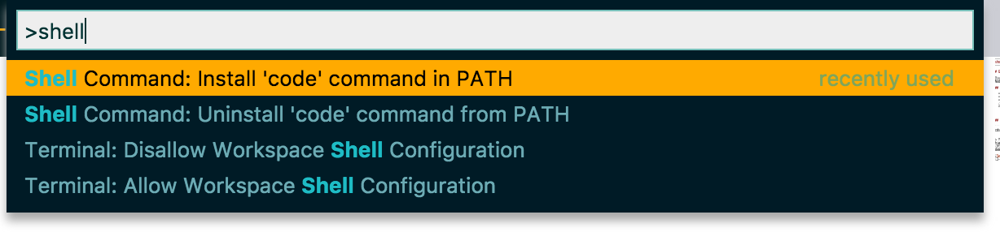
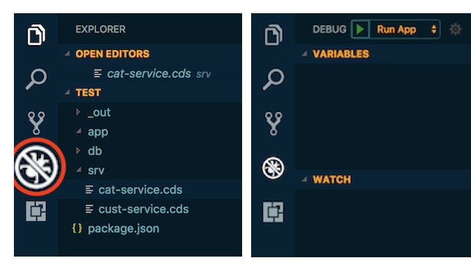
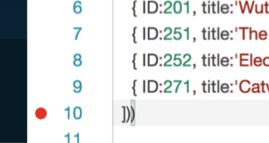
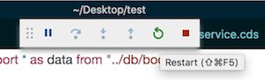
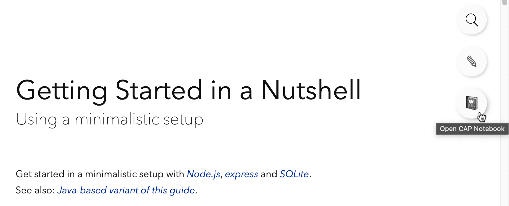

# CDS Editors and Environments

[[toc]]

## SAP Business Application Studio {#bastudio}

### Setup in BTP

If not already done, [set up SAP Business Application Studio](https://developers.sap.com/tutorials/appstudio-onboarding.html) on SAP BTP.


### Setup a Dev Space

1. Open the [SAP BTP cockpit](https://account.hanatrial.ondemand.com/) and choose *SAP Business Application Studio* from the _Quick Tool Access_ section.

1. Choose *Create Dev Space*.

1. Provide a name for your dev space.

1. Choose *Full Stack Cloud Application* as the application type.

   By selecting *Full Stack Cloud Application*, your dev space comes with several extensions out of the box that you need to develop CAP applications. For example, CAP Tools, Java Tools, and MTA Tools are built in. This saves setup time. See [Developer Guide](https://help.sap.com/products/SAP%20Business%20Application%20Studio/9d1db9835307451daa8c930fbd9ab264/84be8d91b3804ab5b0581551d99ed24c.html) for SAP Business Application Studio for more details.

1. Choose *Create Dev Space*.

   The creation of the dev space takes a while. You see that the status for your dev space changes from *STARTING* to *RUNNING*. See [Dev Space Types](https://help.sap.com/products/SAP%20Business%20Application%20Studio/9d1db9835307451daa8c930fbd9ab264/4142f786f3d345699c3d5fbebda5ded6.html) for more details.

1. Once the dev space is running, choose the dev space by clicking on the dev space name.

   >You're using a trial version. Any dev space that hasn't been running for 30 days will be deleted. See the full list of [restrictions](https://help.sap.com/products/SAP%20Business%20Application%20Studio/9d1db9835307451daa8c930fbd9ab264/a45742a719704bdea179b4c4f9afa07f.html).


### Features

To learn about the features specific to CAP development in the studio, see the guide [Developing a CAP Application in SAP Business Application Studio](https://help.sap.com/docs/SAP%20Business%20Application%20Studio/9c36fdb911ae4cadab467a314d9e331f/8a648174036a458688391c3ad7ee7cd5.html)


### Tutorials

+ [Combine CAP with SAP HANA Cloud to Create Full-Stack Applications](https://developers.sap.com/mission.hana-cloud-cap.html)
+ [Set Up SAP Business Application Studio for Development](https://developers.sap.com/tutorials/appstudio-onboarding.html).

+ Video showing [SAP Business Application Studio Productivity Tools](https://www.youtube.com/watch?v=KE6DKU1P9ic)


## Visual Studio Code {#vscode}

### Install Visual Studio Code

1. Install [_Visual Studio Code_](https://code.visualstudio.com) and launch it.
2. Only for macOS: Install the `code` shell command.

{ style="box-shadow: 1px 1px 5px #888888; width:450px;" .ignore-dark}


### Add CDS Editor

1. Go to [**Visual Studio Marketplace**](https://marketplace.visualstudio.com/items?itemName=SAPSE.vscode-cds#overview).
2. Choose *Install* and VS Code opens the details page for the extension **SAP CDS language support**.
3. In VS Code, choose *Install* to enable the extension.

[Learn more about the **CDS Editor**.](#cds-editor){.learn-more}

<span id="invscodeeditor" />


### Run Services

To run services, just open the Integrated Terminal in VS Code and use one of the `cds serve` variants, for example, use `cds watch` to automatically react on changes.

Alternatively, you can use the preconfigured tasks or launch configurations you get when creating a project with `cds init`.
For example, in the _Debug_ view launch _cds run_ with the green arrow button:

{ style="box-shadow: 1px 1px 5px #888888; width:250px;" .ignore-dark}


### Debug Services

You can add and stop at breakpoints in your service implementations. For example, add one to line 10 of our _srv/cat-service.js_ by clicking in the gutter as shown here:

{ style="box-shadow: 1px 1px 5px #888888; width:250px;"}

... then send the _[.../Books](http://localhost:4004/browse/Books)_ request again to stop there.


### Restart the Server

Restart the server when you did changes to your code using the *Debug* views restart button:

{ style="box-shadow: 1px 1px 5px #888888; width:250px;" .ignore-dark}


## IntelliJ

The [CAP CDS Language Support](https://github.com/cap-js/cds-intellij) plugin for IntelliJ IDEs provides syntax highlighting, code completion, formatting, and more.
It supports commercial IntelliJ IDEs including IntelliJ IDEA Ultimate and WebStorm.

{ .ignore-dark style="width:450px"}

See the [detailed feature list](https://github.com/cap-js/cds-intellij/blob/main/FEATURES.md) and the [installation instructions](https://github.com/cap-js/cds-intellij#requirements) for how to get started.

[Report issues and provide feedback](https://github.com/cap-js/cds-intellij/issues).


## CDS Editors & LSP {#cds-editor}

The editor powered by the CDS language server implementation, provides source code validation including diagnostics, like error messages and warnings.

The following features are available for all editors based on our language server implementation for CDS in
SAP Business Application Studio and Visual Studio Code. The plugins are available for download for Visual Studio Code at [Visual Studio Marketplace](https://marketplace.visualstudio.com/items?itemName=SAPSE.vscode-cds#overview).

[Short video about the **SAP CDS language support** extension for VS Code in action by DJ Adams.](https://www.youtube.com/watch?v=eY7BTzch8w0){.learn-more}

[[toc]]


### Features and Functions

**Syntax highlighting**

**Code completion**

- Keywords
- Identifiers including not yet imported identifiers with corresponding `using` statement
- Using paths and artifacts including showing README.md documentation as details
- i18n translation IDs
- Turn on/off formatting regions

**Where-used navigation**

- Navigate to definitions
- Navigate to references
- Highlight occurrences

**QuickFixes**

+ Create using statement for unknown artifacts.
+ Maintain missing translation.
+ Convert `@cds.doc` and `@description` annotations to doc comments.

**Code formatting**

Format...
- the whole document
- a selected range
- on-the-fly when completing statements using ```;``` or ```}```
- on save (depending on the IDE)
- on paste (depending on the IDE)

Use...
- many options, configurable using
  - settings file
  - command line switches
  - config UI with simulation of options for VS Code
  - JSON schema for textual support
- also for markdown in doc comments

**Inventory (symbols)**

- An inventory for the current file.
- An inventory for the workspace including query capabilities to select. For example, artifact types, names, also include reuse models.

**Snippets for typical CDS language constructs**

- Namespace and context
- `using`
- `service`
- `type`
- Entity and projections, ...
- Element, associations, and compositions
- Extend and annotate
- Annotations for documentation

> With documentation extracts of [capire](../cds/cdl) explaining language concepts.

**Hover information based on**

- Doc comments
- `@title`, `@description`, and ~~`@cds.doc`~~ (deprecated) annotations
- Translations

**Translation support**

- Properties, JSON, and CSV files
- Navigate to translation definitions from translation IDs like `'{i18n>customerName}'`.
- Show translations on hover.
- Quickfix to maintain missing translations

**And more**

- Plugin framework for external handlers of annotation domains


### Settings

##### Code formatting settings

These are settings coming with the CDS language server implementation.
Use the command *CDS: Show Formatting Options Configuration*.
You see the settings, grouped into three tabs: *Alignment*, *Other*, and *Whitespace*

##### Format on Type, Format on Paste, and Format on Save in VS Code

These are settings from the editor in VS Code:

1. Press <kbd>F1</kbd>
1. Open *Preferences: Open User Settings*
1. Filter for _Format_.
1. Tick the checkboxes to enable the settings.

##### Cds: Workspace Validation Mode

Default: *ActiveEditorOnly*

Keeps track of the active editor in focus. Only changes there are immediately validated.

The *ActiveEditorOnly* mode is especially useful in situations when navigating through a large model, that is having multiple files open (even if they are not shown as tabs)
and editing a file that the others directly or indirectly depend on.
::: warning
If switched to *OpenEditorsAndDirectSources* all model files on every change, for example typed character, are recompiled.<br>
If switched to _OpenEditorsOnly_ all open files, for example split tabs, are recompiled.<br>
For large models, this can lead to **high CPU load** and **high memory load** and consequently weak responsiveness of the editor.
:::

##### Cds > Contributions > Enablement: Odata*
Default: *on*

This setting enables extended support for annotations, that is refined diagnostics and code completion. Can be switched *off* for performance gains.

##### Cds > Workspace: ScanCsn

Default: *off*

Switch *on* to scan the workspace also for CSN files, additionally to CDS source files.

Note: CSN files are still considered if used from a CDS source file.

##### Cds > Quickfix: ImportArtifact

Default: *off*

Enable to get quickfix proposals for artifact names, like entities, that aren't imported via a `using` statement. For that, all definitions in the workspace need to be considered, which might be slow.

### Commands

##### Welcome page

1. Press <kbd>F1</kbd>
1. Open *CDS: Show CAP Release Notes*

If there are new release notes, this page opens on startup. You can disable this behavior using the *CDS > Release Notes: Show Automatically* (`cds.releaseNotes.showAutomatically`) setting.

##### CAP Notebooks Page { #cap-notebooks-page }

1. Press <kbd>F1</kbd>
1. Open *CDS: Open CAP Notebooks Page*

This page provides information on all of features available in a CAP Notebook with a brief description and examples on each.

##### Beautify settings

1. Press <kbd>F1</kbd>
1. Open *CDS: Show Formatting Options Configuration*

##### Preview CDS sources

You want to create a preview of a specific _.cds_ file in your project. You can do that using the command line. Here is how you do it in VS Code:
1. Open the file you want to preview.
1. Open the context menu.
1. Select _Preview CDS source as..._ .
1. Choose the preview you want to see.


##### Visualize CDS file dependencies

Use the command from the context menu on a folder or CDS file.

A selection popup appears to choose one of three modes:

1. _File to file_ (detailed)
2. _File to file_ (reduced to folders)
3. _Complete folder to complete folder_

The _first option_ shows every model file on its own.
For very large models, the number of files and interdependencies may be too complex to be graphically shown.
A message about insufficient memory will appear. In this case use the second option.

The _second option_ reduces the graph by only showing the folders of all involved files and their interdependencies.
::: tip
Only those files are evaluated that are reachable from the start model where the command was invoked on.
:::

The _third option_ always considers all files in a folder and their dependencies.
This can be useful to understand architectural violations.
> **Example for architectural violation:**<br>
> You want a clean layering in your project: _app_ -> _srv_ -> _db_. With this option, you can visualize and identify that there is a dependency from a file in the service layer to an annotation file in the application layer.


Hovering over a node will show the number of files involved and the combined size of all involved files. Use this function to get a rough understanding about the complexity and the compilation speed.

The command requires the third-party extension _Graphviz (dot) language support for Visual Studio Code_ (joaompinto.vscode-graphviz). If you haven't installed it already, it will be suggested to install.


### Editor Performance

With the following [settings](#settings) you can influence the performance of the editor:

##### Editor > Goto Location: Alternative Definition Command

Do not select *goToReferences*. Otherwise, being already on a definition often requires all models to be recompiled.

##### Workbench > Editor > Limit: Value

If open editors have `using` dependencies, a change in one editor will lead to a recompile of related editors. To decrease the impact on performance, lower the number.

##### Workbench > Editor > Limit: Enabled

To enable the limit value above, switch *on*.


##### Additional Hints to Increase Performance:

- Within _SAP Business Application Studio_: close _CAP Data Models and Services_ view. Otherwise, it will ask for all workspace symbols at every change.
- Commands _Go to References_ / _Find All References_ will recompile all models that might have changed due to a change in a depending model. If there are index models, it often means that the complete workspace is being recompiled.
Until a further change, reference calculation is reasonably fast.
- Command _Go to Symbol in Workspace_ will recompile the complete workspace once, after that it is reasonable fast.
- Changing settings in _CDS_ section will currently perform a complete workspace invalidation i.e. required indexes will lead to recompilations on demand as described above.
- Changing certain `cds.env` settings, for example folder configurations, will invalidate the workspace as well.

### CDS Source Formatter <Beta /> { #cds-formatter}

The CDS code formatter provides a command line interface. Use it as a pre-commit hook or within your CI/CD pipeline, to guarantee a consistent
formatting.

#### Installation

Install the CDS language server globally as a library via `npm i -g @sap/cds-lsp`.
A new shell command `format-cds` is available.

#### Usage

Show help via `format-cds -h`. This explains all commands and formatting options in detail including the default value for
each formatting option.

It is recommended to generate once for each project a settings file (_.cdsprettier.json_) with all default formatting options available. Execute `format-cds --init` in the project root. An existing file would not be overwritten. To adapt your settings to your preferred style, open the _.cdsprettier.json_ file in VS Code. You get code completion and help for each option. There is also a settings UI in [SAP CDS Language Support](https://marketplace.visualstudio.com/items?itemName=SAPSE.vscode-cds),
reachable via command `CDS: Show Formatting Options Configuration`. This allows to see the effects of each formatting option
on an editable sample source. Commit the _.cdsprettier.json_ file into your version control system.

Use `format-cds` to format all your CDS source files. The effective set of formatting options is calculated in order of precedence:
- Default options
- Options from _.cdsprettier.json_ file
- Command line formatting options

It is possible to have _.cdsprettier.json_ files in subfolders. In this case the most relevant settings file per CDS source file
is taken.

Use `format-cds <foldername1> <foldername2> <filename> ...` to restrict the set of CDS source files.
By default, backup files with _.bak_ file extension will be created.

Use `-f` switch to force an overwrite without creating a backup.
This is on your own risk. Should there be problems data loss might occur, especially when formatting in a pre-commit hook.
Better add _.bak_ to your _.gitignore_ file and not use `-f`.


## CAP Notebooks { #cap-vscode-notebook }

A **CAP Notebook** is a [Custom Notebook in Visual Studio Code](https://code.visualstudio.com/blogs/2021/11/08/custom-notebooks) that serves you as a guide on how to create, navigate, and monitor CAP projects. With this approach, we want to encourage the CAP community to work with CAP in the same explorative manner that scientists work with their data, namely by:

- Visually interacting with their code
- Playing with REPL-type inputs (notebook input cells)
- Storing persistent code (notebook output cells)

The cell inputs/outputs are especially useful at later points in time when the project's details have long been forgotten. In addition, notebooks are a good way to share, compare, and also reproduce projects.

* If you are new to CAP Notebooks, try out the notebooks based on our documentation. When available for a given page, these are accessible via the "Download Notebook" button on the top of the screen and enable you to try things out on your local machine, for example the [Getting Started in a Nutshell](../get-started/in-a-nutshell) guide.

  

* To see which features are available in a CAP Notebook, open our [CAP Notebook page](#cap-notebooks-page): <kbd>F1</kbd> → *CDS: Open CAP Notebooks Page*

* Magics, or magic commands, known from [IPython](https://ipython.readthedocs.io/en/stable/interactive/magics.html) are convenient functions to solve common problems. To see which line- and cell-magics can be used within a CAP Notebook, run a code cell with `%quickref`.

* Start an empty CAP Notebook by creating a _*.capnb_ file.

> Provided that the [**CDS Editor**](#cds-editor) is installed, the CAP Notebook will be rendered automatically as the file is selected.


## Using Docker { #docker }

Prerequisite: You have installed [Docker](https://docs.docker.com/get-started/).

#### Build an Image

Create a file called `Dockerfile` and add this content for a quick setup:

```docker
FROM node:lts
# or use `FROM node:<NODEVERSION>` to match a specific Node version
# you have installed locally

USER node
ENV NPM_CONFIG_PREFIX=/home/node/.npm
ENV PATH=$NPM_CONFIG_PREFIX/bin:$PATH

RUN npm i -g @sap/cds-dk
```

Build your first image:

```sh
docker build -t cds .
```


#### Run a Service in a Container

1. Run a container that is based on the image:

   ```sh
   docker run --publish 4004:4004 -it cds sh
   ```

   > You see a `$` command prompt from _inside_ the container.

1. Move to the home directory:

   ```sh
   cd
   ```

1. Write a simple cds file:

   ```sh
   echo 'service CatalogService { entity Books { key ID: UUID; } }' \
       > services.cds
   ```

1. Run the service:

   ```sh
   cds run
   ```

1. Open [http://localhost:4004](http://localhost:4004) in a browser to test the application. You forwarded the port `4004` when running the container, which allows you to access the application as if it would run locally.
