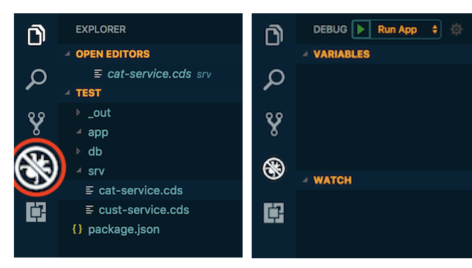
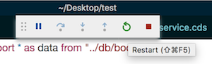

# Development Environments

[[toc]]

## SAP Business Application Studio {#bastudio}

### Setup in BTP

If not already done, [set up SAP Business Application Studio](https://developers.sap.com/tutorials/appstudio-onboarding.html) on SAP BTP.


### Setup a Dev Space

1. Open the [SAP BTP cockpit](https://account.hanatrial.ondemand.com/) and choose *SAP Business Application Studio* from the _Quick Tool Access_ section.

1. Choose *Create Dev Space*.

1. Provide a name for your dev space.

1. Choose *Full Stack Cloud Application* as the application type.

   By selecting *Full Stack Cloud Application*, your dev space comes with several extensions out of the box that you need to develop CAP applications. For example, CAP Tools, Java Tools, and MTA Tools are built in. This saves setup time. See [Developer Guide](https://help.sap.com/products/SAP%20Business%20Application%20Studio/9d1db9835307451daa8c930fbd9ab264/84be8d91b3804ab5b0581551d99ed24c.html) for SAP Business Application Studio for more details.

1. Choose *Create Dev Space*.

   The creation of the dev space takes a while. You see that the status for your dev space changes from *STARTING* to *RUNNING*. See [Dev Space Types](https://help.sap.com/products/SAP%20Business%20Application%20Studio/9d1db9835307451daa8c930fbd9ab264/4142f786f3d345699c3d5fbebda5ded6.html) for more details.

1. Once the dev space is running, choose the dev space by clicking on the dev space name.

   >You're using a trial version. Any dev space that hasn't been running for 30 days will be deleted. See the full list of [restrictions](https://help.sap.com/products/SAP%20Business%20Application%20Studio/9d1db9835307451daa8c930fbd9ab264/a45742a719704bdea179b4c4f9afa07f.html).


### Features

To learn about the features specific to CAP development in the studio, see the guide [Developing a CAP Application in SAP Business Application Studio](https://help.sap.com/docs/SAP%20Business%20Application%20Studio/9c36fdb911ae4cadab467a314d9e331f/8a648174036a458688391c3ad7ee7cd5.html)


### Tutorials

+ [Combine CAP with SAP HANA Cloud to Create Full-Stack Applications](https://developers.sap.com/mission.hana-cloud-cap.html)
+ [Set Up SAP Business Application Studio for Development](https://developers.sap.com/tutorials/appstudio-onboarding.html).

+ Video showing [SAP Business Application Studio Productivity Tools](https://www.youtube.com/watch?v=KE6DKU1P9ic)


## Visual Studio Code {#vscode}

### Install Visual Studio Code

1. Install [_Visual Studio Code_](https://code.visualstudio.com) and launch it.
2. Only for macOS: Install the `code` shell command.

{ style="box-shadow: 1px 1px 5px #888888; width:450px;" .ignore-dark}


### Add CDS Editor

1. Go to [**Visual Studio Marketplace**](https://marketplace.visualstudio.com/items?itemName=SAPSE.vscode-cds#overview).
2. Choose *Install* and VS Code opens the details page for the extension **SAP CDS language support**.
3. In VS Code, choose *Install* to enable the extension.

[Learn more about the **CDS Editor**.](#cds-editor){.learn-more}

<span id="invscodeeditor" />


### Run Services

To run services, just open the Integrated Terminal in VS Code and use one of the `cds serve` variants, for example, use `cds watch` to automatically react on changes.

Alternatively, you can use the preconfigured tasks or launch configurations you get when creating a project with `cds init`.
For example, in the _Debug_ view launch _cds run_ with the green arrow button:

{ style="box-shadow: 1px 1px 5px #888888; width:250px;" .ignore-dark}


### Debug Services

You can add and stop at breakpoints in your service implementations. For example, add one to line 10 of our _srv/cat-service.js_ by clicking in the gutter as shown here:

{ style="box-shadow: 1px 1px 5px #888888; width:250px;"}

... then send the _[.../Books](http://localhost:4004/browse/Books)_ request again to stop there.


### Restart the Server

Restart the server when you did changes to your code using the *Debug* views restart button:

{ style="box-shadow: 1px 1px 5px #888888; width:250px;" .ignore-dark}


## IntelliJ

The [CAP CDS Language Support](https://github.com/cap-js/cds-intellij) plugin for IntelliJ IDEs provides syntax highlighting, code completion, formatting, and more.
It supports commercial IntelliJ IDEs including IntelliJ IDEA Ultimate and WebStorm.

{ .ignore-dark style="width:450px"}

See the [detailed feature list](https://github.com/cap-js/cds-intellij/blob/main/FEATURES.md) and the [installation instructions](https://github.com/cap-js/cds-intellij#requirements) for how to get started.

[Report issues and provide feedback](https://github.com/cap-js/cds-intellij/issues).


## Using Docker { #docker }

Prerequisite: You have installed [Docker](https://docs.docker.com/get-started/).

#### Build an Image

Create a file called `Dockerfile` and add this content for a quick setup:

```docker
FROM node:lts
# or use `FROM node:<NODEVERSION>` to match a specific Node version
# you have installed locally

USER node
ENV NPM_CONFIG_PREFIX=/home/node/.npm
ENV PATH=$NPM_CONFIG_PREFIX/bin:$PATH

RUN npm i -g @sap/cds-dk
```

Build your first image:

```sh
docker build -t cds .
```


#### Run a Service in a Container

1. Run a container that is based on the image:

   ```sh
   docker run --publish 4004:4004 -it cds sh
   ```

   > You see a `$` command prompt from _inside_ the container.

1. Move to the home directory:

   ```sh
   cd
   ```

1. Write a simple cds file:

   ```sh
   echo 'service CatalogService { entity Books { key ID: UUID; } }' \
       > services.cds
   ```

1. Run the service:

   ```sh
   cds run
   ```

1. Open [http://localhost:4004](http://localhost:4004) in a browser to test the application. You forwarded the port `4004` when running the container, which allows you to access the application as if it would run locally.
