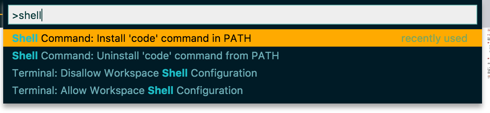
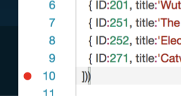

<!--- Migrated: @external/tools/0-index.md -> @external/tools.md -->

# Choose Your Preferred Tools
{{$frontmatter?.synopsis}}

<!--- % include links.md %} -->
<!--- % include _toc levels="2,3" %} -->


## Command Line Interface (CLI)

### Installed with `@sap/cds-dk`

To use `cds` from your command line install `@sap/cds-dk` globally:
```sh
npm i -g @sap/cds-dk
```

### `cds version`

Use `cds version` to get information about your installed package version

<pre class="log">
<i>$</i> cds version
<em>@capire/samples:</em> 2.0.0
<em>@sap/cds:</em> 6.7.0
<em>@sap/cds-compiler:</em> 3.8.2
<em>@sap/cds-dk:</em> 6.7.0
<em>@sap/cds-dk (global):</em> 6.7.0
<em>@sap/cds-mtxs:</em> 1.7.1
<em>@sap/eslint-plugin-cds:</em> 2.6.3
<em>Node.js:</em> v18.13.0
<em>home:</em> .../node_modules/@sap/cds

<i>$</i> cds version --markdown

| @capire/samples | https://github.com/sap-samples/cloud-cap-samples.git |
|:------------------ | ----------- |
| Node.js            | v18.13.0    |
| @sap/cds           | 6.7.0       |
| @sap/cds-compiler  | 3.8.2       |
| @sap/cds-dk        | 6.7.0       |
| @sap/eslint-plugin | 2.6.3       |
</pre>

### `cds help`

Use `cds help` to see an overview of all commands

<pre class="log">
<i>$</i> cds help

USAGE

    <em>cds</em> &lt;command&gt; [&lt;args&gt;]
    <em>cds</em> &lt;src&gt;  =  cds compile &lt;src&gt;
    <em>cds</em>        =  cds help

COMMANDS

    <em>i | init</em>       jump-start cds-based projects
    <em>a | add</em>        add a feature to an existing project
    <em>y | bind</em>       bind application to remote services
    <em>m | import</em>     add models from external sources
    <em>c | compile</em>    compile cds models to different outputs
    <em>p | parse</em>      parses given cds models
    <em>s | serve</em>      run your services in local server
    <em>w | watch</em>      run and restart on file changes
    <em>r | repl</em>       read-eval-event loop
    <em>e | env</em>        inspect effective configuration
    <em>b | build</em>      prepare for deployment
    <em>d | deploy</em>     deploy to databases or cloud
    <em>l | login</em>      login to extendable SaaS application
    <em>t | lint</em>       [beta] run linter for env or model checks
    <em>v | version</em>    get detailed version information
    <em>? | help</em>       get detailed usage information
    <em>  | pull</em>       pull base model for a SaaS app extension
    <em>  | push</em>       push extension to SaaS app to enable or update it
    <em>  | subscribe</em>  subscribe a tenant to a multitenant SaaS app
    <em>  | mock</em>       call cds serve with mocked service

  Learn more about each command using:
  <em>cds help</em> &lt;command&gt; or
  <em>cds</em> &lt;command&gt; <em>--help</em>
</pre>


Use `cds help <command>` or `cds <command> ?` to get specific help

<pre class="log">
<i>$</i> cds watch --help

<em>SYNOPSIS</em>

  <em>cds watch</em> [&lt;project&gt;]

  Tells cds to watch for relevant things to come or change in the specified
  project or the current work directory. Compiles and (re-)runs the server
  on every change detected.

  Actually, cds watch is just a convenient shortcut for:
  <em>cds serve all --with-mocks --in-memory?</em>

OPTIONS

  <em>--port</em> &lt;number&gt;

    Specify the port on which the launched server listens.
    If you specify '0', the server picks a random free port.
    Alternatively, specify the port using env variable PORT.

  <em>--ext</em> &lt;extensions&gt;

    Specify file extensions to watch for in a comma-separated list.
    Example: cds w --ext cds,json,js.

  <em>--livereload</em> &lt;port | false&gt;

    Specify the port for the livereload server. Defaults to '35729'.
    Disable it with value false.

  <em>--open</em> &lt;url&gt;

    Open the given URL (suffix) in the browser after starting.
    If none is given, the default application URL will be opened.

SEE ALSO

  <em>cds serve --help</em> for the different start options.
</pre>

### `cds init`/`add`

* Use `cds init` to create new projects
* Use `cds add` to gradually add facets to projects

### `cds env`

Use `cds env` to inspect currently effective config settings

<pre class="log">
<i>bookshop $</i> cds env get requires.db
{
  impl: <em>'@sap/cds/libx/_runtime/sqlite/Service.js'</em>,
  credentials: { url: <em>':memory:'</em> },
  kind: <em>'sqlite'</em>
}
</pre>


### `cds repl`

Use `cds repl` to live-interact with Node.js APIs

<pre class="log">
<i>bookshop $</i> cds repl
<em>Welcome to cds repl v6.7.0</em>
> SELECT.from(Foo)
Query {
  SELECT: { from: { ref: [ <em>'Foo'</em> ] } }
}

> cds.requires.db
{
  impl: <em>'@sap/cds/libx/_runtime/sqlite/Service.js'</em>,
  credentials: { url: <em>':memory:'</em> },
  use: [Getter],
  kind: <em>'sqlite'</em>
}
</pre>

### Debugging with `cds watch`

Start `cds watch` and enter `debug`. This restarts the application in debug mode. Similarly, `debug-brk` will start debug mode, but pause the application at the first line, so that you can debug bootstrap code.

If you do this in VS Code's integrated terminal with the 'Auto Attach' feature enabled, debugging starts right away. If you executed `cds watch` on a standalone terminal, you can still attach a Node.js debugger to the process.

For example:
- In VS Code, use the _Debug: Attach to Node Process_ command.
- In Chrome browser, just open [chrome://inspect](chrome://inspect) and click _Inspect_.


## Visual Studio Code {#vscode}

### Install Visual Studio Code

1. Install [_Visual Studio Code_](https://code.visualstudio.com) and launch it.
2. Only for macOS: Install the `code` shell command.

{ style="box-shadow: 1px 1px 5px #888888; width:450px;" .ignore-dark}


### Add CDS Editor

1. Go to [**Visual Studio Marketplace**](https://marketplace.visualstudio.com/items?itemName=SAPSE.vscode-cds#overview).
2. Choose *Install* and VS Code opens the details page for the extension **SAP CDS language support**.
3. In VS Code, choose *Install* to enable the extension.

[Learn more about the **CDS Editor**.](#cds-editor){.learn-more}

<span id="invscodeeditor" />


### Run Services

To run services, just open the Integrated Terminal in VS Code and use one of the `cds serve` variants, for example, use `cds watch` to automatically react on changes.

Alternatively, you can use the preconfigured tasks or launch configurations you get when creating a project with `cds init`.
For example, in the _Debug_ view launch _cds run_ with the green arrow button:

{ style="box-shadow: 1px 1px 5px #888888; width:250px;" .ignore-dark}


### Debug Services

You can add and stop at breakpoints in your service implementations. For example, add one to line 10 of our _srv/cat-service.js_ by clicking in the gutter as shown here:

{ style="box-shadow: 1px 1px 5px #888888; width:250px;"}

... then send the _[.../Books](http://localhost:4004/browse/Books)_ request again to stop there.


### Restart the Server

Restart the server when you did changes to your code using the *Debug* views restart button:

{ style="box-shadow: 1px 1px 5px #888888; width:250px;" .ignore-dark}


### Run a CAP Notebook { #cap-vscode-notebook}

A **CAP Notebook** is a [Custom Notebook in Visual Studio Code](https://code.visualstudio.com/blogs/2021/11/08/custom-notebooks) that serves you as a guide on how to create, navigate, and monitor CAP projects. With this approach, we want to encourage the CAP community to work with CAP in the same explorative manner that scientists work with their data, namely by:

- Visually interacting with their code
- Playing with REPL-type inputs (notebook input cells)
- Storing persistent code (notebook output cells)

The cell inputs/outputs are especially useful at later points in time when the project's details have long been forgotten. In addition, notebooks are a good way to share, compare, and also reproduce projects.

* If you are new to CAP Notebooks, try out the notebooks based on our documentation. When available for a given page, these are accessible via the "CAP Notebook button" on the *right-hand-side* of the screen and enable you to try things out on your local machine, for example the [Getting Started in a Nutshell](../get-started/in-a-nutshell) guide.

   

* To see which features are available in a CAP Notebook, open our [CAP Notebook page](#cap-notebooks-page): <kbd>F1</kbd> → *CDS: Open CAP Notebooks Page*

* Magics, or magic commands, known from [IPython](https://ipython.readthedocs.io/en/stable/interactive/magics.html) are conventient functions to solve common problems. To see which line- and cell-magics can be used within a CAP Notebook, run a code cell with `%quickref`.

* Start an empty CAP Notebook by creating a _*.capnb_ file.

> Provided that the [**CDS Editor**](#cds-editor) is installed, the CAP Notebook will be rendered automatically as the file is selected.


## Eclipse

### Prerequisites

* You have followed the instructions in [Local Setup](../get-started/).
* You have installed Eclipse, Spring Tools, and our Eclipse plugin, see [Add the SAP Cloud Business Application Tools for Eclipse](../java/getting-started#eclipse).

<div id="beforedocker" />

## Docker


### Prerequisites
* You have installed [Docker](https://docs.docker.com/get-started/).

### Build an Image

Create a file called `Dockerfile` and add this content for a quick setup:

```docker
FROM node:lts
# or use `FROM node:<NODEVERSION>` to match a specific Node version
# you have installed locally

USER node
ENV NPM_CONFIG_PREFIX=/home/node/.npm
ENV PATH=$NPM_CONFIG_PREFIX/bin:$PATH

RUN npm i -g @sap/cds-dk
```

Build your first image:
```sh
docker build -t cds .
```


### Run a Service in a Container

1. Run a container that is based on the image:
```sh
docker run --publish 4004:4004 -it cds sh
```
> You see a `$ ` command prompt from _inside_ the container.

1. Move to the home directory:
```sh
cd
```

1. Write a simple cds file:
```sh
echo 'service CatalogService { entity Books { key ID: UUID; } }' \
    > services.cds
```

1. Run the service:
```sh
cds run
```

1. Open [http://localhost:4004](http://localhost:4004) in a browser to test the application. You forwarded the port `4004` when running the container, which allows you to access the application as if it would run locally.


## CDS Editors & LSP {#cds-editor}

The editor powered by the CDS language server implementation, provides source code validation including diagnostics, like error messages and warnings.

The following features are available for all editors based on our language server implementation for CDS in
SAP Business Application Studio, Visual Studio Code, and Eclipse. The plugins are available for download for Visual Studio Code at [Visual Studio Marketplace](https://marketplace.visualstudio.com/items?itemName=SAPSE.vscode-cds#overview) and for Eclipse at [SAP Development Tools](https://tools.hana.ondemand.com/#cloud-vscodecds).

[Short video about the **SAP CDS language support** extension for VS Code in action by DJ Adams.](https://www.youtube.com/watch?v=eY7BTzch8w0){.learn-more}

### Features and Functions

**Syntax highlighting**

**Code completion**

- Keywords
- Identifiers including not yet imported identifiers with corresponding `using` statement
- Using paths and artifacts including showing README.md documentation as details
- i18n translation IDs
- Turn on/off formatting regions

**Where-used navigation**

- Navigate to definitions
- Navigate to references
- Highlight occurrences

**QuickFixes**

+ Create using statement for unknown artifacts.
+ Maintain missing translation.
+ Convert `@cds.doc` and `@description` annotations to doc comments.

**Code formatting**

Format...
- the whole document
- a selected range
- on-the-fly when completing statements using ```;``` or ```}```
- on save (depending on the IDE)
- on paste (depending on the IDE)

Use...
- many options, configurable using
  - settings file
  - command line switches
  - config UI with simulation of options for VS Code and Eclipse
  - JSON schema for textual support
- also for markdown in doc comments

**Inventory (symbols)**

- An inventory for the current file.
- An inventory for the workspace including query capabilities to select. For example, artifact types, names, also include reuse models.

**Snippets for typical CDS language constructs**

- Namespace and context
- `using`
- `service`
- `type`
- Entity and projections, ...
- Element, associations, and compositions
- Extend and annotate
- Annotations for documentation

> With documentation extracts of [capire](../cds/cdl) explaining language concepts.

**Hover information based on**

- Doc comments
- `@title`, `@description`, and ~~`@cds.doc`~~ (deprecated) annotations
- Translations

**Translation support**

- Properties, JSON, and CSV files
- Navigate to translation definitions from translation IDs like ```'{i18n>customerName}'```.
- Show translations on hover.
- Quickfix to maintain missing translations

**And more**

- Plugin framework for external handlers of annotation domains


### Settings
<br>

##### Code formatting settings

These are settings coming with the CDS language server implementation.
Use the command *CDS: Show Formatting Options Configuration*.
You see the settings, grouped into three tabs: *Alignment*, *Other*, and *Whitespace*

##### Format on Type, Format on Paste, and Format on Save in VS Code

These are settings from the editor in VS Code:

1. Press <kbd>F1</kbd>
1. Open *Preferences: Open User Settings*
1. Filter for _Format_.
1. Tick the checkboxes to enable the settings.

##### Cds: Workspace Validation Mode

Default: *ActiveEditorOnly*

Keeps track of the active editor in focus. Only changes there are immediately validated.

The *ActiveEditorOnly* mode is especially useful in situations when navigating through a large model, that is having multiple files open (even if they are not shown as tabs)
and editing a file that the others directly or indirectly depend on.
::: warning
If switched to *OpenEditorsAndDirectSources* all model files on every change, for example typed character, are recompiled.<br>
If switched to _OpenEditorsOnly_ all open files, for example split tabs, are recompiled.<br>
For large models, this can lead to **high CPU load** and **high memory load** and consequently weak responsiveness of the editor.
:::

##### Cds > Contributions > Enablement: Odata*
Default: *on*

This setting enables extended support for annotations, that is refined diagnostics and code completion. Can be switched *off* for performance gains.

##### Cds > Workspace: ScanCsn

Default: *off*

Switch *on* to scan the workspace also for CSN files, additionally to CDS source files.

Note: CSN files are still considered if used from a CDS source file.

##### Cds > Quickfix: ImportArtifact

Default: *off*

Enable to get quickfix proposals for artifact names, like entities, that aren't imported via a `using` statement. For that, all definitions in the workspace need to be considered, which might be slow.

### Commands
<br>

##### Welcome page

1. Press <kbd>F1</kbd>
1. Open *CDS: Show CAP Release Notes*

If there are new release notes, this page opens on startup. You can disable this behavior using the *CDS > Release Notes: Show Automatically* (`cds.releaseNotes.showAutomatically`) setting.

##### CAP Notebooks Page { #cap-notebooks-page}

1. Press <kbd>F1</kbd>
1. Open *CDS: Open CAP Notebooks Page*

This page provides information on all of features available in a CAP Notebook with a brief description and examples on each.

##### Beautify settings

1. Press <kbd>F1</kbd>
1. Open *CDS: Show Formatting Options Configuration*

##### Preview CDS sources

You want to create a preview of a specific _.cds_ file in your project. You can do that using the command line. Here is how you do it in VS Code:
1. Open the file you want to preview.
1. Open the context menu.
1. Select _Preview CDS source as..._ .
1. Choose the preview you want to see.


##### Visualize CDS file dependencies

Use the command from the context menu on a folder or CDS file.

A selection popup appears to choose one of three modes:

1. _File to file_ (detailed)
2. _File to file_ (reduced to folders)
3. _Complete folder to complete folder_

The _first option_ shows every model file on its own.
For very large models, the number of files and interdependencies may be too complex to be graphically shown.
A message about insufficient memory will appear. In this case use the second option.

The _second option_ reduces the graph by only showing the folders of all involved files and their interdependencies.
::: tip
Only those files are evaluated that are reachable from the start model where the command was invoked on.
:::

The _third option_ always considers all files in a folder and their dependencies.
This can be useful to understand architectural violations.
> **Example for architectural violation:**<br>
> You want a clean layering in your project: _app_ -> _srv_ -> _db_. With this option, you can visualize and identify that there is a dependency from a file in the service layer to an annotation file in the application layer.


Hovering over a node will show the number of files involved and the combined size of all involved files. Use this function to get a rough understanding about the complexity and the compilation speed.

The command requires the third-party extension _Graphviz (dot) language support for Visual Studio Code_ (joaompinto.vscode-graphviz). If you haven't installed it already, it will be suggested to install.


### Editor Performance

With the following [settings](#settings) you can influence the performance of the editor:

##### Editor > Goto Location: Alternative Definition Command

Do not select *goToReferences*. Otherwise, being already on a definition often requires all models to be recompiled.

##### Workbench > Editor > Limit: Value

If open editors have `using` dependencies, a change in one editor will lead to a recompile of related editors. To decrease the impact on performance, lower the number.

##### Workbench > Editor > Limit: Enabled

To enable the limit value above, switch *on*.


##### Additional Hints to Increase Performance:

- Within _SAP Business Application Studio_: close _CAP Data Models and Services_ view. Otherwise, it will ask for all workspace symbols at every change.
- Commands _Go to References_ / _Find All References_ will recompile all models that might have changed due to a change in a depending model. If there are index models, it often means that the complete workspace is being recompiled.
Until a further change, reference calculation is reasonably fast.
- Command _Go to Symbol in Workspace_ will recompile the complete workspace once, after that it is reasonable fast.
- Changing settings in _CDS_ section will currently perform a complete workspace invalidation i.e. required indexes will lead to recompilations on demand as described above.
- Changing certain `cds.env` settings, for example folder configurations, will invalidate the workspace as well.

### Command Line Client for CDS Code Formatter (beta) { #command-line-client-for-cds-code-formatter}

The CDS code formatter provides a command line interface. Use it as a pre-commit hook or within your CI/CD pipeline, to guarantee a consistent
formatting.

#### Installation
Install the CDS language server globally as a library via `npm i -g @sap/cds-lsp`.
A new shell command `format-cds` is available.

#### Usage
Show help via `format-cds -h`. This explains all commands and formatting options in detail including the default value for
each formatting option.

It is recommended to generate once for each project a settings file (_.cdsprettier.json_) with all default formatting options available. Execute `format-cds --init` in the project root. An existing file would not be overwritten. To adapt your settings to your preferred style, open the _.cdsprettier.json_ file in VS Code. You get code completion and help for each option. There is also a settings UI in [SAP CDS Language Support](https://marketplace.visualstudio.com/items?itemName=SAPSE.vscode-cds),
reachable via command `CDS: Show Formatting Options Configuration`. This allows to see the effects of each formatting option
on an editable sample source. Commit the _.cdsprettier.json_ file into your version control system.

Use `format-cds` to format all your CDS source files. The effective set of formatting options is calculated in order of precedence:
- Default options
- Options from _.cdsprettier.json_ file
- Command line formatting options

It is possible to have _.cdsprettier.json_ files in subfolders. In this case the most relevant settings file per CDS source file
is taken.

Use `format-cds <foldername1> <foldername2> <filename> ...` to restrict the set of CDS source files.
By default, backup files with _.bak_ file extension will be created.

Use `-f` switch to force an overwrite without creating a backup.
This is on your own risk. Should there be problems data loss might occur, especially when formatting in a pre-commit hook.
Better add _.bak_ to your _.gitignore_ file and not use `-f`.


## CDS Lint & ESlint {#cds-lint}

<style lang="scss" scoped>
  .emoji {
    display: inline !important;
    margin: 0px !important;
  }
  tr td {
    padding-left: 0;
    padding-right: 0;
  }
  .cols-2 {
    display: flex;
    align-items: center;
    flex-wrap: wrap;
  }
  @media (min-width: 640px) {
    .cols-2 {
      gap: 2em;
    }
    .cols-2 > * {
      &:first-child {
        flex: 1;
      }
    }
  }
</style>

<div class="cols-2">

<div>

To catch issues with CDS models and the CDS environment early, CAP provides an [ESLint plugin](https://eslint.org/) with a set of [recommended rules](#cds-lint-rules).
Together with the `lint` client of [`@sap/cds-dk`](https://www.npmjs.com/package/@sap/cds-dk), this comprises **CDS Lint**.

</div>

<div>


</div>

</div>

### Usage via `cds` CLI

In your project's root folder, execute:

```sh
cds lint .
```

If there are no lint errors, there is no output. Otherwise, a standard ESLint error report will be printed.

### Editor Integration

1. Download the standard [ESLint extension](https://marketplace.visualstudio.com/items?itemName=dbaeumer.vscode-eslint) for _Visual Studio Code_. CDS Lint seamlessly integrates with it. For _SAP Business Application Studio_ this is preinstalled.

2. Configure our <a href="#cds-lint-rules">recommended rules</a> for CDS model files in your project:

   ```sh
   cds add lint
   ```

   This automatically adds the settings for the ESLint VS Code extension to the project's VS Code settings, installs the CDS ESLint plugin, and adds it to the ESLint configuration of your project.

<!-- [Follow this link to learn about using custom rules.](#lint-custom-rules){.learn-more} -->

### CDS Lint Rules

The **CDS Lint** rules are a set of generic rules based on CAP best practices. The subset of these we consider most essential is part of the `recommended` configuration of the `@sap/eslint-plugin-cds` package.

<span id="cds-lint-rules" />

### Customization
<br>

#### Configuring CDS Lint Rules

Individual package rules can also be [configured](https://eslint.org/docs/user-guide/configuring/rules#configuring-rules) to be turned off or have a different severity. For example, if you want to turn off the recommended *environment* rule [min-node-version](../tools/lint-rulelist/rules#min-node-version), just add the following lines to your [ESLint configuration file](https://eslint.org/docs/user-guide/configuring/), shown here for type `json`:

```json
{
  "rules": {
    "@sap/cds/min-node-version": 0
  }
}
```

#### Using the ESLint CLI

If you want to have more control over the linting process, you can access the CDS ESLint plugin natively via the [ESLint CLI](https://eslint.org/docs/user-guide/command-line-interface). To determine the proper command line options, it can help to refer to the `DEBUG="lint" cds lint` output, which shows all of the options and flags available.

For example:

<pre class="log">
Linting:
<span><em>[lint] - eslint --ext ".cds,.csn,.csv" ...</em></span></pre>

<div id="aftereslintcli" />

## SAP Business Application Studio {#bastudio}

### Set Up SAP Business Application Studio

If not already done, [set up SAP Business Application Studio](https://developers.sap.com/tutorials/appstudio-onboarding.html) on SAP BTP.


### Set Up Your Dev Space

1. Open the [SAP BTP cockpit](https://account.hanatrial.ondemand.com/) and choose *SAP Business Application Studio* from the _Quick Tool Access_ section.

1. Choose *Create Dev Space*.

1. Provide a name for your dev space.

1. Choose *Full Stack Cloud Application* as the application type.

    By selecting *Full Stack Cloud Application*, your dev space comes with several extensions out of the box that you need to develop CAP applications. For example, CAP Tools, Java Tools, and MTA Tools are built in. This saves setup time. See [Developer Guide](https://help.sap.com/products/SAP%20Business%20Application%20Studio/9d1db9835307451daa8c930fbd9ab264/84be8d91b3804ab5b0581551d99ed24c.html) for SAP Business Application Studio for more details.

1. Choose *Create Dev Space*.

    The creation of the dev space takes a while. You see that the status for your dev space changes from *STARTING* to *RUNNING*. See [Dev Space Types](https://help.sap.com/products/SAP%20Business%20Application%20Studio/9d1db9835307451daa8c930fbd9ab264/4142f786f3d345699c3d5fbebda5ded6.html) for more details.

1. Once the dev space is running, choose the dev space by clicking on the dev space name.

   >You're using a trial version. Any dev space that hasn't been running for 30 days will be deleted. See the full list of [restrictions](https://help.sap.com/products/SAP%20Business%20Application%20Studio/9d1db9835307451daa8c930fbd9ab264/a45742a719704bdea179b4c4f9afa07f.html).


### Features

To learn about the features specific to CAP development in the studio, see the guide [Developing a CAP Application in SAP Business Application Studio](https://help.sap.com/docs/SAP%20Business%20Application%20Studio/9c36fdb911ae4cadab467a314d9e331f/8a648174036a458688391c3ad7ee7cd5.html)


### Tutorials Using SAP Business Application Studio

+ [Combine CAP with SAP HANA Cloud to Create Full-Stack Applications](https://developers.sap.com/mission.hana-cloud-cap.html)
+ [Set Up SAP Business Application Studio for Development](https://developers.sap.com/tutorials/appstudio-onboarding.html).

+ Video showing [SAP Business Application Studio Productivity Tools](https://www.youtube.com/watch?v=KE6DKU1P9ic)


## CDS Typer {#cds-typer}

## Type Generation
The `cds-dts-generator` package offers a way to derive Typescript definitions from a CDS model to give users enhanced code completion and a certain degree of type safety when implementing services. The following chapter describes the package in detail.

⏩ _You may skip ahead to the [Quickstart](#quickstart) section if you just want to get everything up and running for your project in a VSCode environment._

Note that this chapter uses the [bookshop sample](https://github.com/SAP-samples/cloud-cap-samples/tree/main/bookshop) as a running sample.

### `typer` Facet
Type generation can be added to your project via `cds add typer`. Under the hood, this does three things:

1. Adds `@sap/cds-dts-generator` as a dev-dependency (⚠️ which you still have to install using `npm i`)
2. Creates (or modify) a _jsconfig.json_ file to support 
  - intellisense for the generated types
  - enable a strict mode to treat missing properties in types as error (`checkJs`)
3. Modifies _package.json_ to enable [subpath imports](https://nodejs.org/api/packages.html#subpath-imports) for the generated types

> ⚠️ **Adding the facet in a Typescript project** will adjust your _tsconfig.json_ instead. Note that you may have to manually add type generator's configured output directory to the `rootDirs` entry in your 
_tsconfig.json_, as we do not want to interfere with your configuration.

You can now already call the type generator CLI at this point:

```sh
./node_modules/@sap/cds-dts-generator/lib/cli.js ./srv/index.cds --outputDirectory ./@types
```

### Emitted Type Files

 The emitted types are bundled into a directory which contains a nested directory structure that mimics the namespaces of your CDS model. For the sake of brevity, we will assume them to be in a directory called `@types` in your project's root in the following sections.
For example, the sample model contains a namespace `sap.capire.bookshop`. You will therefore find the following file structure after the type generation has finished:

```
@types
└───sap
    └───capire
        └───bookshop
              index.js
              index.ts
```

Each _index.ts_ file will contain type information for one namespace. For each entity belonging to that namespace, you will find two exports, a singular and a plural form:

```ts
// @types/sap/capire/bookshop/index.ts
export class Author …
export class Authors …
export class Book …
export class Books …
```

The singular forms represent the entities from the original model and try to adhere to best practices of object oriented programming for naming classes in singular.
The plural form exists as a convenience to refer to a collection of multiple entities. You can [fine tune](#fine-tuning) both singular and plural names that are used here.

At this point, you could already import these types by using absolute paths, but there is a more convenient way for doing so which will be described in the next section.

### Subpath Imports
Adding type support via `cds add typer` includes adding [subpath imports](https://nodejs.org/api/packages.html#subpath-imports). Per default, the facet adds a mapping of `#model/` to the default path your model's types are assumed to be generated to (`<project root>/@types/`). If you are generating your types to another path and want to use subpath imports, you may have to adjust this setting in your _package.json_ and _jsconfig.json_/ _tsconfig.json_ accordingly.

Consider [the bookshop sample](https://github.com/SAP-samples/cloud-cap-samples/tree/main/bookshop) with the following structure with types already generated into `@types`:

```
bookstore
│   package.json
│
└───@types
│   └───<see above>
│
└───db
│      schema.cds
│      …
│   
└───srv
│      cat-service.cds
│      cat-service.js
│       …
│
└─── …
```

The following two (equally valid) statements would amount to the same import [from the catalogue service](https://github.com/SAP-samples/cloud-cap-samples/blob/main/bookshop/srv/cat-service.js):

```js
// srv/cat-service.js
const { Books } = require('../@types/sap/capire/bookshop')
const { Books } = require('#model/sap/capire/bookshop')
```

These imports will behave like [`cds.entities('sap.capire.bookshop')`](https://pages.github.tools.sap/cap/docs/node.js/cds-reflect#entities) during runtime, but offer you code completion and type hinting at design time:

```js
class CatalogService extends cds.ApplicationService { init(){
  const { Book } = require('#model/sap/capire/bookshop')

  this.on ('UPDATE', Book, req => {
    // in here, req is known to hold a payload of type Book.
    // Code completion therefore offers all the properties that are defined in the model.
  })
})
```

Note that just as with `cds.entities(…)`, these imports cannot be static, but need to be dynamic:

```js
// ❌ works during design time, but will cause runtime errors
const { Book } = require('#model/sap/capire/bookshop')

class CatalogService extends cds.ApplicationService { init(){
  // ✅ works both at design time and at runtime
  const { Book } = require('#model/sap/capire/bookshop')
})
```

### Using Emitted Types in Your Service
The types emitted by the type generator are tightly integrated with the CDS API. The following section elucidates where the generated types are recognised by CDS.

#### CQL

Most CQL constructs have an overloaded signature to support passing in generated types. Chained calls will offer code completion related to the type you pass in.

```js
// how you would have done it before (and can still do it)
SELECT('Books')  // etc...

// how you can do it using generated types
const { Book, Books } = require('#model/sap/capire/Bookshop')

// SELECT
SELECT(Books)
SELECT.one(Book)
SELECT(Books, b => { b.ID })  // projection
SELECT(Books, b => { b.author(a => a.ID) })  // nested projection

// INSERT / UPSERT
INSERT.into(Books, […])
INSERT.into(Books).columns(['title', 'ID'])  // column names derived from Books' properties

// DELETE
DELETE(Books).byKey(42)
```

Note that your entities will expose additional capabilities in the context of CQL, such as the `.as(…)` method to specify an alias.

#### CRUD Handlers
The CRUD handlers `before`, `on`, and `after` accept generated types:

```js
// the paylod is known to contain Books inside the respective handlers
service.before('READ', Books, req => { … }
service.on('READ', Books, req => { … }
service.after('READ', Books, req => { … }
```
🚧 **NOTE to editors:** this particular section is subject to change, as per our last sync.

Note that you can pass in both singular, as well as plural versions of your entity. Doing so will slightly alter the semantics of the handler. Passing the plural will result in a callback that is called _once_ with the entire result set. Passing the singular will cause the callback to be called once _for each_ element of the result set:

```js
service.on('READ', Books, req => req.data[0].ID)
service.on('READ', Book,  req => req.data.ID)
```

#### Actions

In the same manner, actions can be combined with `on`:

```js
const { submitOrder } = require('#model/sap/capire/Bookshop')

service.on(submitOrder, (…) => { /* implementation of 'submitOrder' */ })
```

> ⚠️ **Using anything but lambda functions** for either CRUD handler or action implementation will make it impossible for the LSP to infer the parameter types.

You can remedy this by specifying the expected type yourself via [JSDoc](https://jsdoc.app/):

```js
service.on('READ', Books, readBooksHandler)

/** @param {{ data: import('#model/sap/capire/Bookshop').Books }} req */
function readBooksHandler (req) { /* req.data is now properly known to be of type Books again */ }
```

### Integration into VSCode
Using the [SAP CDS Language Support extension for VSCode](https://marketplace.visualstudio.com/items?itemName=SAPSE.vscode-cds), you can make sure the generated type information stays in sync with your model. Instead of [manually calling](#type-generator-cli) the type generator every time you update your model, the extension will automatically trigger the process whenever you hit _save_ on a `.cds` file that is part of your model. 
Opening your VSCode settings and typing "`cds type generator`" into the search bar will reveal several options to configure the type generation process.
Output, warnings, and error messages of the process can be found in the output window called "`CDS`".
If you stick to the defaults, saving a `.cds` file will have the type generator emit [its type files](#emitted-type-files) into the directory `node_modules/@cap-js/cds-modules` in your project's root.

### Fine Tuning
#### Singular/ Plural
The generated types offer both a singular and plural form for convenience. The derivation of these names uses a heuristic that assumes entities are named with an English noun in plural form, following the [best practice guide](https://cap.cloud.sap/docs/guides/domain-modeling#pluralize-entity-names).

Naturally, this best practice can not be enforced on every model. Even for names that do follow best practices, the heuristic can fail. If you find that you would like to specify custom identifiers for singular or plural forms, you can do so using the `@singular` or `@plural` annotations:

```cds
// model.cds
@singular: 'Mouse'
entity Mice { … }

@plural: 'FlockOfSheep'
entity Sheep { … }
```

will emit the following types:

```ts
// index.ts
export class Mouse …
export class Mice …
export class Sheep …
export class FlockOfSheep …
```

### Quickstart
1. Make sure you have the [SAP CDS Language Support extension for VSCode](https://marketplace.visualstudio.com/items?itemName=SAPSE.vscode-cds) installed
2. In your project's root, execute `cds add typer`
3. Install the newly added dev-dependency using `npm i`
4. Saving any `.cds` file of your model triggers the type generation process
5. Model types can be imported to service implementation files using `require('#model/…')`